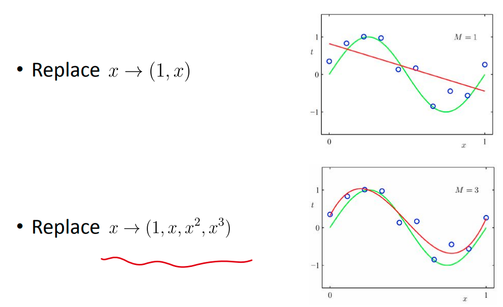

# kernel method

## feature map

我们知道对于 $x\in \mathbb{R}^n$ linear model $h(\mathbf{x,w})=\mathbf{w}^{\top} \mathbf{x}$ can only produce 一个 hyperplane in it. 因而 not very flexible & powerful.

为此我们的解决方法是使用 feature map, 把 $x$ maps to 更加高维度的 (nonlinear) feature space 上, 然后进行学习: 

更加直观的是: 当 data live on 一些 nonlinear manifold 上时:

此时 data 是 not linearly separable 的, 因而我们可以把 $L^2$ distance to origin 作为一个 third feature 来进行学习, 即: 
$$
\phi:(x_1,x_2)\mapsto (x_1,x_2,d(x_1,x_2))
$$
或者我们可以直接降低维度, 只取这个 feature: 
$$
\phi:(x_1,x_2)\mapsto d(x_1,x_2)
$$

会达到比较好的 regression/classification 效果.

 

### example of solving regression with nonlinear features  

for example: ridge regression

linear regression model with feature map: 
$$
h(\mathbf{x}, \mathbf{w})=\mathbf{w}^{\top} \phi(\mathbf{x})=\sum_{j=0}^M w_j \phi_j(\mathbf{x})
$$

object: Least-squares with L2 regression
$$
J(\mathbf{w})=\frac{1}{2} \sum_{n=0}^N\left(\mathbf{w}^{\top} \phi\left(\mathbf{x}^{(n)}\right)-y^{(n)}\right)^2+\frac{\lambda}{2} \mathbf{w}^{\top} \mathbf{w}
$$

Closed form solution: 
$$
\mathbf{w}=\left(\Phi^{{\top}} {\Phi+\lambda \mathbf{I}}\right)^{-1} \mathbf{y}
$$

这一切都没什么问题但是: 

$\Phi$ 是一个 $N \times  M$ 的 matrix
- $N$ : the number of examples
- $M$ : the number of features

因而, 为了计算这个 closed form sol, 我们需要 invert $\Phi^{\top} \Phi$ 这个大小是 $M \times  M$ 的 matrix.

Computational complexity scales with $O\left(M^3\right)$

试想: 如果 $M$ 非常大 (远大于 $N$) 怎么办?

## kernel function

### define kernel function from feature map

我们定义 kernel function: $k: \mathbb{R}^n \times \mathbb{R}^n \to \mathbb{R} $ by: 
$$
k\left(\mathbf{x}, \mathbf{x}^{\prime}\right)=\phi(\mathbf{x})^{\top} \phi\left(\mathbf{x}^{\prime}\right)
$$
两个点的 features 的内积, 即: **这两个点映射到在 feature space 中的 similarity.**

for example: 

### define 一个 kernel function, 反过来看它对应 feature map

因为我们并不是从 $\mathbf{w}$ 反推 $\mathbf{a}$ ，而是主动把 $\mathbf{w}$ 表示成 $\Phi \mathbf{a}$ 的形式。
这种方式等价于在函数空间中搜索解，而不是直接在参数空间中优化。也就是说，即使 $\Phi$ 不是满秩的，甚至不是方阵，我们仍然可以这么写。

这实际上是核方法中「代表定理（Representer Theorem）」的体现：最优解 $\mathbf{w}$ 总可以表示成样本映射的线性组合，即 $\mathbf{w}=\sum_{i=1}^N a_i \phi\left(x^{(i)}\right)$ 。