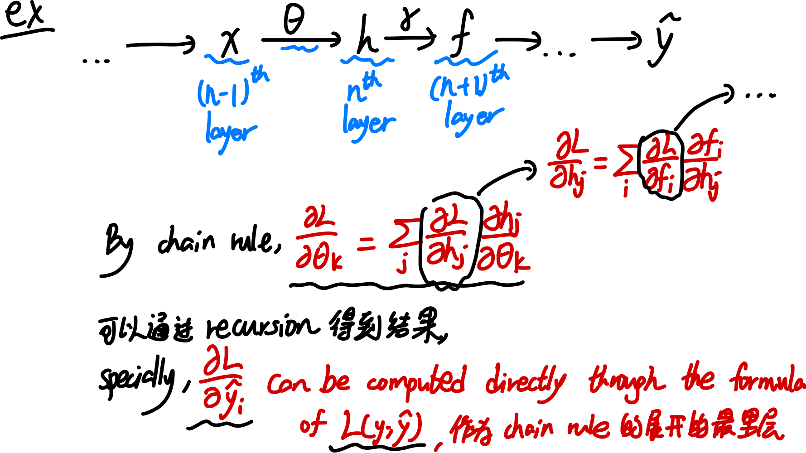

# overview of NN

DL 本质上就是**将 input Space 到 Feature Space 的映射从 single layer (比如 logistic regression) 扩展为 multilayer**，并通过这些层次化的表示来学习数据的更高阶特征.

比方说 DL 一个分类问题:

1. 低层神经元：学习边缘、纹理等低级特征。
2. 中层神经元：学习更复杂的模式，如耳朵、眼睛等部件。
3. 高层神经元：学习全局信息，如“这是一只猫”。
4. 最终输出分类结果（猫/狗）。

以下为各种 Machine Learning methods 以 supervised 与否、deep 与否这两个标准的分类

### types of neurons

linear & Relu:

Sigmoid & tanh:

softmax

使用这些组建, 我们可以搭建一个 layer; 并用 layers 组成一个 NN

### train NN: forward 和 backward propagation

Algorithm of NN training: 

在这一过程中, 其中一个 layer 到另一个 layer 是这样

对于某一层的 parameters $\theta$ 的导数的计算, 可以由 chain rule 得到. 

其 vectorization form: 

#### my remark: ml 里数学 notation 的不严谨之处, 以及如何指认.

我们首先复习正常的多元实分析中学到的 notation:

而 ml 中, 经常会有滥用 notation 的情况。我这里并不是指 notation 的形式和数学里不一样，而是 ml 里经常会有 notation 内部的 inconsistency. 比如下面:

我们如何 consistently 翻译这个内容：在 ml 的 notation 里，**对于 R^n to R^m (where m>1)的函数, 不论它写作 nabla 形式还是 partial partial 形式, 都是 Jacobian matrix, 也就是 derivative (即便写成 nabla)；对于 R^n to R 的函数, 不论它写作 nabla 形式还是 partial partial 形式, 都是 gradient, 也就是 derivative 的 transpose (即便写成partial partial)**

虽然我们自己仍然对于 derivative 用 partial partial, 对于 gradient 用 nabla, 但是碰到这种标记就用上面这个翻译来理解。

#### ex: NN with 1 hidden layer

Scalar-valued, 很容易算

vectorized: 有点难. 

至于 matrix input, vector valued 的函数, 其涉及 tensor 的 differentiation, 目前还没写.

Neural Network 对于数据量很大的数据集 work well, 因为 multi layers 可以学习到复杂的数据范式；但是当数据量比较小的时候，它不 work well，反而是传统的 ml 更加有用。因为数据量小的时候它很容易过拟合。（参数过多）

## sgd 一系列的 optimization methods for NN learning

在深度学习中，优化算法用于调整模型参数以最小化损失函数。常见的优化算法包括 **SGD（随机梯度下降）**、**Momentum（动量）** 和 **Adagrad（自适应梯度算法）**，它们在更新参数时具有不同的策略。以下是它们的介绍：

#### **1. SGD（随机梯度下降）**

**SGD 是最基本的优化方法。**

- **更新公式**：
  $$
  \theta_{t+1} = \theta_t - \eta \nabla L(\theta_t)
  $$
  其中：
  - $ \theta_t $ 是参数
  - $ \eta $ 是学习率
  - $ \nabla L(\theta_t) $ 是损失函数关于参数的梯度

- **特点**：
  - 计算简单，每次仅使用**一个或一小批**样本来计算梯度，减少计算成本。
  - 由于随机梯度的方差较大，**更新方向不稳定**，容易震荡，尤其是在接近最优点时。
  - 可能会陷入**局部极小值**，特别是在复杂的损失面上。

#### **2. Momentum 动量优化**

**Momentum 通过引入“动量”来加速收敛并减少震荡。**

- **更新公式**：
  $$
  v_t = \beta v_{t-1} - \eta \nabla L(\theta_t)
  $$
  $$
  \theta_{t+1} = \theta_t + v_t
  $$
  其中：
  - $ v_t $ 是动量项，累积了过去的梯度信息
  - $ \beta $ 是动量系数，通常取 0.9 左右

- **特点**：
  - 通过**累积过去的梯度**，在梯度方向一致时加速收敛。
  - 在震荡较大的方向（例如损失面狭长的区域），减少梯度波动，提高稳定性。
  - 类似物理学中的“惯性效应”，在陡峭的方向上快速收敛，在平坦方向上平稳前进。

https://distill.pub/2017/momentum/

#### **3. Adagrad（自适应梯度算法）**

**Adagrad 通过调整每个参数的学习率，使得常见特征的学习率降低，而稀疏特征的学习率较高。**

- **更新公式**：
  $$
  G_t = G_{t-1} + \nabla L(\theta_t) \odot \nabla L(\theta_t)
  $$
  $$
  \theta_{t+1} = \theta_t - \frac{\eta}{\sqrt{G_t + \epsilon}} \nabla L(\theta_t)
  $$
  其中：
  - $ G_t $ 是累积平方梯度
  - $ \epsilon $ 是一个小常数（如 $ 10^{-8} $），用于数值稳定性

- **特点**：
  - 适用于**稀疏数据**（如 NLP 任务），能够自适应调整学习率，使得更新更稳定。
  - **问题**：梯度平方累积不断增大，导致学习率逐渐趋近于 0，可能会过早停止学习。

在实际应用中，**Momentum 比 SGD 更受欢迎**，因为它能加速收敛并减少震荡。而 **Adagrad 适合稀疏数据，但学习率下降过快的问题常用 RMSprop（对 Adagrad 进行了改进）来解决**。

你如果对 RMSprop 或 Adam（结合了 Momentum 和 Adagrad）也感兴趣，可以继续探讨！

RMSprop 和 Adam 是优化算法的改进版本，它们在深度学习中广泛使用，因为它们能有效地加速训练并提高收敛稳定性。以下是详细介绍：

#### 4. RMSprop（Root Mean Square Propagation）
RMSprop 是对 Adagrad 的改进，解决了其学习率随时间下降过快的问题。

- Adagrad 问题：
  - Adagrad 在训练过程中会不断累积历史梯度平方 $ G_t $，导致学习率 $ \eta / \sqrt{G_t} $ 逐渐变小，从而使得训练提前停滞。
  - 解决方案：不累积所有过去的梯度，而是使用指数加权移动平均（EMA） 让过去的梯度衰减。

- 更新公式：
  $$
  S_t = \beta S_{t-1} + (1 - \beta) \nabla L(\theta_t)^2
  $$
  $$
  \theta_{t+1} = \theta_t - \frac{\eta}{\sqrt{S_t + \epsilon}} \nabla L(\theta_t)
  $$
  其中：
  - $ S_t $ 是梯度平方的指数加权移动平均（EMA）。
  - $ \beta $ 是衰减系数（通常取 0.9）。
  - $ \epsilon $ 是一个小数（如 $ 10^{-8} $），避免分母为零。

- 特点：
  - 与 Adagrad 不同，**RMSprop 只保留最近一段时间的梯度信息，不会让学习率无限衰减**。
  - 适用于非平稳目标函数（如深度学习）。
  - 适用于RNN（循环神经网络），因为它能处理不同尺度的梯度变化。

#### 5. Adam（Adaptive Moment Estimation）

Adam 结合了 Momentum 和 RMSprop 的思想，是目前最流行的优化算法之一。

- Adam 结合了两个部分：
  1. Momentum 机制（梯度的指数加权移动平均），用于加速收敛：
     $$
     m_t = \beta_1 m_{t-1} + (1 - \beta_1) \nabla L(\theta_t)
     $$
     其中 $ m_t $ 是梯度的一阶矩估计，相当于梯度的动量。
  
  2. RMSprop 机制（梯度平方的指数加权移动平均），用于自适应学习率：
     $$
     v_t = \beta_2 v_{t-1} + (1 - \beta_2) \nabla L(\theta_t)^2
     $$
     其中 $ v_t $ 是梯度的二阶矩估计，相当于梯度平方的滑动平均。

  - 偏差校正（解决初始动量偏差）：
    $$
    \hat{m}_t = \frac{m_t}{1 - \beta_1^t}, \quad \hat{v}_t = \frac{v_t}{1 - \beta_2^t}
    $$
  - 最终参数更新：
    $$
    \theta_{t+1} = \theta_t - \frac{\eta}{\sqrt{\hat{v}_t} + \epsilon} \hat{m}_t
    $$

- 超参数选择：
  - 默认推荐值：
    - $ \beta_1 = 0.9 $（动量项）
    - $ \beta_2 = 0.999 $（梯度平方项）
    - $ \eta = 0.001 $（学习率）

- 特点：
  - 结合了 Momentum 和 RMSprop 的优点，既能加速收敛，又能自适应调整学习率。
  - 对超参数不敏感，默认参数通常表现很好。
  - 广泛用于各种深度学习任务，包括 CNN、RNN 和 Transformer。

---

#### 对比总结以及选择

https://github.com/j-w-yun/optimizer-visualization

| 优化算法     | 优势                                                   | 劣势                                  |
| :----------- | ------------------------------------------------------ | ------------------------------------- |
| **SGD**      | 简单高效，适用于大规模数据                             | 更新方向不稳定，可能收敛慢            |
| **Momentum** | 减少梯度震荡，加速收敛                                 | 需要调节额外的动量参数 $ \beta $      |
| **Adagrad**  | 适用于稀疏数据，能自适应调整学习率                     | 学习率会随时间下降，可能导致训练停滞  |
| **RMSprop**  | 解决 Adagrad 过快衰减学习率的问题，适用于 RNN          | 仍然需要手动调节学习率                |
| **Adam**     | 结合 Momentum 和 RMSprop，收敛快且稳定，对超参数不敏感 | 可能在某些任务上表现不如 SGD+Momentum |

- **SGD + Momentum：适用于大规模深度学习任务，如 CNN 训练**，能提供更好的泛化能力（避免 Adam 过拟合）。
- **RMSprop：适用于RNN 训练，比如 LSTM 处理时间序列数据**。
- **Adam：适用于大多数任务，默认推荐的优化器，特别是 NLP 和 Transformer 任务**。

### batch normalization

**Batch Normalization（BN）** 是一种用于**加速神经网络训练并提高稳定性**的技术，特别是在深度网络中，它能减少**内部协变量偏移（Internal Covariate Shift）**，使训练更快、更稳定。

---

为什么需要 Batch Normalization？
在深度神经网络中，不同层的输入分布可能会随着训练的进行不断变化，这被称为**内部协变量偏移**。这种变化会导致：

- **梯度消失或梯度爆炸**（特别是在深层网络中）。
- 需要**更小的学习率**，否则容易震荡或不收敛。
- 依赖**精细的权重初始化**，否则优化困难。

BN 通过在**每一层的输入上做归一化**，让数据分布保持稳定，从而缓解这些问题。

---

假设某一层的输入是 $ x $，Batch Normalization 计算如下：

1. **计算 mini-batch 均值和方差：**
   $$
   \mu_B = \frac{1}{m} \sum_{i=1}^{m} x_i
   $$
   $$
   \sigma_B^2 = \frac{1}{m} \sum_{i=1}^{m} (x_i - \mu_B)^2
   $$
   其中，$ m $ 是 mini-batch 的大小，$ \mu_B $ 和 $ \sigma_B^2 $ 分别是该 batch 的均值和方差。

2. **归一化（标准化）：**
   $$
   \hat{x}_i = \frac{x_i - \mu_B}{\sqrt{\sigma_B^2 + \epsilon}}
   $$
   其中 $ \epsilon $ 是一个很小的常数（如 $ 10^{-5} $），防止分母为 0，for numerical stability

3. **缩放和平移（可训练参数）：**
   $$
   y_i = \gamma \hat{x}_i + \beta
   $$
   - $ \gamma $（缩放参数）和 $ \beta $（平移参数）是**可学习的参数**，用于恢复模型的表达能力。
   - 经过 BN 后，数据分布被归一化，但仍然保留了模型的非线性变换能力。

---

BN 的优点
✅ **提高训练速度**：减少梯度消失/爆炸问题，可以使用**更大的学习率**，加速收敛。  
✅ **减小参数对初始化的依赖**：不需要精细的权重初始化，训练更加稳定。  
✅ **缓解过拟合**：由于 BN 在 mini-batch 级别上引入了一定的噪声，类似于 Dropout，具有一定的正则化效果。  

---

BN 在训练和推理阶段的区别:

在**训练阶段**：

- BN 使用 mini-batch 的均值和方差进行归一化。
- 由于不同 batch 的均值和方差可能有所不同，会引入一定的噪声。

在**推理阶段**：
- 不能依赖 mini-batch 进行归一化，而是使用整个训练集的**全局均值和方差**：
  $$
  \mu_{\text{global}} = \frac{1}{N} \sum_{\text{all batches}} \mu_B
  $$
  $$
  \sigma_{\text{global}}^2 = \frac{1}{N} \sum_{\text{all batches}} \sigma_B^2
  $$
- 这些全局统计量是在训练过程中累计计算的，推理时不会再使用 batch 内均值。

---

Batch Normalization vs 其他归一化方法：

| 方法                            | 归一化范围                 | 计算方式                    | 适用场景                       |
| ------------------------------- | -------------------------- | --------------------------- | ------------------------------ |
| **Batch Normalization (BN)**    | 每个 mini-batch            | 计算 batch 内均值/方差      | CNN、DNN                       |
| **Layer Normalization (LN)**    | 每个样本的所有特征维度     | 计算单个样本的均值/方差     | NLP（如 Transformer）          |
| **Instance Normalization (IN)** | 每个样本的单个通道         | 计算单个通道内的均值/方差   | 风格迁移、图像任务             |
| **Group Normalization (GN)**    | 每个样本的多个通道（分组） | 计算某一组通道内的均值/方差 | CNN（特别是 batch 小的情况下） |

---

BN 的局限性：
❌ **对 batch size 敏感**：如果 batch size 很小，BN 计算的均值和方差不稳定，可能导致模型性能下降（可以用 GN 代替）。  
❌ **不适用于 RNN**：在序列任务（如 RNN）中，BN 的 batch 计算方式不适用，通常用 **Layer Normalization (LN)** 替代。  
❌ **计算开销增加**：BN 需要计算均值和方差，并存储额外的统计信息，会增加计算量，特别是在推理阶段。

