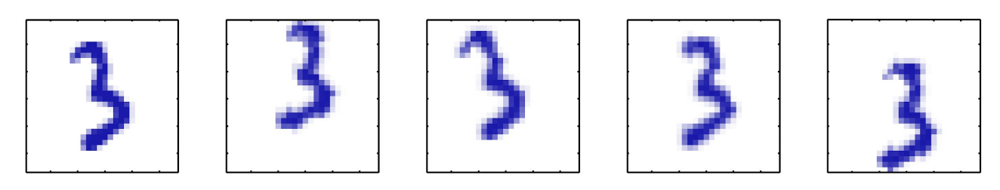

# PCA

Idea: high-dim Dataset 可能是 embedded in low-dim manifolds 的.

比如: image of 

- The data is $100 \times 100$-dimensional.
- But there are only three degrees of freedom, so it lies on a 3-dimensional subspace ( $x, y$, angle).
- (on a non-linear manifold, in this case)

kernel PCA: 是一种 black box. 因为我们需要尝试不同的 kernels, 看看哪个更加合适这个数据集，没有直接的法则告诉我们用什么 kernel.

通常，我们在处理一些 downstream tasks 比如 classification 和 regression 时使用 kernel PCA，and 我们 just try some popular kernels 看看它们是否 working. 

