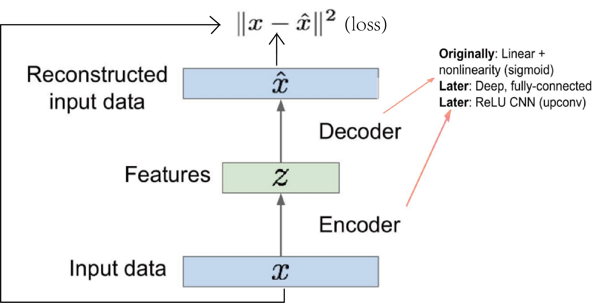

# Autoencoder and VAE

## Autoencoder

Autoencoder 是一个很简单的事情, 就是一个使用 deep learning 架构的 dimension reduction 器, 是一个结合了 deep learing 和 embedding method 的方法

即通过选取一些 dl 层, 把 $x$ 映射到低维 latent variable 然后再通过一些 dl 层映射回原来的维度，通过 $L^2$ loss 来学习这两个映射.

eg:

eg:

### denoising autoencoder

可想而知, autoencoder 需要大量的数据 (因为要 dl), 并且为了学习到 representations, 又需要大量参数.

参数多于数据时, autoencoder 会 overfit.

即便参数量合理, autoencoder 也有一个问题, 就是会 memorize training data too closely, 导致在 unseen data 上不能很好地泛化.

有一个针对这个问题的 AE 架构是: DAE (denoising AE)

它加入了 isotropic 的 Gaussian noise 以及 binary masking noise.

DAE 是比较合理的 AE 架构. 通常作为 DNN 的 building blocks.

## VAE

variational AE 是一种基于 AE 的 generative model.

它通过对 AE 使用 probabilistic modeling, 使得我们可以生成 data. (note: AE 原本的作用是 reconstructing data, VAE 更进阶)
$$
\begin{aligned} & \log p_\theta\left(x^{(i)}\right)=\mathbf{E}_{z \sim q_\phi\left(z \mid x^{(i)}\right)}\left[\log p_\theta\left(x^{(i)}\right)\right] \quad\left(p_\theta\left(x^{(i)}\right) \text { Does not depend on } z\right) \\ &=\mathbf{E}_z\left[\log \frac{p_\theta\left(x^{(i)} \mid z\right) p_\theta(z)}{p_\theta\left(z \mid x^{(i)}\right)}\right] \quad(\text { Bayes' Rule) } \\ &=\mathbf{E}_z\left[\log \frac{p_\theta\left(x^{(i)} \mid z\right) p_\theta(z)}{p_\theta\left(z \mid x^{(i)}\right)} \frac{q_\phi\left(z \mid x^{(i)}\right)}{q_\phi\left(z \mid x^{(i)}\right)}\right] \quad(\text { Multiply by constant) } \\ &=\underbrace{\mathbf{E}_z\left[\log p_\theta\left(x^{(i)} \mid z\right)\right]-\mathbf{E}_z\left[\log \frac{q_\phi\left(z \mid x^{(i)}\right)}{p_\theta(z)}\right]+\mathbf{E}_z\left[\log \frac{q_\phi\left(z \mid x^{(i)}\right)}{p_\theta\left(z \mid x^{(i)}\right)}\right] \quad \text { (Logarithms) }} \\ &=\underbrace{\mathbf{E}_z\left[\log p_\theta\left(x^{(i)} \mid z\right)\right]-D_{K L}\left(q_\phi\left(z \mid x^{(i)}\right) \| p_\theta(z)\right)}_{\text {Tractable ELBO, we can take grad and optimize since $p_\theta, $ KL term both diffble}}+\underbrace{D_{K L}\left(q_\phi\left(z \mid x^{(i)}\right) \| p_\theta\left(z \mid x^{(i)}\right)\right)}_{\geq 0}\end{aligned}
$$

从而我们得到了 ELBO:
$$
\mathcal{L} (x^{(i)},\theta, \phi) : =\mathbf{E}_z\left[\log p_\theta\left(x^{(i)} \mid z\right)\right]-D_{K L}\left(q_\phi\left(z \mid x^{(i)}\right) \| p_\theta(z)\right)
$$
s.t. 
$$
\log p_\theta\left(x^{(i)}\right) \geq \mathcal{L}\left(x^{(i)}, \theta, \phi\right)
$$

我们的 training 即优化:
$$
\theta^*, \phi^*=\arg \max _{\theta, \phi} \sum_{i=1}^N \mathcal{L}\left(x^{(i)}, \theta, \phi\right)
$$

### training VAE

