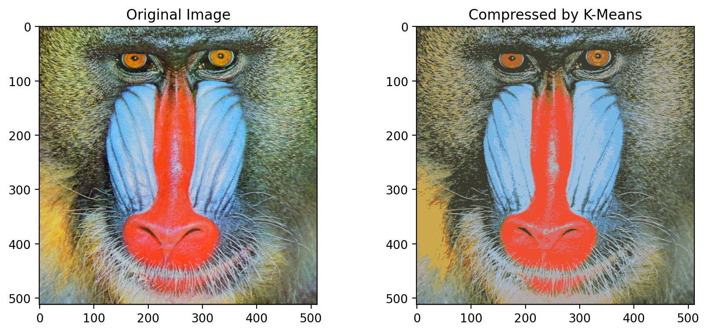
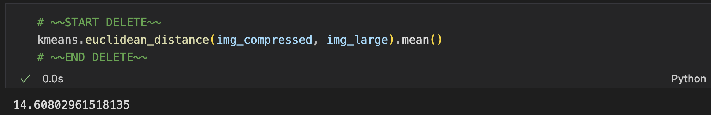
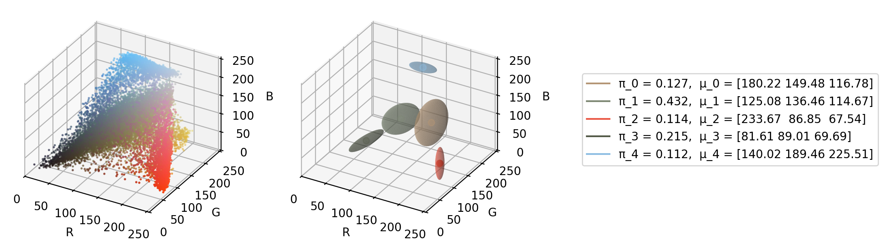
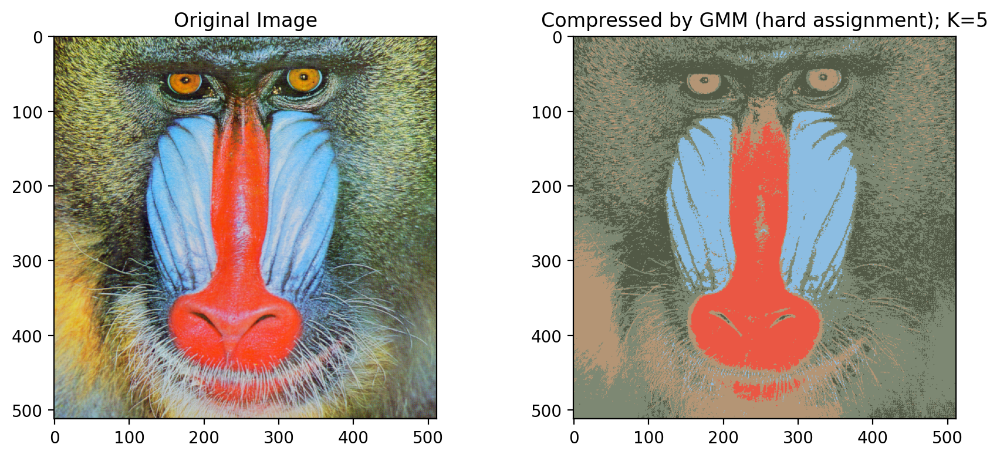
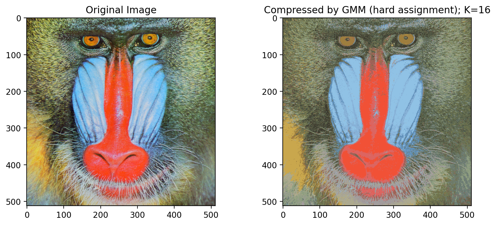

# 1. [25 points] K-means and GMM for Image Compression

In this problem: We will apply K-means and Gaussian Mixture Models (GMM) to lossy image compression, by reducing the number of colors used in the image.

input image files: 

1. `mandrill-large.tiff`, $512 \times 512 = 262144$ pixels size, 24-bit color ($3\times 8$ bits color channels, 8 bits represent 0~255, RGB colors). 

   So the size of each picture is $262144 \times 3$ B

2.  `mandrill-small.tiff`: $128 \times 128$ pixels version of `mandrill-large.tiff`. 

## 1.1 K-means 

### (a) (auto) implement k-means

work on `keans_gmm.ipynb` 和 `kmean.py`

Treat every pixel as $(r,g,b)\in \mathbb{R}^3$, implement and run k-means with 16 clusters, on `mandrill-small.tiff`, running 50 updates steps.

Initial centriods is in `initial_centrids` , so the result is deterministic.

We will implement a general version of K-means algorithm in `kmeans.train_kmeans()`, which will be graded with the provided sample data and some random data. In order to get full points, your implementation should be efficient and fast enough (otherwise you will get only partial points).

**Hint:** You may use `sklearn.metrics.pairwise_distances` function to **compute the distance** between centroids and data points, although it would not be difficult to implement this function (in a vectorized version) on your own.

### (b) test on `mandrill-large.tiff`

After training, we test on `mandrill-large.tiff`, replace $(r,g,b)$ of every pixel with the value of the closest cluster centroid.

Attach the plots original and compressed images side-by-side to the write-up. (Note: you should have reasonable image quality/resolution to make the difference discernible). 

Also, measure and write down the **mean pixel error** between the original and compressed image.

> **Sol**: 
>
> Plots as below
>
> 
>
> **mean pixel error** as below:
>
> 

### (c) explain: what factor have we compressed

If we represent the image with these reduced 16 colors, by (approximately) what factor have we compressed the image (in terms of bits used to represent pixels) in terms of the data size? Include an explanation of why.

> **Sol:**
>
> Originally we have $256^3$ possible number of $(r,g,b)$ colors to represent, taking over $3 \log _2 256 =512 8 \times 3 = 24$ Bits, for one pixel.
>
> And now we have $16$ colors, taking over $\log_2 16 = 4$ bits, for one pixel.
>
> Storing the information of the $16$ colors as basis, takes over $16 \times 24 = 384$ bits, (this amount is quite little compared to the size of an image.)
>
> Thus the factor of compression is approximately:
> $$
> = \frac{24 \times 512^2}{ 4 \times 512^2 + 384} \approx 6
> $$

------

## 1.2 Gaussian Mixtures

现在让我们使用高斯混合模型（Gaussian Mixtures，带完整协方差矩阵）来重复前面的图像压缩任务，这次将聚类数设置为 $K = 5$，

### (d) implement the EM algorithm for GMM

(10 pts) (Autograder) Work on the notebook `kmeans_gmm.ipynb` to implement the EM algorithm for GMM. You will need to implement gmm. train_gmm() to train a GMM model, which will be graded with the provided sample data and some random data. In order to get full points, your implementation should be efficient and fast enough (otherwise you will get only partial points).

[Hint 1: You may use `scipy.stats.multivariate_normal()` to compute the log-likelihood of the data.] 

[Hint 2: You may use `scipy.special.logsumexp()` when computing $\gamma\left(z_{n k}\right)$. You would need trick this because division by small probabilities can become computationally unstable when the likelihood values are too small. In practice, it is recommended to represent (possibly small) probabilities $\mathcal{N}\left(\mathbf{x}^{(n)} \mid \boldsymbol{\mu}_k, \boldsymbol{\Sigma}_k\right)$ with log-likelihood. Note that
$$
N(x^{(n)} \mid \mu_k, \Sigma_k) = \exp[\log N(x^{(n)} \mid \mu_k, \Sigma_k)]  \notag
$$
 ]
Do not use (and you don't need use) any other scipy or scikit-learn APIs.

>**E-step** (compute responsibilities):
>
>For each point $ x_n $, and cluster $ k $:
>$$
>\gamma(z_{nk}) = \frac{\pi_k \cdot \mathcal{N}(x_n \mid \mu_k, \Sigma_k)}{\sum_{j=1}^K \pi_j \cdot \mathcal{N}(x_n \mid \mu_j, \Sigma_j)} \notag
>$$
>
>Use **log-space trick**:
>
>- compute `log p(x_n | k)` using `scipy.stats.multivariate_normal.logpdf`
>- then compute log-sum-exp over $ k $for normalization (using `scipy.special.logsumexp`)
>- exponentiate to get $ \gamma(z_{nk})$
>
>
>
>**M-step** (update parameters):
>
>Let $ N_k = \sum_n \gamma(z_{nk}) $
>
>- $ \pi_k = \frac{N_k}{N} $
>- $ \mu_k = \frac{1}{N_k} \sum_n \gamma(z_{nk}) x_n $
>- $ \Sigma_k = \frac{1}{N_k} \sum_n \gamma(z_{nk}) (x_n - \mu_k)(x_n - \mu_k)^T $
>

### (e) train GMM on ``mandrill-small.tiff`` image

(3 points) Train GMM on `mandrill-small.tiff` using $K = 5$. Provided initial parameters:

- initial mean（`initial_mu`）
- covariance matrices（`initial_sigma`）
- prior distribution of latent cluster（`initial_pi`）

report:

- log-likelihood of training data after running 50 EM steps
- Parameters $\{(\pi_k, \mu_k) \mid k = 1, ..., 5\}$

You do not need to write down $\Sigma_k$. You can choose either write down the values, or attach visualization plots.

> log-likelihood of training data after running 50 EM steps:
>
> 
>
> Parameter values:
>
> 
>
> 
>
> Plots: 
>
> 

### (f) test on ``mandrill-large.tiff`` image

(2 pts) After training on the train `image mandrill-small.tiff`, read the test image `mandrill-large.tiff` and replace each pixel's $(r, g, b)$ values with the value of latent cluster mean, where we use the MAP (Maximum A Posteriori) estimation for the latent cluster-assignment variable for each pixel.

Use the notebook's plotting code to display the original and compressed images side-by-side, and attach the plots to the write-up. (Note: you should have reasonable image quality/resolution to make the difference discernable). 

Also, measure and write down the mean pixel error between the original and compressed image.

> **Sol:** 
>
> Plot:
>
> 
>
> mean pixel error between the original and compressed image:
>
> 
>
> Plot for $K=16$:
>
> 

# 2. [20 分] EM for GDA with missing labels

In this problem, we will work on using the EM algorithm for Gaussian Discrimination Analysis (GDA) with missing labels.

Suppose that you are given dataset where some portion of the data is labeled and the other portion is unlabeled. We want to learn a generative model over this partially-labeled dataset. ${ }^2$ 

> This type of learning formalism is called semi-supervised learning, which is a broad research field in machine learning.

In particular, suppose there are $l$ examples with labels and $u$ examples without labels, i.e., $\mathcal{D}=\left\{\left(\mathbf{x}^{(1)}, y^{(1)}\right), \cdots,\left(\mathbf{x}^{(l)}, y^{(l)}\right), \mathbf{x}^{(l+1)}, \cdots, \mathbf{x}^{(l+u)}\right\}.$

We also make have the following assumptions:
- The data is real-valued and $M$-dimensional, i.e., $\mathbf{x} \in \mathbb{R}^M$
- The label $y$ can take one of $\{0,1\}$ (i.e., binary classification problem).
- We model the data following the same assumption as in Gaussian Discrimination Analysis, i.e.,

$$
\begin{aligned}
P(\mathbf{x}, y) & =P(y) P(\mathbf{x} \mid y) \\
P(y=j) & = \begin{cases}\phi & \text { if } j=1 \\
1-\phi & \text { if } j=0\end{cases} \\
P(\mathbf{x} \mid y=j) & =\mathcal{N}\left(\mathbf{x} ; \boldsymbol{\mu}_j, \boldsymbol{\Sigma}_j\right), j=0 \text { or } 1
\end{aligned}	\tag{1,2,3}
$$

where $\phi$ is a Bernoulli probability (i.e., $0 \leq \phi \leq 1$ ), and $\boldsymbol{\mu}_j$ and $\boldsymbol{\Sigma}_j$ are class-specific mean and covariance, respectively. For notational convenience, you can use $\phi_1=\phi$ and $\phi_0=1-\phi$.

Further, $\mathcal{N}\left(x ; \boldsymbol{\mu}_j, \boldsymbol{\Sigma}_j\right)$ is the multivariate Gaussian distribution which is defined as:

$$
p\left(\mathbf{x} \mid y=j ; \boldsymbol{\mu}_j, \boldsymbol{\Sigma}_j\right)=\mathcal{N}\left(x ; \boldsymbol{\mu}_j, \boldsymbol{\Sigma}_j\right)=\frac{1}{(2 \pi)^{\frac{M}{2}}\left|\boldsymbol{\Sigma}_j\right|^{\frac{1}{2}}} \exp \left(-\frac{1}{2}\left(\mathbf{x}-\boldsymbol{\mu}_j\right)^{\top} \boldsymbol{\Sigma}_j^{-1}\left(\mathbf{x}-\boldsymbol{\mu}_j\right)\right) 	\tag{4}
$$

Since we have unlabeled data, our goal is to maximize the following hybrid objective function:

$$
\mathcal{J}=\sum_{i=1}^l \log p\left(\mathbf{x}^{(i)}, y^{(i)}\right)+\lambda \sum_{i=l+1}^{l+u} \log p\left(\mathbf{x}^{(i)}\right) 	\tag{5}
$$

where $\lambda$ is a hyperparameter that controls the weight of labeled and unlabeld data.
As we don't explicitly model the distribution $p(\mathbf{x})$, we use the law of total probability and rewrite the object function as:
$$
\mathcal{J}=\sum_{i=1}^l \log p\left(\mathbf{x}^{(i)}, y^{(i)}\right)+\lambda \sum_{i=l+1}^{l+u} \log \sum_{j \in\{0,1\}} p\left(\mathbf{x}^{(i)}, y^{(i)}=j\right)	\tag{6}
$$

This way the unlabeled training examples is using the same models as the labeled samples. Now we will be using **EM algorithm** to optimize this objective function.

**(Hint) You can use the fact:**
$$
p\left(\mathbf{x}^{(i)}, y^{(i)}\right)=\prod_{j \in\{0,1\}}\left[\frac{\phi_j}{(2 \pi)^{\frac{M}{2}}\left|\boldsymbol{\Sigma}_j\right|^{\frac{1}{2}}} \exp \left(-\frac{1}{2}\left(\mathbf{x}^{(i)}-\boldsymbol{\mu}_j\right)^{\top} \boldsymbol{\Sigma}_j^{-1}\left(\mathbf{x}^{(i)}-\boldsymbol{\mu}_j\right)\right)\right]^{\mathbb{I}\left[y^{(i)}=j\right]}	\tag{7}
$$

### (a) lower bound derivation [3 points]

(3 points) Derive the variational lower bound $\mathcal{L}(\boldsymbol{\mu}, \boldsymbol{\Sigma}, \phi)$ of the objective $\mathcal{J}$. Specifically, show that any arbitrary probability distribution $q_i\left(y^{(i)}=j\right)$, the lower bound of the objective function can be written as:
$$
\mathcal{L}(\mu, \Sigma, \phi) = \sum_{i=1}^l \log p(x^{(i)}, y^{(i)}) + \lambda \sum_{i=l+1}^{l+u} \sum_{j \in \{0,1\}} Q_{ij} \log \frac{p(x^{(i)}, y^{(i)} = j)}{Q_{ij}} \tag{8}
$$

where $Q_{i j} \triangleq q_i\left(y^{(i)}=j\right)$ is a simplified shorthand notation. 

[**Hint: you may want to use Jensen's Inequality.**]

### (b) E-step 

[2 points] Write down the E-step. Specifically, define the distribution $Q_{ij} = q_i(y^{(i)} = j)$

### (c) M-step for $\mu_k$ 

[6 points] (c) Derive the M-step update rule for $\boldsymbol{\mu}_k$ where $k=0$ or 1 , while holding $Q_i$ 's (which you obtained in (a)) fixed. Also, explain in words (English) what intuitively $\boldsymbol{\mu}_k$ looks like in terms of $\mathbf{x}^{(i)}$ 's (each of labeled and unlabeled) and pseudo-counts.

### (d) M-step for $\phi$ 

[6 points] [6 points] Derive the M-step update rule for $\phi \in \mathbb{R}$, while holding $Q_i$ 's (which you obtained in (a)) fixed. Also, explain in words (English) what intuitively $\phi$ looks like in terms of $\mathbf{x}^{(i)}$ 's (each of labeled and unlabeled) and pseudo-counts.

### (e) M-step for $\Sigma_k$

[3 points] Finally, let's think about the M-step update rule for $\boldsymbol{\Sigma}_k$ where $k=0$ or 1 . Since we know the derivation is very similar to the case of GDA (and GMM M-step), we do not require you to repeat the similar the step as you have already worked on other two M-step update rules. Write down the M-step update rule for $\boldsymbol{\Sigma}_k$, without derivation, based on your guess and the analogy we have seen. Also, explain in words (English) what intuitively $\boldsymbol{\Sigma}_k$ looks like in terms of $\mathbf{x}^{(i)}$ 's (each of labeled and unlabeled) and pseudo-counts.

# 3. [20 points] PCA and eigenfaces

### (a) derive PCA from "minimizing squared error" viewpoint

(a) ( 8 pts ) In lecture, we derived PCA from the "maximizing variance" viewpoint. In this problem, we will take the "minimizing squared error" viewpoint. Let $K \in\{1, \ldots, D\}$ be arbitrary and let $\mathbf{x}^{(n)} \in \mathbb{R}^D$. Let $\mathcal{U}=\left\{\mathbf{U}=\left[\mathbf{u}_1 \cdots \mathbf{u}_K\right] \in \mathbb{R}^{D \times K} \mid\left\{\mathbf{u}_i\right\}_{i=1}^K\right.$ 's are orthonormal vectors $\}$, where $\mathbf{u}_i$ is the $i$-th column vector of $\mathbf{U}$.
Let's define the objective function for minimizing the distortion error:
$$
\mathcal{J}=\frac{1}{N} \sum_{n=1}^N\left\|\mathbf{x}^{(n)}-\mathbf{U} \mathbf{U}^{\top} \mathbf{x}^{(n)}\right\|^2=\frac{1}{N} \sum_{n=1}^N\left\|\mathbf{x}^{(n)}-\sum_{i=1}^K \mathbf{u}_i \mathbf{u}_i^{\top} \mathbf{x}^{(n)}\right\|^2   \tag{9}
$$

Here, $\mathbf{U U}^{\top} \mathbf{x}^{(n)}$ is called a projection of $\mathbf{x}^{(n)}$ into the subspace spanned by $\mathbf{u}_i$ 's, and we can denote the projection $\widetilde{\mathbf{x}}^{(n)}=\mathbf{U} \mathbf{U}^{\top} \mathbf{x}^{(n)}$ as in the lecture.
Specifically, show that:
$$
\mathcal{J}=\sum_{i=1}^D \lambda_i-\sum_{i=1}^K \mathbf{u}_i^{\top} \mathbf{S} \mathbf{u}_i	\tag{10}
$$

where $\mathbf{S}$ is the data covariance matrix $\mathbf{S}=\frac{1}{N} \sum_{n=1}^N\left(\mathbf{x}^{(n)}-\overline{\mathbf{x}}\right)\left(\mathbf{x}^{(n)}-\overline{\mathbf{x}}\right)^{\top}, \overline{\mathbf{x}}$ is the data mean vector, and $\lambda_1 \geq \ldots \geq \lambda_d$ are the (ordered) eigenvalues of $\mathbf{S}$. Since the first term is a constant, the above equation implies that minimizing the squared error after projection is equivalent to maximizing the variance, as we have shown in the lecture slides.

With further simplification, show that the minimum distortion error corresponds to the sum of the $D-K$ smallest eigenvalues of $\mathbf{S}$, i.e.,
$$
\min _{\mathbf{U} \in \mathcal{U}} \mathcal{J}=\sum_{k=K+1}^D \lambda_k	\tag{11}
$$
and that the $\mathbf{u}_i$ 's that minimize $\mathcal{J}$ are indeed the $K$ eigenvectors of $\mathbf{S}$ corresponding to the (ordered) eigenvalues $\left\{\lambda_i\right\}_{k=1}^K$. After showing Eq.(10), it is okay to use the fact (without proof) that the optimal solution $\mathbf{u}_i$ 's that maximize $\sum_{i=1}^K \mathbf{u}_i^{\top} \mathbf{S} \mathbf{u}_i$ is to pick the top- $K$ eigenvectors of $\mathbf{S}$ (i.e., $\mathbf{u}_1, \ldots, \mathbf{u}_K$ corresponding to the largest $K$ eigenvalues of $\mathbf{S}$ in descending order), as we already have seen in the lecture.

[Hint 1: You may assume that the data is zero-centered, i.e., $\overline{\mathbf{x}}=\frac{1}{N} \sum_{n=1}^N \mathbf{x}^{(n)}=\mathbf{0} \in \mathbb{R}^D$ without loss of generality. Be sure to mention it if you make such an assumption.]

[Hint 2: You can rewrite the objective as $\mathcal{J}=\frac{1}{N}\left\|\mathbf{X}-\mathbf{U U}^{\top} \mathbf{X}\right\|_F^2$, where $\mathbf{X} \in \mathbb{R}^{D \times N}$ is the matrix that stacks all the data points $\left\{\mathbf{x}^{(n)}\right\}_{n=1}^N$ as column vectors, and the $\|\cdot\|_F$ denotes the Frobenious norm:
$$
\|A\|_F=\sqrt{\sum_{i, j}\left(A_{i j}\right)^2}	\tag{12}
$$

and use the fact $\|A\|_F^2=\operatorname{tr}\left(A^{\top} A\right)$ and $\operatorname{tr}(\mathbf{S})=\sum_i \lambda_i$. Also note that there are many possible approaches for proving the claim, so you do not have to use this fact if you take a different approach.]

Now, you will apply PCA to face images. The principal components (eigenvectors) of the face images are called eigenfaces.

> **Proof**:
>
> First, **WLOG, we can assume that the data is zero-centered**, i.e.,
>
> $$
> \overline{{x}}=\frac{1}{N} \sum_{n=1}^N {x}^{(n)}=\mathbf{0} \notag
> $$
>
> This is because the directions of maximum variance depend on how the data is spread, not on where it's located; if the data is not zero-centered, shifting all data points by a constant vector (i.e. the mean) doesn't change the shape of the data. More concretely, even if the data is not zero-centered, the normalized data which is used for the data covariance matrix, will still be zro-centered:
> $$
> {S}=\frac{1}{N} \sum_{n=1}^N\left({x}^{(n)}-\overline{{x}}\right)\left({x}^{(n)}-\overline{{x}}\right)^T\notag
> $$
>
> Since we are projecting each data point ${x}^{(n)} \in \mathbb{R}^D$ onto a $K$-dimensional subspace spanned by orthonormal basis vectors $\mathbf{u}_1, \ldots, \mathbf{u}_K$. The projection of ${x}^{(n)}$ is:
> $$
> \widetilde{{x}}^{(n)}={U}{U}^T {x}^{(n)}	\notag
> $$
>
>
> Then the projection error for each data point is:
>
> $$
> \left\|{x}^{(n)} - {U U}^T {x}^{(n)}\right\|^2 \notag
> $$
>
>
> So the total average error is:
>
> $$
> \mathcal{J}=\frac{1}{N} \sum_{n=1}^N\left\|{x}^{(n)}-{U} {U}^T {x}^{(n)}\right\|^2	\notag
> $$
> Define the data matrix $X=\left[x^{(1)}, \ldots, x^{(N)}\right] \in \mathbb{R}^{D \times N}$. Then by def of **Frobenius norm** we have:
>
> $$
> \mathcal{J}=\frac{1}{N}\left\|X-U U^T X\right\|_F^2 \notag
> $$
>
>
> Using the identity:
>
> $$
> \|A\|_F^2=\operatorname{tr}\left(A^T A\right)\notag
> $$
>
>
> We have:
>
> $$
> \mathcal{J}=\frac{1}{N} \operatorname{tr}\left[\left(X-U U^T X\right)^{\top}\left(X-U U^T X\right)\right] \notag
> $$
>
>
> Let's denote $P:=U U^T$ as the projection matrix. Then:
>
> $$
> \begin{aligned}
> \mathcal{J} & =\frac{1}{N} \operatorname{tr}\left[((I-P) X)^T(I-P) X\right] \\
> & =\frac{1}{N} \operatorname{tr}\left[X^T(I-P)^T(I-P) X\right]
> \end{aligned} \notag
> $$
>
>
> Note that (as the property of projection matrix) we have:
>
> $$
> P^T=\left(U U^T\right)^T=U U^T=P \quad \text { and } \quad P^2=\left(U U^T U U^T\right)=U U^T=P \notag
> $$
> Thus we also have:
>
> $$
> (I-P)^T=I^T-P^T=I-P \notag
> $$
>
> so
>
> $$
> (I-P)^T(I-P)=I-2 P+P^2=I-P \notag
> $$
>
>
> This simplifies $\mathcal{J}$ to
>
> $$
> \begin{aligned}
> \mathcal{J}=\frac{1}{N} \operatorname{tr}\left[X^T(I-P) X\right] & =\frac{1}{N} \operatorname{tr}\left[X^T X-X^T P X\right] \\
> & =\frac{1}{N}\left(\operatorname{tr}\left(X^T X\right)-\operatorname{tr}\left(X^T P X\right)\right) \quad \text { by linearity of trace } \\
> & =\frac{1}{N}\left(\operatorname{tr}\left(X^T X\right)-\operatorname{tr}\left(X^T U U^T X\right)\right) \\
> & =\frac{1}{N}\left(\operatorname{tr}\left(X^T X\right)-\operatorname{tr}\left(U^T X X^T U\right)\right) \quad \text { since } \operatorname{tr}(A B)=\operatorname{tr}(B A
> \end{aligned} \notag
> $$
>
>
> Define the data covariance matrix:
>
> $$
> S:=\frac{1}{N} \sum_{n=1}^N\left(x^{(n)}-\bar{x}\right)\left(x^{(n)}-\bar{x}\right)^T=\frac{1}{N} X X^T \quad \text { (since data is zero-centered) }  \notag
> $$
> Then since $\operatorname{tr}\left(X^T X\right)=\operatorname{tr}\left(X X^T\right)$, we have:
>
> $$
> \mathcal{J}=\operatorname{tr}(S)-\operatorname{tr}\left(U^T S U\right)\notag
> $$
>
>
> Now, trace of a symmetric matrix equals the sum of its eigenvalues, so denoting $\lambda_1 \geq \cdots \geq \lambda_D$ as the eigenvalues of $S$, we have $\operatorname{tr}(S)=\sum_{i=1}^D \lambda_i$; and we know that $\operatorname{tr}\left(U^T S U\right)=\sum_{i=1}^K \mathbf{u}_i^T S \mathbf{u}_i$, thus we simplify $\mathcal{J}$ to be:
>
> $$
> \mathcal{J}=\sum_{i=1}^D \lambda_i-\sum_{i=1}^K \mathbf{u}_i^T S \mathbf{u}_i\notag
> $$
>
> To minimize $\mathcal{J}$ is to maximize $\sum_{i=1}^K \mathbf{u}_i^T S \mathbf{u}_i$ over $\left\{\mathbf{u}_i\right\}$.
> Now we use the fact (from spectral theorem) that, the optimal solution $\mathbf{u}_i$ 's to maximize $\sum_{i=1}^K \mathbf{u}_i^T S \mathbf{u}_i$ is to pick the top-$K$ eigenvectors of $S$. Note each $\mathbf{u}_i$ is unit, to make them orthonormal (thus $\mathbf{u}_i ^T \mathbf{u}_i = 1$ for each $i$)
>
> So we have:
> $$
> S \mathbf{u}_i = \lambda_i  \mathbf{u}_i  \implies \mathbf{u}_i ^T S \mathbf{u}_i = \lambda_i \mathbf{u}_i ^T  \mathbf{u}_i = \lambda_i
> $$
> This completes the proof that:
> $$
> \mathcal{J}_{\min }=\sum_{i=1}^D \lambda_i-\sum_{i=1}^K \lambda_i=\sum_{k=K+1}^D \lambda_k \notag
> $$

### (b) implement PCA

(4 pts) (Autograder) Work on the provided code pca.ipynb and pca.py to implement PCA. Your code will be graded by the correctness on the sample face dataset and some other randomly-generated dataset.

### (c) perform PCA on face images

 (3 pts) By regarding each image as a vector in a high dimensional space, perform PCA on the face images (sort the eigenvalues in descending order). In the write-up, report the eigenvalues corresponding to the first 10 principal components, and plot all the eigenvalues (in sorted order) where x -axis is the index of corresponding principal components and $y$-axis is the eigenvalue. Use $\log$ scale for the $y$-axis.

### (d) plot eigenfaces

 (3 pts) Plot and attach to your write-up: a $2 \times 5$ array of subplots showing the first 10 principal components/eigenvectors ("eigenfaces") (sorted according to the descending eigenvalues) as images, treating the mean of images as the first principal component. Comment on what facial or lighting variations some of the different principal components are capturing (Note: you don't need to comment for all the images. Just pick a few that capture some salient aspects of image).

### (e) calculate: how many principle components are needed to represent 95% total variance

(2 pts) Eigenfaces are a set of bases for all the images in the dataset (every image can be represented as a linear combination of these eigenfaces). Suppose we have $L$ eigenfaces in total. Then we can use the $L$ coefficients (of the bases, i.e. the eigenfaces) to represent an image. Moreover, we can use the first $K(<L)$ eigenfaces to reconstruct the face image approximately (correspondingly use $K$ coefficients to represent the image). In this case, we reduce the dimension of the representation of images from $L$ to $K$. To determine the proper $K$ to use, we will check the percentage of variance that has been preserved (recall that the basic idea of PCA is preserving variance). Specifically, we define total variance
$$
v(K)=\sum_{i=1}^K \lambda_i \notag
$$

where $1 \leq K<L$ and $\lambda_1 \geq \lambda_2 \geq \ldots \geq \lambda_L$ are eigenvalues. Then the percentage of total variance is

$$
\frac{v(K)}{v(L)} \notag
$$

How many principal components are needed to represent $95 \%$ of the total variance? How about $99 \%$ ? What is the percentage of reduction in dimension in each case?

# 4. [10 points] Independent Component Analysis

In this problem, you will implement maximum-likelihood Independent Component Analysis (ICA) for blind audio separation. As we learned in the lecture, the maximum-likelihood ICA minimizes the following loss:
$$
\ell(W)=\sum_{i=1}^N\left(\sum_{j=1}^m \log g^{\prime}\left(w_j^{\top} x^{(i)}\right)+\log |W|\right) \tag{13}
$$

where $N$ is the number of time steps, $m$ is the number of independent sources, $W$ is the transformation matrix representing a concatenation of $w_j$ 's, and $g(s)=1 /\left(1+e^{-s}\right)$ is the sigmoid function. This link has some nice demos of blind audio separation: https://cnl.salk.edu/~tewon/Blind/blind_audio.html.

We provided the starter code `ica.py` and the `data ica_data.dat`, which contains mixed sound signals from multiple microphones. Run the provided notebook `ica.ipynb` to load the data and run your ICA implementation from `ica.py`.

### (a) implement ICA

 (6 points) (Autograder) Implement ICA by filling in the ica.py file.

### (b) report $W$

(4 points) Run your ICA implementation in the ica.ipynb notebook. To make sure your code is correct, you should listen to the resulting unmixed sources. (Some overlap in the sources may be present, but the different sources should be pretty clearly separated.)
Report the $W$ matrix you found and submit the notebook ica.ipynb (along with ica.py) to the autograder. Make sure the audio tracks are audible in the notebook before submitting. You do not need to submit your unmixed sound files (`ica_unmixed_track_X.wav`).

# 5. [25 points] Conditional Variational Autoencoders

In this problem, you will implement a conditional variational autoencoder (CVAE) from [1] and train it on the MNIST dataset.

### (a) derive variational lower bound of a conditional VAE

[5 points] Derive the variational lower bound of a conditional variational autoencoder. Show that:
$$
\begin{aligned}
\log p_\theta(\mathbf{x} \mid \mathbf{y}) & \geq \mathcal{L}(\theta, \phi ; \mathbf{x}, \mathbf{y}) \\
& =\mathbb{E}_{q_\phi(\mathbf{z} \mid \mathbf{x}, \mathbf{y})}\left[\log p_\theta(\mathbf{x} \mid \mathbf{z}, \mathbf{y})\right]-D_{K L}\left(q_\phi(\mathbf{z} \mid \mathbf{x}, \mathbf{y}) \| p_\theta(\mathbf{z} \mid \mathbf{y})\right)	
\end{aligned}\tag{14}
$$

where $\mathbf{x}$ is a binary vector of dimension $d, \mathbf{y}$ is a one-hot vector of dimension $c$ defining a class, $\mathbf{z}$ is a vector of dimension $m$ sampled from the posterior distribution $q_\phi(\mathbf{z} \mid \mathbf{x}, \mathbf{y})$. The posterior distribution is modeled by a neural network of parameters $\phi$. The generative distribution $p_\theta(\mathbf{x} \mid \mathbf{y})$ is modeled by another neural network of parameters $\theta$. Similar to the VAE that we learned in the class, we assume the conditional independence on the componenets of $\mathbf{z}$ : i.e., $q_\phi(\mathbf{z} \mid \mathbf{x}, \mathbf{y})=\prod_{j=1}^m q_\phi\left(z_j \mid \mathbf{x}, \mathbf{y}\right)$, and $p_\theta(\mathbf{z} \mid \mathbf{y})=\prod_{j=1}^m p_\theta\left(z_j \mid \mathbf{y}\right)$.

### (b) Derive the analytical KL-divergence between two Gaussian distributions 

[8 points] Derive the analytical solution to the KL-divergence between two Gaussian distributions $D_{K L}\left(q_\phi(\mathbf{z} \mid \mathbf{x}, \mathbf{y}) \| p_\theta(\mathbf{z} \mid \mathbf{y})\right)$. Let us assume that $p_\theta(\mathbf{z} \mid \mathbf{y}) \sim \mathcal{N}(\mathbf{0}, \mathbf{I})$ and show that:
$$
D_{K L}\left(q_\phi(\mathbf{z} \mid \mathbf{x}, \mathbf{y}) \| p_\theta(\mathbf{z} \mid \mathbf{y})\right)=-\frac{1}{2} \sum_{j=1}^m\left(1+\log \left(\sigma_j^2\right)-\mu_j^2-\sigma_j^2\right)	\tag{15}
$$

where $\mu_j$ and $\sigma_j$ are the outputs of the neural network that estimates the parameters of the posterior distribution $q_\phi(\mathbf{z} \mid \mathbf{x}, \mathbf{y})$.
You can assume without proof that
$$
D_{K L}\left(q_\phi(\mathbf{z} \mid \mathbf{x}, \mathbf{y}) \| p_\theta(\mathbf{z} \mid \mathbf{y})\right)=\sum_{j=1}^m D_{K L}\left(q_\phi\left(z_j \mid \mathbf{x}, \mathbf{y}\right) \| p_\theta\left(z_j \mid \mathbf{y}\right)\right)	\tag{16}
$$

This is a consequence of conditional independence of the components of $\mathbf{z}$.

### (c) implement CVAE

[12 points] Fill in code for CVAE network as a nn.Module class called CVAE in the starter code cvae.py and the notebook cvae.ipynb:

- Implement the recognition_model function $q_\phi(\mathbf{z} \mid \mathbf{x}, \mathbf{y})$.
- Implement the generative_model function $p_\theta(\mathbf{x} \mid \mathbf{z}, \mathbf{y})$.
- Implement the forward function by inferring the Gaussian parameters using the recognition model, sampling a latent variable using the reparametrization trick and generating the data using the generative model.
- Implement the variational lowerbound loss_function $\mathcal{L}(\theta, \phi ; \mathbf{x}, \mathbf{y})$.
- Train the CVAE and visualize the generated image for each class (i.e., 10 images per class).
- Repeat the image generation 10 times with different random noise. In the write-up, attach and submit $10 \times 10$ array of images showing all the generated images, where the images in the same row are generated from the same random noise, and images in the same column are generated from the the same class label.
- The hyperparameters and training setups provided in the code should work well for learning a CVAE on the MNIST dataset, but please feel free to make any changes as needed and you think appropriate to make CVAE work. Please discuss (if any) there are some notable changes you have made.

If trained successfully, you should be able to sample images $\mathbf{x}$ that look like MNIST digits reflecting the given label $\mathbf{y}$, and the noise vector $\mathbf{z}$.
