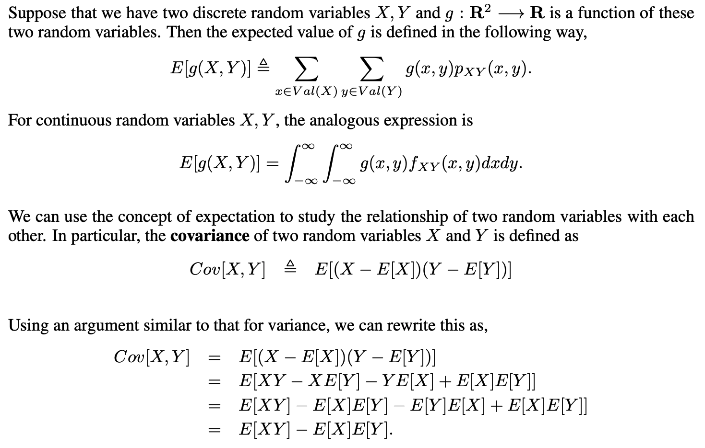
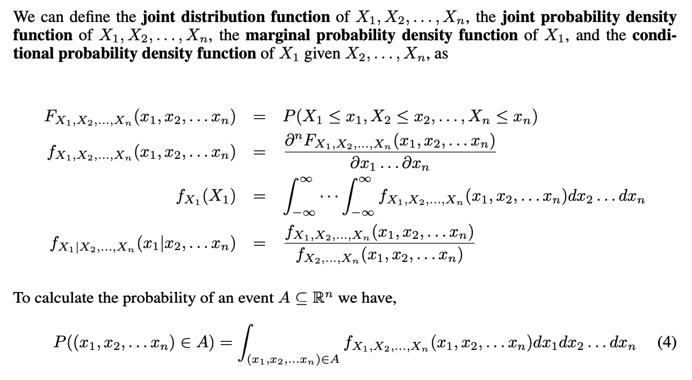
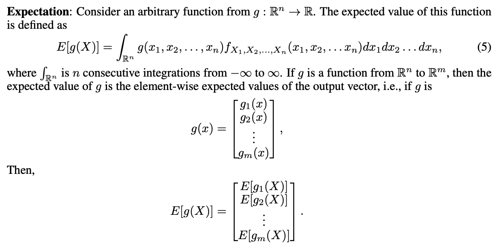
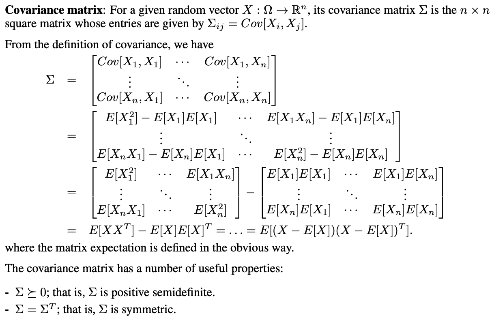

# Probability

Probability space 是一个 measurable space $(\Omega, \mathcal{F})$ with a measure $P$ s.t. $P(\Omega) = 1$.

我们把全集 $\Omega$ 叫做 **sample space**,  $\sigma$-algebra $\mathcal{F}$ 中的每个元素叫做一个 **event**, measure function $P$ 叫做 **probability measure.**

对于每个 event $A$ 的 probability measure $P(A)$, 我们把它叫做 event $A$ 的 probability.

额外定义: 对于事件 $A$, $B$, 我们把 $P(A|B) := P(A\cap B) / P(B)$ 叫做 $A|B$ 的 conditional probability

## random variable

给定一个 prob space，一个随机变量 $X$ 就是它上面的一个可测函数

$$
X: \Omega \to \mathbb{R}
$$
（recall 可测函数的定义即：对于任何实数 $a$，事件 $\{ \omega \in \Omega \mid X(\omega) \leq a \}$ 必须是 $\mathcal{F}$ 中的一个事件，
$$
P(X \leq a) = P(\{ \omega \in \Omega \mid X(\omega) \leq a \})
$$
这是一个概率值，受 **\(P\) 这个概率测度的约束**。

这是基本的定义，我们也有更加 generalized 的 Random variable:

### generalized random variable

genearlized 的 random vafriable $X$ on a probability space 不一定需要 map to 实数域，而是可以 map to 一个 general 的**Measurable Space**。例如 **向量空间、集合、拓扑空间，甚至是函数空间**

即：
$$
X: \Omega \to S
$$
其中 $S$ 可以是：

- **$\mathbb{R}$**：经典随机变量，如正态分布

- **离散集合**：如分类变量（红、绿、蓝）。

- **向量空间如 $\mathbb{R}^d$**：如多元正态分布。

  **例子：二维正态分布**
  $$
  X = \begin{bmatrix} X_1 \\ X_2 \end{bmatrix} \sim \mathcal{N}(\mu, \Sigma)
  $$
  其中 $\mu$ 是均值向量，$\Sigma$ 是协方差矩阵；向量值随机变量常见于机器学习、金融、物理建模。

- **矩阵空间**：如随机矩阵。

  如果 $X: \Omega \to \mathbb{R}^{m \times n}$，那么 $X$ 是一个**随机矩阵（Random Matrix）**。
   **例子：随机高斯矩阵**
  $$
  X \sim \mathcal{N}(0, I)
  $$
  表示 $X$ 的每个元素都是独立同分布（i.i.d.）的标准正态分布随机变量；随机矩阵广泛用于深度学习（神经网络权重）、统计物理、量子计算。

- **集合**：如随机过程的路径。

  例子：如果 $X: \Omega \to 2^S$（即取值为某个集合的子集），它是一个**随机集合（Random Set）**。
  目标检测中的 Bounding Box 在计算机视觉中，目标检测任务中的边界框（bounding box）可以视为一个随机集合：
  $$
  X(\omega) = \{(x_1, y_1), (x_2, y_2)\}
  $$
  其中 $(x_1, y_1)$ 和 $(x_2, y_2)$ 是矩形框的左上角和右下角坐标。

- **函数空间**：如随机过程。

  如果 $X: \Omega \to \mathcal{F}$，其中 $\mathcal{F}$ 是某个函数空间，那么 $X$ 是一个**随机过程（Stochastic Process）**，如：

  **例子：布朗运动**
  $$
  B_t(\omega) \sim \mathcal{N}(0, t)
  $$
  其中 $B_t$ 是一个取值为函数的随机变量，它在每个时间 $t$ 处都服从正态分布。

（我们本节课应该只考虑 real-valued 的随机变量，和 vector-valued 的？）

### **随机变量诱导的概率分布**

我们知道，**可测函数本身诱导了它映射到的另一测度空间上的一个概率测度：**

这里首先考虑因此，随机变量 $X$ 自身**诱导**了一个新的概率测度 $\mu_X$，定义在 $\mathbb{R}$ 上：
$$
\mu_X(B) = P(X^{-1}(B)) = P(\{\omega \in \Omega \mid X(\omega) \in B\})
$$
其中 $B$ 是 $\mathbb{R}$ 上的某个可测集合（例如，一个区间 \((a, b]\)）

这个函数表示的是: **$X$ 的值在范围在 $B$ 上的概率有多少大.** 因而它也叫做**随机变量 X 的 Probability Distribution**

这是一个在 $\mathbb{R}$ 作为概率空间上的概率函数.

总结:  随机变量 $X: \Omega \to S$ 在原空间上的概率测度 $P: \Omega \rightarrow [0,1]$ 下，诱导出了可测空间 $S$ 上的概率测度 $\mu_X: S\rightarrow [0,1]$, 其满足:
$$
\mu_X(B) = P(X^{-1}(B)) = P(\{\omega \in \Omega \mid X(\omega) \in B\})
$$
我们把它简写为:
$$
P(X \in B)
$$
所以当我们看到这个符号时，我们就知道它是**随机变量 $X$ induce 出的 $S$ 上的概率测度.**

（**于是特别地，当 $X$ 是一个 real-valued 的随机变量时，$\mu_X: \mathbb{R} \rightarrow [0,1]$**）

例如：**掷骰子**

- 样本空间：$\Omega = \{1, 2, 3, 4, 5, 6\}$
- 定义随机变量：$X(\omega) = \omega$，表示把事件 $\{w\}$ （扔出点数为 $w$）映射到它的点数值
- 设骰子是公平的，概率测度是：
  $$
  P(\{\omega\}) = \frac{1}{6}, \quad \forall \omega \in \{1,2,3,4,5,6\}
  $$
- 那么，随机变量 $X$ 的概率分布由**概率质量函数（PMF, Probability Mass Function）** 给出：
  $$
  P(X = x) = \frac{1}{6}, \quad x \in \{1,2,3,4,5,6\}
  $$

在这个例子中，随机变量 $X$ 通过 **$P$ 诱导了一个新的概率测度 $\mu_X$**，它在 $\mathbb{R}$ 上的定义是：
$$
\mu_X(B) = P(X^{-1}(B)) = \sum_{x \in B} P(X = x)
$$
其中 $B$ 是 $\mathbb{R}$ 的一个子集（例如 $\{2,3,4\}$）。

## distribution functions

### CDF

给定一个测度空间，以及其上的一个 **real-valued 随机变量** $X$，它的 cumulative distribution function 被定义为 
$$
F_X (x) := P(X\leq x)
$$
注意，这是一个从 $\mathbb{R} \rightarrow [0,1]$ 的递增函数，在正无穷处的极限为 1. 

尽管 $X:\Omega \rightarrow \mathbb{R}$, 我们知道它不一定取完 $\mathbb{R}$ 上的值。我们把情况主要区分为: （这里不严格，因为我也没严格学过

1. CDF 的**取值集合 $S$ 为 finite 或 countable 个值**，那么称它为**离散型随机变量**
2. CDF 取值集合 $S$ **uncountable**，但是是(a.e.) **continuous function**，那么称它是**连续型随机变量。**
3. CDF 不a.e.连续，那么没有特殊名称

### PMF and PDF

对于离散型随机变量，我们可以定义:
$$
f_X(x) = P(X = x)
$$
称为 **probability mass function**

1. 它在 $S$ 上上 sum 为 1

2. 满足：

$$
P(X \in A) = \sum_{x\in A} f_X(x)
$$

对于连续性随机变量，我们没法定义 probability mass function, 因为任意 $P(X = x) = 0$，by 集合论。

因而我们定义: 
$$
f_X(x) = F_X'(x)
$$

称为  **probability density function**

1. 它在 $S$ 上 integral 为 1
2. 满足

$$
P(X \in A) = \int_{x\in A} f_X(x)
$$

注意：**pmf 并不是 pdf 的一种特殊情况**。因为我们通过取导数的行为并不能得到 pmf。容易发现，**对于离散型随机变量的 cdf，在取值的离散点上导数不存在（跳跃不连续），在其他点上导数为 0。这表示了 $X$ 的分布集中在这些点上**。

尽管如此，之后我们都只 focus on 连续型，因为离散型的公式很容易类比。

我们也习惯用 
$$
p(x) := f_X(x)
$$
来指代一个 pmf/ pdf 函数

### 一些经典的 pdf/pmf 

离散型：

连续型：

这些经典的分布都可以用几个参数来表达。

## Expectation 和 Variance

expectation 表示一个 random variable 的 weighted average, 是一个 constant. 它表示一个随机变量在 $\Omega$ 上，与它的 pmf/pdf 的乘积的 sum / integral

离散:
$$
E(X) := \sum_{x \in S} X(x) f_X(x)
$$
连续:
$$
E(X) := \int X(x)f_X(x)
$$

而 variance 表示一个 random variable 上**每个 $x$ 的 mass/density 离这个随机变量的 weighted average 的距离 的平均值**. 即这个**随机变量作为一个函数有多么平稳**
$$
Var(X) := E((X-E(X))^2)
$$

### 期望和方差对于复合随机变量的properties

Note: 我们可以定义一个 $S$ 上到自身的可测函数  **$g: S \rightarrow S$**，对随机变量 $X: \Omega \rightarrow S$ 加以复合，

从而 **$g(X):\Omega \rightarrow S$  也是一个随机变量**

对于复合型随机变量，我们有以下性质：

### 经典分布的期望和方差

## product prob space and multiple random variables 

我们这里考虑两个 prob spaces, 以及它们的 product probability space, with the product probability measure.

### joint CDF

我们定义 the joint cumulatibe distribution function of $X,Y$ 这两个 random varables on the product prob space 为:
$$
F_{XY}(x,y) := P(X \leq x, Y \leq y)
$$
通过取极限的行为，我们还可以用 这个 joint CDF 来获得单个 CDF：
$$
F_X (x)  = \lim_{y \rightarrow \infty} F_{XY}(x,y)
$$
$Y$ 同理.

直观理解是：我们对 $Y$ 取 unboundedly large 的值，使得 $Y \leq y $ 这个约束变得无关紧要。

我们于是 Naturaly 得到以下性质：

### joint pmf/pdf

对于 $X,Y$ discrete random variables, 我们定义它们的 joint pmf $p_{XY}(x,y: S\times Q \rightarrow [0,1])$ 为:
$$
p_{XY} (x,y) = P(X=x,Y=y)
$$
显然我们有:
$$
\sum_S \sum_Q P_{XY}(x,y) = 1
$$
并且有:
$$
\sum_Q p_{XY}(x,y) = p_X(x)
$$

对于 X,Y countinuous random variables, 我们定义他们的 joint pdf $f_{XY}(x,y: S\times Q \rightarrow [0,1])$ 为:
$$
f_{XY} (x,y) = \frac{\partial^2F_{XY}(x,y)}{\partial x \partial y}
$$
显然有:
$$
\int \int_{x\in S} f_{XY}(x,y)dx = f_Y(y)
$$

### conditional distribution 与 Bayes' rule

对于 discrete random variables $X:\Omega_1 \rightarrow S,Y:\Omega_2 \rightarrow Q$, 我们定义
$$
p_{Y|X}(y|x) := \frac{p_{XY}(x,y)}{p_X(x)}
$$
并且根据与贝叶斯定理，有：
$$
p_{Y|X}(y|x) := \frac{p_{XY}(x,y)}{p_X(x)} = \frac{p_{X|Y}(x|y) p_Y(y)}{\sum_Q P_{XY}(x|z)P_Y(z)}
$$
对于 countinuous random variables $X:\Omega_1 \rightarrow S,Y:\Omega_2 \rightarrow Q$ 我们定义
$$
f_{Y|X}(y|x) := \frac{f_{XY}(x,y)}{f_X(x)}
$$
并且根据与贝叶斯定理，有：
$$
f_{Y|X}(y|x) := \frac{f_{XY}(x,y)}{f_X(x)} = \frac{f_{X|Y}(x|y) f_Y(y)}{\int_Q P_{XY}(x|z)P_Y(z) d\mu_Y}
$$
这个 formula 对 ml 很重要：

1. $f_{Y|X}(y|x)$ 是后验概率密度(postier)，表示在观察到 $X=x$ 后，我们对 $Y=y$ 的更新概率密度；
2. ${f_{X|Y}(x|y)}$ 是似然函数，表示如果 $Y=y$ 为真，那么这个概率模型声称观察到 $X=x$ 的可能性；
3. $f_Y(y)$ 是先验概率密度(prior)，表示在没有观察到 $X$ 的值前，我们对 $Y$ 的可能性的主观判断.

这个 formula 告诉我们: postier 是和 prior 与似然函数的乘积 正相关的，

在统计推断中，我们经常需要最大化似然函数，因而我们可以通过 posteier 和 prior 来做到这件事。（比如通过优化概率测度的建模的参数，使得后验概率更大） 

### independence

如果 $f_{XY} = f_X f_Y$，则称 $X,Y$ 是 indepentdent 的.

容易看出，这个 independence 完全取决于我们的概率测度的建模

显然有这一定理：

如果 $X:\Omega_1 \rightarrow S,Y:\Omega_2 \rightarrow Q$, independent random vairables, 那么对于任意 $S,Q$ 中的可测集 $A,B$ 我们有
$$
P(X \in A, Y\in B) = P(X\in A) P(Y\in B)
$$

### expectation 和 covariance

对于两个 random variables $X:\Omega_1 \rightarrow S,Y:\Omega_2 \rightarrow Q$ 我们取任意一个 **measurable function $g$ on the product space** $(S,Q)$ with respect to the product measure to itself, 即 $g:(S,Q) \rightarrow (S,Q)$ measurable, 那么 $g(X,Y):\Omega_1 \times \Omega_2 \rightarrow (S,Q)$.为一个 product random variable 

我们定义这个 product random variable 的 expectation, 以及 covariance 为:

如果这两个 random variables 的 cov 为 0，则称它们是 unrelated 的.

Note: **independent 是强于 unrelated 的条件**，**unrelated 只要求线性无关**，**但不排除非线性关系**，unrelated 的随机变量可能具有非线性依赖性（如平方、指数等）

**独立一定不相关，不相关不一定独立。**

两个随机变量的期望和协方差有以下性质：

### multiple random variables

把两个 prob spaces 的 product prob space 上的 product random variable 推广到 multiple 个 prob spaces 的 product prob space 上的 product random variable：

## random vector

刚才我们虽然讨论的都是 abstract prob space 和 random variables 的情况，但是我们主要在 $\mathbb{R}$ 上讨论。现在我们讨论

$X: \Omega \rightarrow \mathbb{R}^n$ 形式的 random variables, 称其为 random vector.

这等价于 $n$ 个 $X_i: \Omega \rightarrow \mathbb{R}$ 的 product random variable. 这是 by product measure 的性质.

