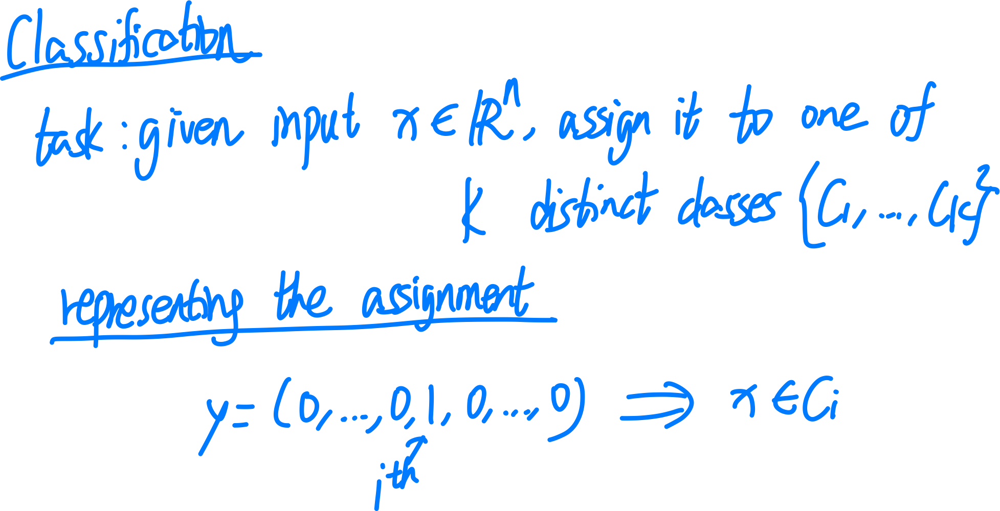
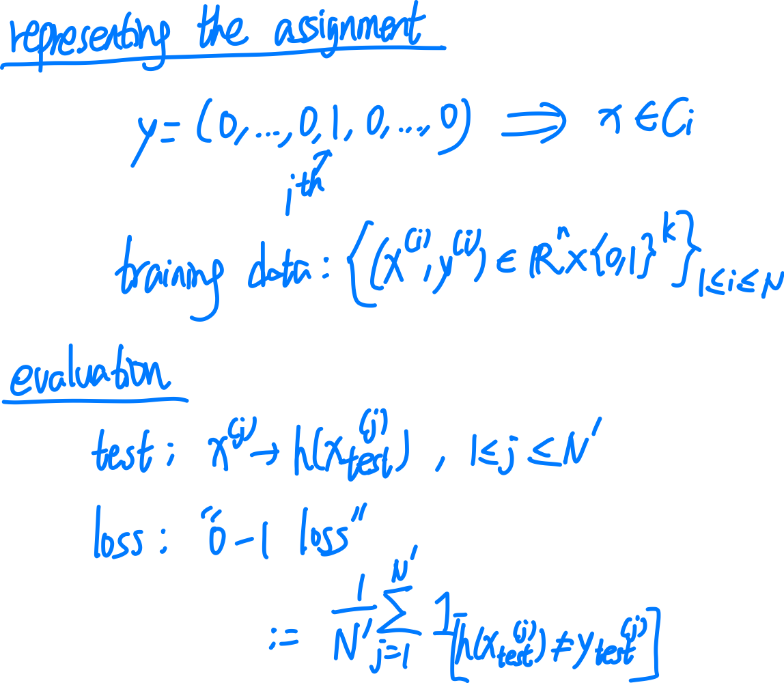

## Classification(lec 3)

### framework

本节 lec：learn $P(C_k | x)$ over data (e.g. max likelihood)，并直接 predict labels from inputs

下节 lec：learn $P(C_k | x)$ over data (e.g. max likelihood)，而后使用 Bayes' Rule 来 predict label.

