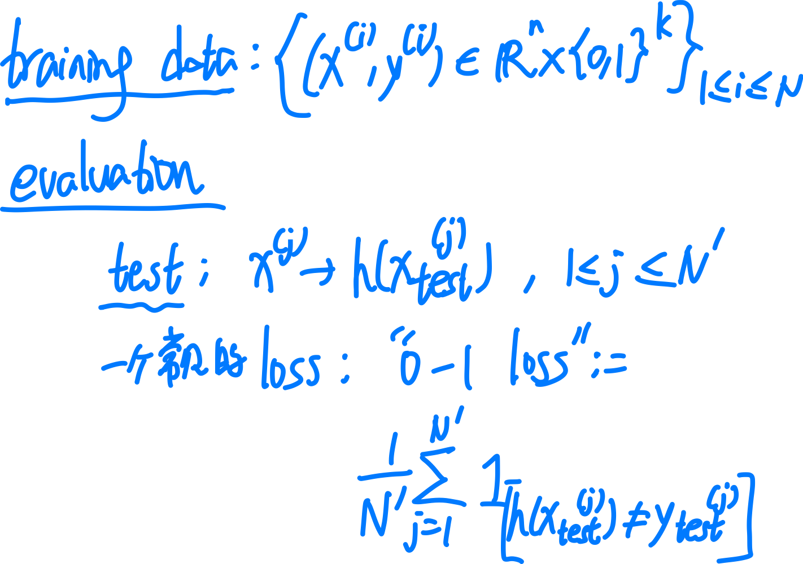
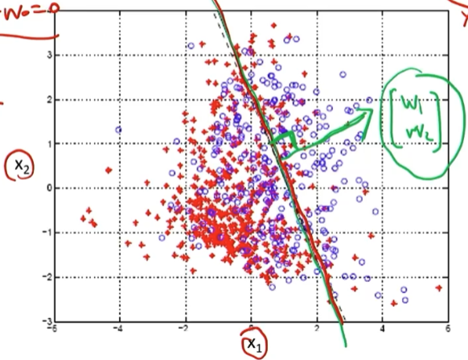
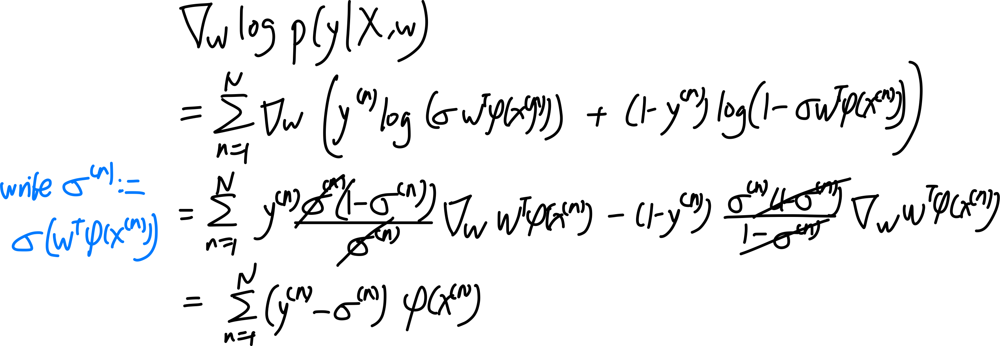
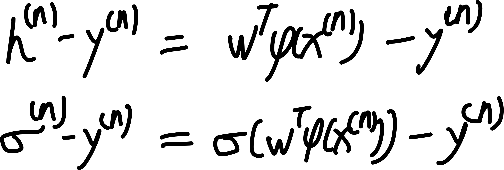

## Classification(lec 4)

### framework

我们已经学习了一种 supervised learning: regression. 现在学习第二种 supervised learning: classification

本节 lec：learn $P(C_k | x)$ over data (e.g. max likelihood)，并直接 predict labels from inputs

下节 lec：learn $P(C_k | x)$ over data (e.g. max likelihood)，而后使用 Bayes' Rule 来 predict label.

### logistic regression

logistic regression 是一种二分类算法，idea: 用一个 hyperplane 来分割整个空间

比如我们的 features 数量为 $M$，那么 $\mathbb{R}^M$ (每个 axis 表示一个 feature) 中我们假设存在这样一个 hyerplane defined by weights $w_1,\cdots,w_M$ 即 weights vector，这个其表达式为:
$$
w^T\phi(x)  = 0
$$

在这个模型中，我们并不 deterministic 地 predict，而是 probabilistically.

我们 recall sigmoid function:
$$
\sigma(a) = \frac{\exp(a)}{1+\exp(a)}
$$
注意总有 
$$
\sigma(a) + \sigma(-a) = 1
$$
即:
$$
\sigma(-a) = 1 -\sigma(a)
$$

#### modeling output as a probability function of $\{0,1\}$

我们使用这个平面作为概率为 1/2 的分界线, 配合 logistic 函数 来对输出进行建模. **这个输出是一个 source 为 $\{0,1\}$ 的函数, 表示这个点 $x$ 的 $y$ 是 1 的概率和 是 0 的概率，即一个概率密度函数.**
$$
p(y=1 \mid x,w) := \sigma(w^T \phi(x))
$$

$$
p(y=0 \mid x,w) := 1- \sigma(w^T \phi(x))
$$

我们发现这个函数也可以写为:
$$
p(y \mid x,w) := \sigma(w^T \phi(x))^y(1- \sigma(w^T \phi(x)))^{1-y}
$$

Note: **这里的概率并不是 prior 的，而是我们以 $w$ 为参数自己定义出来的: 给定一组 features $\phi(x)$, 它对应的 class 是 0 以及 是 1 的概率.**  

意思是，我们想要说一个点是 0 / 1 的概率是多少，就能说是多少，这是我们自己通过改变参数 $w$ 而建模出来的，和真实值本身没有关系。

即，我们假定的是：**在这个 hyperplane $w^T\phi(x)  = 0$ 上的点, 其得到的属于 class 0, 1 的概率都是 $1/2$.** 因为
$$
\sigma(0) = \frac{1}{1+ e^0} = \frac{1}{2}
$$
**而上面的点, 我们声称它是 1 的概率更大, 下面的点我们声称它是 0 的概率更大(**具体数值根据 input 可计算).

#### using likelihood function to evaluate "how accurate is our output"

因而完全可能出现的情况: 比如一共有三个点, 一个属于 class 0, 我们却说它是 0 的概率是 $0.1$, 而另两个属于 class 1, 我们却说它是 1 的概率是 $0.02$. 这种情况就说明我们的参数设置有问题, 不能很好地反映样本. 

我们想要足够好的参数, 使得我们对每个点 **[$x^{(n)}$ 作为 input]** 得到的 **[概率密度函数 $p(y \mid x^{(n)},w)$ 作为 output]** 的描述是尽可能准确的. 比如这个点实际的 $y^{(n)} = 1$, 而我们的 $w$ 得到的  $p(y \mid x^{(n)},w)$ 为 [ $p(y=1 \mid x^{(n)},w) = 0.98$,  $p(y=0 \mid x^{(n)},w) = 0.02$].

因而我们需要评判这个输出的结果有多准确并针对 $w$ 进行优化，需要使用 likelihood function：这是一个 表示在我们给定的数据集 $X$ 上，我们这个概率描述的输出有多可信。这是一个关于 $w$ 的函数:
$$
L(w\mid x^{(n)}) = p(y^{(n)} \mid x^{(n)}, w)
$$
对于 $(x^{(n)}, y^{(n)})$ 的输入, 它给出我们定义好的 $p(y^{(n)}\mid x,w)$, 即我们定义出的 "$x^{{(n)}}$ 属于 $y^{(n)}$ 的概率"，希望这个值越高越好.

从而:
$$
L(w\mid X) = p(y\mid X,w) = \prod_{n=1}^N p(y^{(n)} \mid x^{(n)}, w)
$$
我们想要 Maximize 这个 llikelihood function，使得我们所有声称 [$x^{(n)}$ 属于 $y^{(n)}$ 的概率] 的乘积最大, 越接近 1 越好.

比如如果 $y^{(1)} = 1$, $y^{(2)} = 1$, $y^{(3)} = 0$, 而我们的模型得到 "$p(y^{(1)} = 1 \mid x_1,w) = 0.98$",  "$p(y^{(2)} = 1 \mid x_2,w) = 0.97$, $p(y^{(3)} = 0 \mid x_3,w) = 0.99$, 那么我们得到的 $L(w \mid X)$  就等于 0.98 x 0.97 x 0.99=0.941，说明模型很好.

因而，我们的 objective function 就是 log likelihood, 即
$$
E(w) := - \log L(w \mid X) = - \log  p(y\mid X,w) 
$$

#### minimizing neg log likelihood function

我们回忆: linear model with stochastic noise 中, 每个 input $x^{(n)}$ 对应的预测结果也是一个 distribution of corresponding $y$  to it. 只不过在该模型中, 我们是假定 noise 遵守一定 prior 的分布规律 (比如正态分布), 而固定住方差用参数 $w$ 表示分布中心的不同, 从而通过 minimizing neg log likelihood function 的方式修改 $w$。得到最符合现有样本的分布规律，从而确定从 input $x$ 到 output [distribution of $y$] 的映射模型.

而这里 logistic regression 也类似，只不过这里我们不使用具有先验分布的 noise，而是完全通过 $w$ 来 encode predicted distribution of $y$, 并同样通过 minimizing neg log likelihood function 的方式修改 $w$ 以获得最符合现有样本的分布规律, 从而确定从 input $x$ 到 output [distribution of $y$] 的映射模型.

区别是, **linear regression 中, 我们需要 output 为一个 distribution function 是因为有噪声的存在, 因而 linear model 被变为了一个 stochastic model; 而 logistic regression 中, 我们是主动构建了 probablistic model.** 

Note: linear regression with Gaussian noise 中的 output random variable $y$ 服从的是 **Gaussian distribution**, 而 logistic regression 中 output random variable $y$ 服从的是 **Bernoulli distribution**.

现在我们计算一下 gradient:

因而:
$$
\nabla E(w) = \sum_{n=1}^N (\sigma^{(n)} - y^{(n)}) \phi(x^{(n)}) = \Phi^T (\sigma - y)
$$
和 linear regression 中差不多. 只是在 linear regression 中, 对 $h$ 中每一项施加了一个 sigmoid 函数就好.

### Newton's method

梯度下降（Gradient Descent, GD）和牛顿法（Newton's Method）都是优化算法，它们各有优缺点，适用于不同的场景。尽管梯度下降是更常见的方法，但牛顿法仍然有其独特的优势，因此仍然被使用。

### 1. **收敛速度**

- **梯度下降**: 使用一阶导数（梯度）来更新参数，通常采用固定或自适应的步长（学习率）。它的收敛速度依赖于学习率的选择，可能需要较多的迭代才能接近最优解。
- **牛顿法**: 使用二阶导数（Hessian 矩阵）来调整步长，可以在二次可微的情况下实现 **二阶收敛**，即每一步可以更接近最优解，因此通常比梯度下降收敛得更快。

### 2. **步长的选择**

- **梯度下降**: 需要手动调整学习率，选择不当可能导致收敛速度慢或震荡，甚至不收敛。
- **牛顿法**: 由于利用了二阶导数，能更智能地选择步长，不需要额外调节学习率，在某些情况下更加稳定。

### 3. **计算成本**

- **梯度下降**: 计算梯度的成本相对较低，尤其适用于高维度的大规模优化问题（如深度学习）。
- **牛顿法**: 计算二阶 Hessian 矩阵及其逆矩阵的成本较高，尤其是在高维情况下，可能会非常耗费计算资源。

### 4. **适用场景**

- **梯度下降**: 适用于大规模优化问题，特别是数据维度很高的情况下（如机器学习、深度学习）。
- **牛顿法**: 适用于小规模、高精度的优化问题，如凸优化、数值计算中的非线性方程求解。

### 5. **逃离鞍点**

- **梯度下降**: 可能会卡在鞍点或局部极小值。
- **牛顿法**: 由于 Hessian 矩阵的信息，能更好地区分局部极小值和鞍点，有助于避免停留在鞍点。

### **结论**

虽然梯度下降在大规模优化问题（如神经网络训练）中更受青睐，但牛顿法在需要高精度求解、二阶信息易于计算的情况下（如凸优化）仍然有优势。因此，在不同的应用场景下，我们可能会选择不同的优化方法，甚至结合两者（如拟牛顿法 Quasi-Newton Methods，如 BFGS 算法）。

### KNN(K-nerest neighbors)

