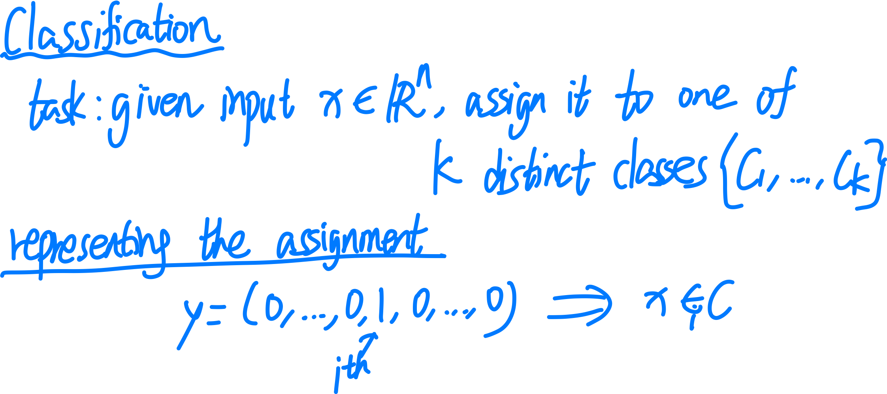
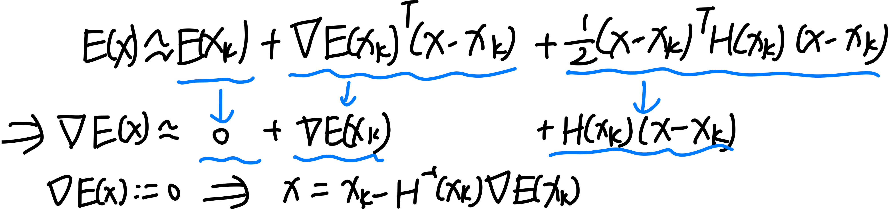
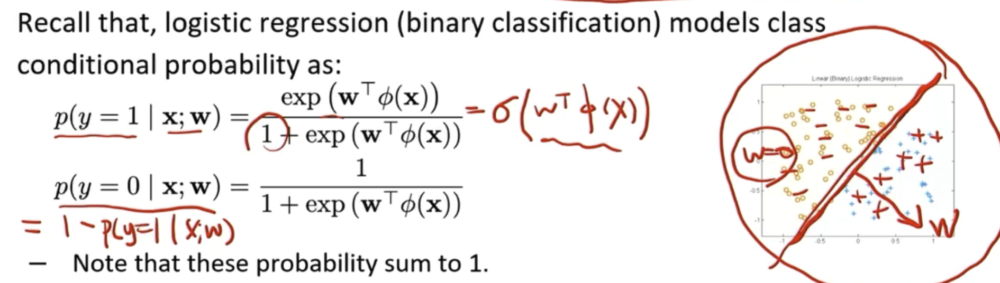
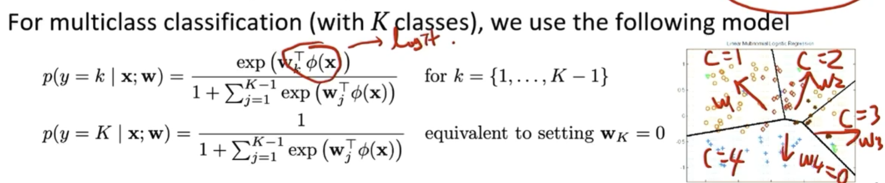
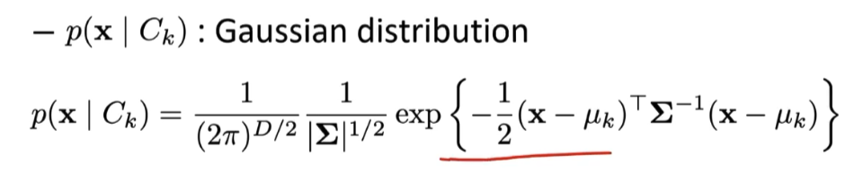
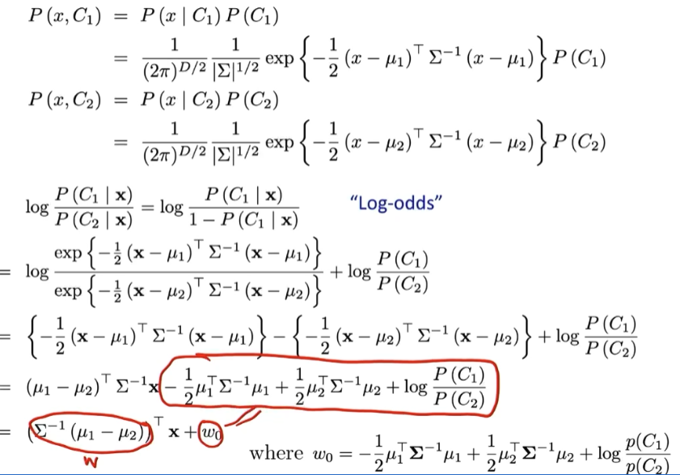

## Classification(lec 4)

### framework

我们已经学习了一种 supervised learning: regression. 现在学习第二种 supervised learning: classification

本节 lec：learn $P(C_k | x)$ over data (e.g. max likelihood)，并直接 predict labels from inputs

下节 lec：learn $P(C_k | x)$ over data (e.g. max likelihood)，而后使用 Bayes' Rule 来 predict label.

### logistic regression

logistic regression 是一种二分类算法，idea: 用一个 hyperplane 来分割整个空间

比如我们的 features 数量为 $M$，那么 $\mathbb{R}^M$ (每个 axis 表示一个 feature) 中我们假设存在这样一个 hyerplane defined by weights $w_1,\cdots,w_M$ 即 weights vector，这个其表达式为:
$$
w^T\phi(x)  = 0
$$

在这个模型中，我们并不 deterministic 地 predict，而是 probabilistically.

我们 recall sigmoid function:
$$
\sigma(a) = \frac{\exp(a)}{1+\exp(a)}
$$
注意总有 
$$
\sigma(a) + \sigma(-a) = 1
$$
即:
$$
\sigma(-a) = 1 -\sigma(a)
$$

#### modeling output as a probability function of $\{0,1\}$

我们使用这个平面作为概率为 1/2 的分界线, 配合 logistic 函数 来对输出进行建模. **这个输出是一个 source 为 $\{0,1\}$ 的函数, 表示这个点 $x$ 的 $y$ 是 1 的概率和 是 0 的概率，即一个概率密度函数.**
$$
p(y=1 \mid x,w) := \sigma(w^T \phi(x))
$$

$$
p(y=0 \mid x,w) := 1- \sigma(w^T \phi(x))
$$

我们发现这个函数也可以写为:
$$
p(y \mid x,w) := \sigma(w^T \phi(x))^y(1- \sigma(w^T \phi(x)))^{1-y}
$$

Note: **这里的概率并不是 prior 的，而是我们以 $w$ 为参数自己定义出来的: 给定一组 features $\phi(x)$, 它对应的 class 是 0 以及 是 1 的概率.**  

意思是，我们想要说一个点是 0 / 1 的概率是多少，就能说是多少，这是我们自己通过改变参数 $w$ 而建模出来的，和真实值本身没有关系。

即，我们假定的是：**在这个 hyperplane $w^T\phi(x)  = 0$ 上的点, 其得到的属于 class 0, 1 的概率都是 $1/2$.** 因为
$$
\sigma(0) = \frac{1}{1+ e^0} = \frac{1}{2}
$$
**而上面的点, 我们声称它是 1 的概率更大, 下面的点我们声称它是 0 的概率更大(**具体数值根据 input 可计算).

#### using likelihood function to evaluate "how accurate is our output"

因而完全可能出现的情况: 比如一共有三个点, 一个属于 class 0, 我们却说它是 0 的概率是 $0.1$, 而另两个属于 class 1, 我们却说它是 1 的概率是 $0.02$. 这种情况就说明我们的参数设置有问题, 不能很好地反映样本. 

我们想要足够好的参数, 使得我们对每个点 **[$x^{(n)}$ 作为 input]** 得到的 **[概率密度函数 $p(y \mid x^{(n)},w)$ 作为 output]** 的描述是尽可能准确的. 比如这个点实际的 $y^{(n)} = 1$, 而我们的 $w$ 得到的  $p(y \mid x^{(n)},w)$ 为 [ $p(y=1 \mid x^{(n)},w) = 0.98$,  $p(y=0 \mid x^{(n)},w) = 0.02$].

因而我们需要评判这个输出的结果有多准确并针对 $w$ 进行优化，需要使用 likelihood function：这是一个 表示在我们给定的数据集 $X$ 上，我们这个概率描述的输出有多可信。这是一个关于 $w$ 的函数:
$$
L(w\mid x^{(n)}) = p(y^{(n)} \mid x^{(n)}, w)
$$
对于 $(x^{(n)}, y^{(n)})$ 的输入, 它给出我们定义好的 $p(y^{(n)}\mid x,w)$, 即我们定义出的 "$x^{{(n)}}$ 属于 $y^{(n)}$ 的概率"，希望这个值越高越好.

从而:
$$
L(w\mid X) = p(y\mid X,w) = \prod_{n=1}^N p(y^{(n)} \mid x^{(n)}, w)
$$
我们想要 Maximize 这个 llikelihood function，使得我们所有声称 [$x^{(n)}$ 属于 $y^{(n)}$ 的概率] 的乘积最大, 越接近 1 越好.

比如如果 $y^{(1)} = 1$, $y^{(2)} = 1$, $y^{(3)} = 0$, 而我们的模型得到 "$p(y^{(1)} = 1 \mid x_1,w) = 0.98$",  "$p(y^{(2)} = 1 \mid x_2,w) = 0.97$, $p(y^{(3)} = 0 \mid x_3,w) = 0.99$, 那么我们得到的 $L(w \mid X)$  就等于 0.98 x 0.97 x 0.99=0.941，说明模型很好.

因而，我们的 objective function 就是 log likelihood, 即
$$
E(w) := - \log L(w \mid X) = - \log  p(y\mid X,w) 
$$

#### minimizing neg log likelihood function: 计算梯度

我们回忆: linear model with stochastic noise 中, 每个 input $x^{(n)}$ 对应的预测结果也是一个 distribution of corresponding $y$  to it. 只不过在该模型中, 我们是假定 noise 遵守一定 prior 的分布规律 (比如正态分布), 而固定住方差用参数 $w$ 表示分布中心的不同, 从而通过 minimizing neg log likelihood function 的方式修改 $w$。得到最符合现有样本的分布规律，从而确定从 input $x$ 到 output [distribution of $y$] 的映射模型.

而这里 logistic regression 也类似，只不过这里我们不使用具有先验分布的 noise，而是完全通过 $w$ 来 encode predicted distribution of $y$, 并同样通过 minimizing neg log likelihood function 的方式修改 $w$ 以获得最符合现有样本的分布规律, 从而确定从 input $x$ 到 output [distribution of $y$] 的映射模型.

区别是, **linear regression 中, 我们需要 output 为一个 distribution function 是因为有噪声的存在, 因而 linear model 被变为了一个 stochastic model; 而 logistic regression 中, 我们是主动构建了 probablistic model.** 

Note: linear regression with Gaussian noise 中的 output random variable $y$ 服从的是 **Gaussian distribution**, 而 logistic regression 中 output random variable $y$ 服从的是 **Bernoulli distribution**.

现在我们计算一下 gradient:

因而:
$$
\nabla E(w) = \sum_{n=1}^N (\sigma^{(n)} - y^{(n)}) \phi(x^{(n)}) = \Phi^T (\sigma - y)
$$
和 linear regression 中差不多. **只是在 linear regression 中, 对 $h$ 中每一项施加了一个 sigmoid 函数就好.**

### Newton's method

我们下面讲一个优化方法. newton 法是寻找一个函数的 root 的数值方法. 

$\mathbb{R}\rightarrow \mathbb{R}$ 情况:

为了寻找 $x_*$ 使得 $f(x_*) = 0$ , 牛顿法迭代更新:
$$
x_{k+1} = x_k - \frac{f(x_k)}{f'(x_k)}
$$
推导也很简洁, 我们使用一阶泰勒近似:

看起来一步就出了, 但是我们仍要进行迭代, 因为这是一阶泰勒近似, 后面还有余项. 迭代就是不停地求出一阶近似结果.

#### Newton's method in optimization: 求梯度零点

我们对于 $E: \mathbb{R}^N \rightarrow \mathbb{R}$, 想要求其 stationary point, 即 $\nabla E = 0$ 处, 我们可以令 $f := \nabla E$, 然后使用 Newton's method 求出 $\nabla E$ 的零点. **因而这属于 second-order method. 它要求一个函数是 $C^2$ 的.** (严格而言, 据我们在分析课所知, 因为它的推导使用的是二阶泰勒近似).

$\mathbb{R^n}\rightarrow \mathbb{R}$ 情况:
$$
x_{k+1} = x_k - H(x_k)^{-1} \nabla f(x_k)
$$

#### 推导

Note: **for linear regression, Hessian 为 $\Phi^T\Phi$.**

### 求 gradient 和 Heissan

Note: 

对于 $f:\mathbb{R}^n \rightarrow \mathbb{R}$,
$$
\nabla f: \mathbb{R}^n \rightarrow \mathbb{R^n}
$$
把一个点的值映射到这个点的导数的转置

而 Hessian 则是:
$$
H_f(x) = D(\nabla f) (x)
$$
对 $\nabla f$ 的求导.

梯度的链式法则:

#### 和 gradient descent 的对比

梯度下降（Gradient Descent, GD）和牛顿法（Newton's Method）都是优化算法，它们各有优缺点，适用于不同的场景。尽管梯度下降是更常见的方法，但牛顿法仍然有其独特的优势，因此仍然被使用。

1. **收敛速度**

- **梯度下降**: 使用一阶导数（梯度）来更新参数，通常采用固定或自适应的步长（学习率）。它的收敛速度依赖于学习率的选择，可能需要较多的迭代才能接近最优解。
- **牛顿法**: 使用二阶导数（Hessian 矩阵）来调整步长，可以在二次可微的情况下实现 **二阶收敛**，即每一步可以更接近最优解，因此通常比梯度下降收敛得更快。

2. **步长的选择**

- **梯度下降**: 需要手动调整学习率，选择不当可能导致收敛速度慢或震荡，甚至不收敛。
- **牛顿法**: 由于利用了二阶导数，能更智能地选择步长，不需要额外调节学习率，在某些情况下更加稳定。

3. **计算成本**

- **梯度下降**: 计算梯度的成本相对较低，尤其适用于高维度的大规模优化问题（如深度学习）。
- **牛顿法**: 计算二阶 Hessian 矩阵及其逆矩阵的成本较高，尤其是在高维情况下，可能会非常耗费计算资源。

4. **适用场景**

- **梯度下降**: 适用于大规模优化问题，特别是数据维度很高的情况下（如机器学习、深度学习）。
- **牛顿法**: 适用于小规模、高精度的优化问题，如凸优化、数值计算中的非线性方程求解。

5. **逃离鞍点**

- **梯度下降**: 可能会卡在鞍点或局部极小值。
- **牛顿法**: 由于 Hessian 矩阵的信息，能更好地区分局部极小值和鞍点，有助于避免停留在鞍点。

梯度下降在大规模优化问题（如神经网络训练）中更受青睐，牛顿法在需要高精度求解、二阶信息易于计算的情况下（如凸优化）仍然有优势。因此，在不同的应用场景下，我们可能会选择不同的优化方法，甚至结合两者（如拟牛顿法 Quasi-Newton Methods，如 BFGS 算法）。

#### Applying Newton's method on logistic regression

我们在 linear regression 中可以解出 closed-form sol. 但是, **logistic regression 是 non-linear 的, 不存在 closed form sol,** 所以我们需要通过迭代方法，比如**迭代使用 Newton's method 来获得 optimal sol.** 

这个过程叫做 **iteratively reweighted least squares.** 

推导 sketch:

### KNN(K-nerest neighbors)

这是一个比起 logstic regression, 更加简单的分类算法.

**它并不进行 learning！！**而是直接把 training set 原封不动拿来作为参照

而是对于每个 query example, 

1. 找到 $k$ 个 training set 中和它最近的点, 这个集合标记为 $KNN$
2. 而后, predict 结果为它的 $KNN$ 中的众数 $y$. 即相邻的 training 点中最多的从属类.

Note: 通过 adapt 这个预测公式, 我们也可以应用它到 regression 上。

#### hyper parameters

1. **更大的 $k$ 可以获得更加 smooth 的 decision boundary.**

2. **更大的 $N$ (training set size) 可以提高 performance.** 

   ESL 13.3 定理: 当 $N\rightarrow \infty$ 时, 1-NN 分类器的 error 不会超过 optimal error 的两倍。

1. distance metric 的选择也很重要.  (which $L_p$?)

#### Effectiveness analysis

KNN 的优点是简洁，灵活，对于低维度 input 高效

缺点是 expansive，对高维度 input 并不高效（都太远了），以及 not robust to irrelevant features. 容易收到 noise 影响。

## Classification(lec 5)

### Probabilistic Discriminative Models 和 Probabilistic Generative Models 的区别

**Probabilistic Discriminative Models** 和 **Probabilistic Generative Models** 是两种概率模型，用于解决分类和预测问题，它们的主要区别在于建模的方式和目标：

#### Probabilistic Discriminative Models

**Probabilistic Discriminative Models** 建模 **conditional 概率分布** $P(y |x,w)$，**object 是 maximize conditional likelihood $L(w|x)$** , 即在给定 $x$ 的情况下, 输出随机变量 $y$ 的概率分布.

- 例子: 比如 logistic regression 和 今天要讲的 **softmax regression (multiclass logistic regression)**

- 优点
  - 不需要对 $P(x)$ 或 $P(x,y)$ 建模
  - 计算效率高，训练相对简单

- 缺点

  - 对数据的整体生成过程没有建模，适用场景有限

#### Probabilistic Generative Models

**Probabilistic Generative Models** 建模 **joint 概率分布** $P(x,y | w)$，object 是 **maxmize joint likelihood** $L(w)$，可以通过建模数据生成过程，间接推断 $P(y|x)$；并且同时也可以自己生成数据 $x$. 

- 例子

  - **Gaussian Discriminant Analysis (高斯判别分析)**: 假设类条件分布 $P(x \mid y)$ 为高斯分布。
  - **Naive Bayes (朴素贝叶斯)**: 假设特征条件独立，简化计算。

- 优点

  - 可以生成新数据 (生成模型)。
  - 对数据的分布有更全面的建模。

- 缺点

  - 对数据分布假设更强 (如高斯假设)。
  - 计算量可能较大。

Note: 这个模型会生成 both $x$ 和 $y$，不过它仍需要 testing set, 用于评估模型在未知数据上的表现，即它根据 $x$ 生成 $y$ 的能力.

### Softmax regression: multiclass classification

先前我们的 logistic regression:

现在考虑 multiclass， $y$ 的 possible values 是 $1,\cdots, K$

我们 set: 

#### setting the last weight vector $w_k$ to 0 vector 

我们采取的策略是: 分配 $K-1$ 个 weight vector, 再用它们分别和 input features 的 dot product, 即 logit, 取 exponential 作为这个 class 在这个 $x$ 上的得分. 最后这个 "y = this class" 的条件概率被建模为: 这个 class 的得分 / 总得分.

注意到: **有 $K$ 个 classes, 但是我们只分配 $K-1$ 个 weight vectors**, 获得了 $K-1$ 个 logit, 这是因为为了**维持这个条件概率函数建模的 well-definedness (符合定义的条件概率函数, 所有 classes 的概率和为 1)**, 我们必须对于最后一个 class, **固定地用 (1-前面 classes 的条件概率) 这个剩余值来建模, 即设置 $w_k = (0,\cdots,0)$ 恒定**. 

这个做法是没有问题的, 因为经过前面 classes 的 logit 的作用, 这个 weight 为 0 的 class 的得分会自动适应, 间接地被学习到。(不过，只有最后一个 class 可以这么做，如果设置两个这样的 weight vector 为 0 的 classes, 那么它们就会自动平分剩余的条件概率, 从而这两个 classes 的条件概率永远相等.)

注意：

####  Softmax 的 weight vector 和 hyperplane 的关系

在 Softmax 回归中，假设我们有 $K$ 个类别，每个类别 $k$ 对应一个权重向量 $\mathbf{w}_k$

类别 \(k\) 的得分为：
$$
z_k = \mathbf{w}_k^T \phi(x)
$$

类别的预测概率由 Softmax 函数给出：
$$
P(y = k \mid x) = \frac{\exp(\mathbf{w}_k^T \phi(x))}{\sum_{j=1}^K \exp(\mathbf{w}_j^T \phi(x))}
$$

**决策边界的定义**：在 Softmax 回归中，类别 \(k\) 和类别 \(j\) 的决策边界是由以下条件确定的：
$$
\mathbf{w}_k^T \phi(x) = \mathbf{w}_j^T \phi(x) \quad \text{或者等价于} \quad (\mathbf{w}_k - \mathbf{w}_j)^T \phi(x) = 0
$$

单个权重向量 $\mathbf{w}_k$ 的意义: 定义了类别 $k$ 的特征偏好, 看作这一类别的“吸引中心”，在决策时决定 $x$ 离类别 $k$ 的相对距离。Softmax 回归的类别对之间一共有 $K(K-1)/2$ 条决策边界：每两个类别 k 和 j 的决策边界是一个超平面，该超平面的法向量是 $\mathbf{w}_k - \mathbf{w}_j$，而不是单个 $\mathbf{w}_k$，**一个输入被分配到距离最近的类别。**

#### log-likelihood objective function of softmax regression

### Probabilistic Generative model overview

刚才我们说了，对于 probabilistic discriminative model, 我们要 model 的是 $p(C_k|x)$,

而对于 probabilistic generative model, 我们要 model 的是 joint density function $p(x,C_k)$ （并同时得到 $p(x|C_k)$

方法: 我们**通过 model 并 learn $p(X=x|C_k)$ 以及 prior $p(C_k)$ 的乘积 $p(x,C_k)$) **，**运用 Beyes rule 来 predict $p(x | C_k)$.**

By Bayes: 

对于固定的 $x$, 我们通过我们 model 的 $p(x|C_k)$ 以及 $p(C_k)$ for each $k$, 即 $p(C_k,x)$，从而得到 $p(C_k |x)$，即我们的预测结果

以两个 classes 为例:  two classes: 

### Gaussian Discriminant Analysis

https://aman.ai/cs229/gda/

https://kuleshov-group.github.io/aml-book/contents/lecture7-gaussian-discriminant-analysis.html

GDA 是一种 probabilistic generative model, 它 model 每个 $p(C_k)$ 为 constant (比如使用 Bernoulli 分布)，并对每个 $C_k$, 把 $p(x | C_k)$ model 为一个 Gaussian distribution:

其中 $\Sigma$ 表示 covariance matrix of the $M$ features

以 dim=2 为例：

recall: **cov matrix 一定半正定，并且对称。**

**最 basic 的 GDA 假设所有 classes 的 covariance 都是相等的。**

于是 follows: decision boundary 是 linear 的

#### 计算 log odds 的表达式

其表达式为: 

#### Learning GDA

（假设所有数据 i.i.d.）

#### GDA 参数一览

因而 GDA 对 data 的 distribution 有很多的假设。logistic regression 则只有 2M 个参数。

一览：

## Classification (lec 6)

### Naive Bayes

仍然假设 class label 的 Probability 是 constant 的, 即 model 为 Bernoulli 分布
$$
y \sim Bernulli(\phi)
$$
即 $P(C_1)= \phi$, $P(C_0) = 1-\phi$

Naive Bayes assumption: $x$ 的所有 coordinates 是 **conditionally independent**  的

