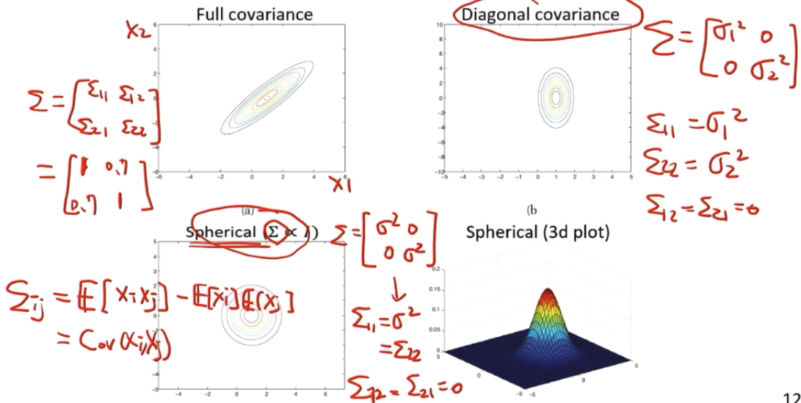
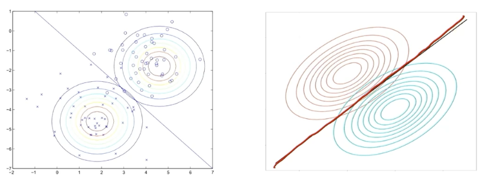
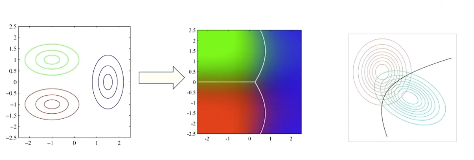

# GDA

https://aman.ai/cs229/gda/

https://kuleshov-group.github.io/aml-book/contents/lecture7-gaussian-discriminant-analysis.html

## Modeling

GDA 是一种 probabilistic generative model, 它 model:

1. 每个 $p(C_k)$ 为 constant. 比如 in case $k=2$, 使用 $y \sim Bernulli(\phi)$, 即 $P(C_1)= \phi$, $P(C_2) = 1-\phi$

   write in a compact way: 
   $$
   p(y)=\phi^y(1-\phi)^{1-y}
   $$
   (因为 $y$ 只取 0,1, 所以这里可以得到 $P(C_1)= \phi$, $P(C_2) = 1-\phi$)

   这个形式的优点是便于优化

2. 对于每个 $C_k$, 把 $p(x | C_k)$ model 为一个 Gaussian distribution
   $$
   p\left(\mathbf{x} \mid C_k\right)=\frac{1}{(2 \pi)^{D / 2}} \frac{1}{|\boldsymbol{\Sigma}|^{1 / 2}} \exp \left\{-\frac{1}{2}\left(\mathbf{x}-\mu_k\right)^{\top} \boldsymbol{\Sigma}^{-1}\left(\mathbf{x}-\mu_k\right)\right\}
   $$
   $\mathbf\Sigma$ 表示 covariance matrix of the $M$ features.

   以 dim=2 为例：

   

   recall: **cov matrix 必须是 p.s.d. 并且对称的. **

   

### 参数量

Note: For our GDA, 我们假设所有 classes 的 covariance 都一样, 即所有 classes 共享 $\mathbf\Sigma$. 

从而这里参数:一个是 $\phi$, 一个是 $\mu_1,\cdots,\mu_k$, 一个是 $\mathbf\Sigma$. 从而参数量是:
$$
k + kM +M(M+1) / 2
$$

#### Note: Sharing $\mathbf\Sigma \implies$ linear decision boundary

### 给定参数, 预测

从而, 固定学习到的参数, 我们对 input data $x$ 属于的类别作出的预测是:  (by Bayes' theorem) 
$$
p\left(C_1 \mid \mathbf{x}\right)=\frac{p\left(\mathbf{x} \mid C_1\right) p\left(C_1\right)}  {p\left(\mathbf{x} \mid C_1\right) p\left(C_1\right)+p\left(\mathbf{x} \mid C_2\right) p\left(C_2\right)}
$$
我们可以把它转化成 sigmoid 的形式:

Define log-odd:
$$
a := \log \frac{p\left(C_1 \mid \mathbf{x}\right)}{p\left(C_2 \mid \mathbf{x}\right)}=\log \frac{p\left(\mathbf{x} \mid C_1\right) p\left(C_1\right)}{p\left(\mathbf{x} \mid C_2\right) p\left(C_2\right)}
$$
那么 $p\left(C_1 \mid \mathbf{x}\right)$ 可转化为:
$$
p\left(C_1 \mid \mathbf{x}\right)=\frac{1}{1+\exp (-a)}=\sigma(a)
$$

#### log-odds 的推导

$$
\begin{aligned} & =\log \frac{\exp \left\{-\frac{1}{2}\left(\mathbf{x}-\mu_1\right)^{\top} \Sigma^{-1}\left(\mathbf{x}-\mu_1\right)\right\}}{\exp \left\{-\frac{1}{2}\left(\mathbf{x}-\mu_2\right)^{\top} \Sigma^{-1}\left(\mathbf{x}-\mu_2\right)\right\}}+\log \frac{P\left(C_1\right)}{P\left(C_2\right)} \\ & =\left\{-\frac{1}{2}\left(\mathbf{x}-\mu_1\right)^{\top} \Sigma^{-1}\left(\mathbf{x}-\mu_1\right)\right\}-\left\{-\frac{1}{2}\left(\mathbf{x}-\mu_2\right)^{\top} \Sigma^{-1}\left(\mathbf{x}-\mu_2\right)\right\}+\log \frac{P\left(C_1\right)}{P\left(C_2\right)} \\ & =\left(\mu_1-\mu_2\right)^{\top} \Sigma^{-1} \mathbf{x}-\frac{1}{2} \mu_1^{\top} \Sigma^{-1} \mu_1+\frac{1}{2} \mu_2^{\top} \Sigma^{-1} \mu_2+\log \frac{P\left(C_1\right)}{P\left(C_2\right)} \\ & =\left(\Sigma^{-1}\left(\mu_1-\mu_2\right)\right)^{\top} \mathbf{x}+b \quad \text { where } b=-\frac{1}{2} \mu_1^{\top} \mathbf{\Sigma}^{-1} \mu_1+\frac{1}{2} \mu_2^{\top} \mathbf{\Sigma}^{-1} \mu_2+\log \frac{p\left(C_1\right)}{p\left(C_2\right)}\end{aligned}
$$

因而: 当 GDA 作为一个判别模型 时，我们可以得到决策边界：
$$
p(C_1\mid x)=\frac{1}{1+e^{-w^T x-b}}
$$

这恰好是 逻辑回归（Logistic Regression）的形式，其中：
$w=\Sigma^{-1}\left(\mu_1-\mu_0\right)$

$b=-\frac{1}{2}\left(\mu_1^T \Sigma^{-1} \mu_1-\mu_0^T \Sigma^{-1} \mu_0\right)+\log \frac{\phi}{1-\phi}$

可以 generalizes to normalized exponential (softmax) :
$$
p_i=\frac{\exp \left(q_i\right)}{\sum_j \exp \left(q_j\right)}
$$

## Learning: maximize Log likelihood

$$
\begin{aligned} P\left(x, C_1\right) & =P\left(x \mid C_1\right) P\left(C_1\right) \\ & =\frac{1}{(2 \pi)^{D / 2}} \frac{1}{|\Sigma|^{1 / 2}} \exp \left\{-\frac{1}{2}\left(x-\mu_1\right)^{\top} \Sigma^{-1}\left(x-\mu_1\right)\right\} \phi \\ 
P\left(x, C_2\right) & =P\left(x \mid C_2\right) P\left(C_2\right) \\ & =\frac{1}{(2 \pi)^{D / 2}} \frac{1}{|\Sigma|^{1 / 2}} \exp \left\{-\frac{1}{2}\left(x-\mu_2\right)^{\top} \Sigma^{-1}\left(x-\mu_2\right)\right\} (1-\phi)\end{aligned}
$$

因而给定训练数据 $\left\{\left(x_i, y_i\right)\right\}_{i=1}^m$ ，我们可以写出 likelihood 函数:
$$
\mathcal{L}\left(\phi, \mu_0, \mu_1, \Sigma\right)=\prod_{i=1}^N P\left(x^{(i)}, y^{(i)}; \phi, \mu_0, \mu_1, \Sigma\right)
$$

通过最大化这个似然函数，可以学习到最优的 $\mu_k$, $\Sigma$, 以及 $\pi=P(y=1)$.

$$
\begin{aligned}
\ell\left(\phi, \mu_0, \mu_1, \Sigma\right) = \log \mathcal{L} & =\log \prod_{i=1}^N p\left(\mathbf{x}^{(i)} \mid y^{(i)} ; \phi, \mu_0, \mu_1, \Sigma\right) p\left(y^{(i)} ; \phi\right) \\
& =\sum_{i=1}^N \log p\left(\mathbf{x}^{(i)} \mid y^{(i)} ; \phi, \mu_0, \mu_1, \Sigma\right)+\sum_{i=1}^N \log p\left(y^{(i)} ; \phi\right) \\
& =\sum_{i=1}^N\left[\log \frac{1}{(2 \pi)^{\frac{M}{2}}|\Sigma|^{\frac{1}{2}}}-\frac{1}{2}\left(\mathbf{x}^{(i)}-\mu_{y^{(i)}}\right)^{\top} \Sigma^{-1}\left(\mathbf{x}^{(i)}-\mu_{y^{(i)}}\right)+\log \phi^{y^{(i)}}+\log (1-\phi)^{\left(1-y^{(i)}\right)}\right] \\
& \simeq \sum_{i=1}^N\left[-\frac{1}{2} \log |\Sigma|-\frac{1}{2}\left(\mathbf{x}^{(i)}-\mu_{y^{(i)}}\right)^{\top} \Sigma^{-1}\left(\mathbf{x}^{(i)}-\mu_{y^{(i)}}\right)+y^{(i)} \log \phi+\left(1-y^{(i)}\right) \log (1-\phi)\right]
\end{aligned}
$$

(the constant term is independent of the parameters, thus removed.)

通过最大化这个函数，我们可以求得参数的 MLE 估计：
$$
\begin{gathered}
\hat{\phi}=\frac{1}{m} \sum_{i=1}^m y_i \\
\hat{\mu}_0=\frac{\sum_{i: y_i=0} x_i}{\sum_{i=1}^m 1\left(y_i=0\right)} \\
\hat{\mu}_1=\frac{\sum_{i: y_i=1} x_i}{\sum_{i=1}^m 1\left(y_i=1\right)} \\
\hat{\mathbf\Sigma}=\frac{1}{m} \sum_{i=1}^m\left(x_i-\mu_{y_i}\right)\left(x_i-\mu_{y_i}\right)^T
\end{gathered}
$$

### MLE 推导 (hw 2(3))

#### $\hat{\phi}$​

$$
\begin{aligned}
\frac{\partial \ell}{\partial \phi} & =\sum_{i=1}^N\left(\frac{y^{(i)}}{\phi}-\frac{1-y^{(i)}}{1-\phi}\right) \\
& =\sum_{i=1}^N \frac{1\left(y^{(i)}=1\right)}{\phi}+\frac{N-\sum_{i=1}^N \mathbb{I}\left(y^{(i)}=1\right)}{1-\phi}
\end{aligned}
$$

Therefore, $\phi_{\mathrm{ML}}=\frac{1}{N} \sum_{i=1}^N 1\left(y^{(i)}=1\right)$, i.e**. the fraction of the training examples such that $y^{(i)}=1$.**

#### $\hat{\mu}_k$

$$
\begin{aligned}
\nabla_{\mu_0} \ell & =-\frac{1}{2} \sum_{i: y^{(i)}=0} \nabla_{\mu_0}\left(\mathbf{x}^{(i)}-\mu_0\right)^{\top} \Sigma^{-1}\left(\mathbf{x}^{(i)}-\mu_0\right) \\
& =-\frac{1}{2} \sum_{i: y^{(i)}=0} \nabla_{\mu_0}\left[-2 \mu_0^{\top} \Sigma^{-1} \mathbf{x}^{(i)}+\mu_0^{\top} \Sigma^{-1} \mu_0\right] \\
& =-\frac{1}{2} \sum_{i: y^{(i)}=0}\left[-2 \Sigma^{-1} \mathbf{x}^{(i)}+2 \Sigma^{-1} \mu_0\right]
\end{aligned}
$$

By setting the gradient to zero,

$$
\begin{aligned}
\sum_{i: y^{(i)}=0}\left[\Sigma^{-1} \mathbf{x}^{(i)}-\Sigma^{-1} \mu_0\right] & =0 \\
\sum_{i=1}^N \mathbb{I}\left\{y^{(i)}=0\right\} \Sigma^{-1} \mathbf{x}^{(i)}-\sum_{i=1}^N \mathbb{I}\left\{y^{(i)}=0\right\} \Sigma^{-1} \mu_0 & =0
\end{aligned}
$$
Thus we obtain $\mu_{0_{\mathrm{ML}}}=\frac{\sum_{i=1}^N \mathbb{I}\left\{y^{(i)}=0\right\} \mathbf{x}^{(i)}}{\sum_{i=1}^N \mathbb{I}\left\{y^{(i)}=0\right\}}$, i.e., the mean of the training examples with $y^{(i)}=0$

#### $\hat{\mathbf\Sigma}$

对于 $M=1$ case,

When everything is a scalar, the log-likelihood of the data can be re-written as

$$
\begin{aligned}
\ell\left(\phi, \mu_0, \mu_1, \Sigma\right) & \simeq \sum_{i=1}^N\left[-\frac{1}{2} \log |\Sigma|-\frac{1}{2}\left(\mathbf{x}^{(i)}-\mu_{y^{(i)}}\right)^{\top} \Sigma^{-1}\left(\mathbf{x}^{(i)}-\mu_{y^{(i)}}\right)+y^{(i)} \log \phi+\left(1-y^{(i)}\right) \log (1-\phi)\right] \\
& =\sum_{i=1}^N\left[-\log \sigma-\frac{1}{2 \sigma^2}\left(x^{(i)}-\mu_{y^{(i)}}\right)^2+y^{(i)} \log \phi+\left(1-y^{(i)}\right) \log (1-\phi)\right]
\end{aligned}
$$

By taking derivative with respect to $\sigma$ and set it to zero:

$$
\nabla_\sigma \ell=\sum_{i=1}^N\left[-\frac{1}{\sigma}+\frac{1}{\sigma^3}\left(x^{(i)}-\mu_{y^{(i)}}\right) 2\right]=0
$$

Obtain: $\sigma_{\mathrm{ML}}=\frac{1}{N} \sum_{i=1}^N\left(x^{(i)}-\mu_{y^{(i)}}\right)^2$.

对于 general case, 
$$
\ell\left(\phi, \mu_0, \mu_1, \Sigma\right) \simeq \sum_{i=1}^N\left[-\frac{1}{2} \log |\Sigma|-\frac{1}{2}\left(\mathbf{x}^{(i)}-\mu_{y^{(i)}}\right)^{\top} \Sigma^{-1}\left(\mathbf{x}^{(i)}-\mu_{y^{(i)}}\right)+y^{(i)} \log \phi+\left(1-y^{(i)}\right) \log (1-\phi)\right]
$$

为了计算 gradient 我们需要用到 matrix gradient properties:
$$
\nabla_X \log |X| = X^{-1}
$$
以及
$$
    \nabla_X (a^\top X^{-1} a) = -X^{-1} a a^\top X^{-1}
$$

Using the hints and taking gradient w.r.t $\Sigma$ and setting it to zero, we get

$$
\nabla_{\Sigma}=\sum_{i=1}^N\left[-\frac{1}{2} \Sigma^{-1}+\frac{1}{2} \Sigma^{-1}\left(\mathbf{x}^{(i)}-\mu_{y^{(i)}}\right)\left(\mathbf{x}^{(i)}-\mu_{y^{(i)}}\right)^{\top} \Sigma^{-1}\right]=0
$$

using which we obtain $\Sigma_{\mathrm{ML}}=\frac{1}{N} \sum_{i=1}^N\left(\mathbf{x}^{(i)}-\mu_{y^{(i)}}\right)\left(\mathbf{x}^{(i)}-\mu_{y^{(i)}}\right)^{\top}$

## Remarks

如果不假设 sharing $\hat{\mathbf\Sigma}$: Decision boundaries between some classes can be quadratic when they have different covariances.

Comparison between GDA and Logistic regression (or softmax regression)

- Logistic regression has less parameters and is more flexible about data distribution.
- GDA has a stronger modeling assumption and works well when the distribution follows the assumption.