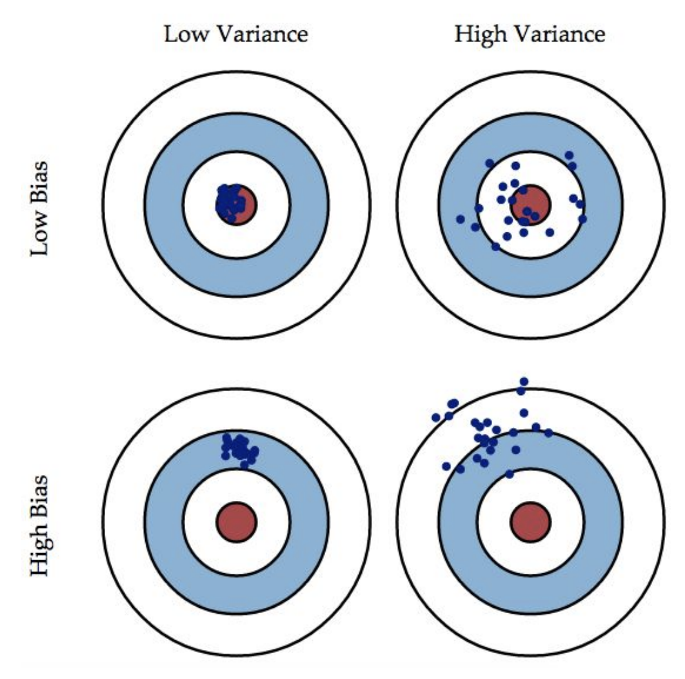

## Regularization (lec 7)

避免 overfitting:

1. 增加 data points
2. choose right number of features

fully Bayesian Approach: assime prior distributiiion of $P(w)$

Estimaate posterior $P(w |D) $ from $D$;
$$
P(w|D) ~ P(D|w)|(w)
$$

好的，我们深入讲解 \( P(w) \) 以及它在贝叶斯推断中的角色和意义。

**什么是 \( P(w) \)?**

- \( P(w) \) 是参数 \( w \) 的 **先验分布（Prior Distribution）**。
- 它反映了**在观察数据 \( D \) 之前**，我们对参数 \( w \) 的信念或假设。
- 这种信念可以来源于以下几种方式：
  1. **领域知识**：例如，过去的实验或经验让我们对 \( w \) 的范围有一定的了解。
  2. **主观假设**：当没有明确的信息时，可以选择一个标准分布（例如，正态分布或均匀分布）作为无偏假设。
  3. **非信息先验**：如果对参数完全没有先验知识，可以选择均匀分布或最大熵的分布作为假设。

例如：

- 若 \( w \) 是一个概率值（范围在 [0, 1]），我们可能假设 \( P(w) \) 是一个 Beta 分布。
- 若 \( w \) 是一个连续变量，可以假设 \( P(w) \) 是正态分布。

---

**贝叶斯公式如何结合 \( P(w) \)?**
贝叶斯推断的核心公式是：
\[
P(w|D) \propto P(D|w) P(w)
\]
各项解释：

1. **\( P(w|D) \)**：后验分布（Posterior Distribution），是我们在观察数据 \( D \) 后对 \( w \) 的更新认知。
2. **\( P(D|w) \)**：似然函数（Likelihood），描述在假定 \( w \) 的情况下，数据 \( D \) 出现的概率。
3. **\( P(w) \)**：先验分布，描述在观察数据 \( D \) 之前对 \( w \) 的假设。
4. **归一化项**：公式右侧需要一个归一化因子 \( P(D) = \int P(D|w)P(w) dw \)，确保后验分布 \( P(w|D) \) 的总概率为 1。

简单来说：

- \( P(w) \) 是你对参数的“起点假设”。
- \( P(D|w) \) 利用数据更新这个假设，最终得到更符合数据的 \( P(w|D) \)。

---

3. **为什么 \( P(w) \) 很重要？**
4. **捕捉先验知识**：
   - 假设你知道 \( w \) 是某范围内的值（比如，物理限制），那么你可以选择 \( P(w) \) 来反映这个范围。
   - 例如，如果你知道某实验参数 \( w \) 应该在 [0, 1]，可以使用 Beta 分布（如 \( Beta(2, 2) \)）作为先验分布。

5. **平滑化**：
   - 在数据稀少或噪声大的情况下，先验分布能够防止模型过拟合，给结果提供额外的稳定性。
   - 例如，极端数据点可能会强烈影响 \( P(D|w) \)，但合理的 \( P(w) \) 能降低这种影响。

6. **控制后验分布的形状**：
   - \( P(w) \) 的选择会直接影响 \( P(w|D) \) 的形状。
   - 例如，选择共轭先验（如高斯先验配合高斯似然）能够使后验分布更易于解析（仍是高斯分布）。

---

4. **如何选择 \( P(w) \)?**
   \( P(w) \) 的选择是贝叶斯推断中的一个关键步骤，以下是一些常见方法：

**a. 使用共轭先验**

- **共轭先验（Conjugate Prior）** 是指，选择一个与似然函数 \( P(D|w) \) 具有特定关系的先验分布，使得后验分布 \( P(w|D) \) 与先验分布保持相同的形式。
- 常见共轭关系：
  1. **伯努利分布（Bernoulli Likelihood）** → Beta 先验
  2. **高斯分布（Gaussian Likelihood）** → 高斯先验
  3. **多项式分布（Multinomial Likelihood）** → 狄利克雷先验（Dirichlet Prior）

**例子：**

- 假设 \( w \) 是某事件发生的概率，数据观测值是二元的（0 或 1）。
  - 使用 Beta 分布作为先验：\( P(w) = Beta(\alpha, \beta) \)。
  - 数据的似然函数：\( P(D|w) = w^k (1-w)^{n-k} \)，其中 \( k \) 是观测到 1 的次数，\( n \) 是总次数。
  - 后验分布：\( P(w|D) = Beta(\alpha + k, \beta + n - k) \)。

**b. 非信息先验（Non-informative Prior）**

- 当没有任何关于 \( w \) 的先验知识时，可以选择“中立”或“无偏”的分布。
- 常见选择：
  1. 均匀分布（Uniform Distribution）：假设所有值等可能。
  2. 最大熵分布（Maximum Entropy Prior）：例如正态分布或对数正态分布。

**c. 信息先验（Informative Prior）**

- 使用领域知识或历史数据来构建先验。
- 例如，如果你之前的实验表明 \( w \) 应该集中在某个范围，可以用高斯分布 \( N(\mu, \sigma^2) \) 表示。

### Bias-Variance Decomposition

We want: learn a model with low bias(more fitting) and low variance(more stable)

$$
Bias := (\mathbb{E}_{train} [h(x,D_{train})] - \mathbb{E} [y|x])^2
$$

$$
Variance := Var_{D_{train}} (h(x,D_{train}))
$$

large number of features: probably larger variance.

$$
\mathbb{E}[L] = \int \int (h(x)-y)^2. p(x,y) dxdy
$$

Consider $h(x) -y = h(x) - \mathbb{E}[y|x] + \mathbb{E} [y|x] - y$

因而 
$$
\mathbb{E}[L]  = \int (h(x)-\mathbb{E}[y|x])^2p(x) dx + \int\int (\mathbb{E}[y|x]-y)^2 p(x,y)dxdy
$$

expecred loss = (bias)^2 + variance + noise

