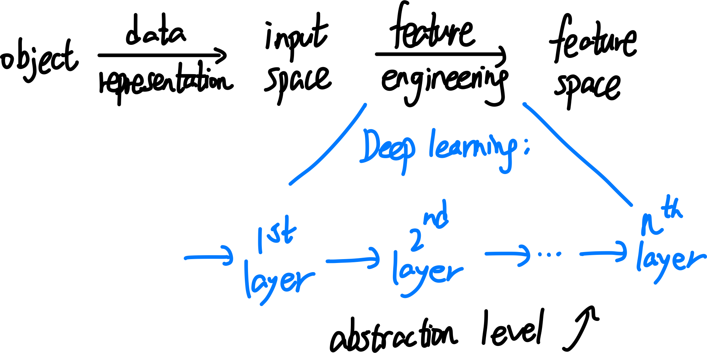
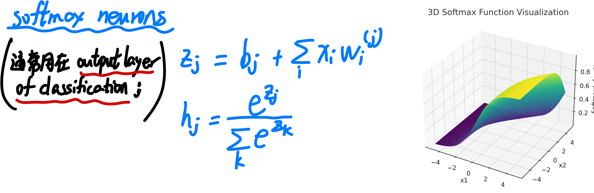

# lec 11: overview of NN

DL 本质上就是**将 input Space 到 Feature Space 的映射从 single layer (比如 logistic regression) 扩展为 multilayer**，并通过这些层次化的表示来学习数据的更高阶特征.

比方说 DL 一个分类问题:

1. 低层神经元：学习边缘、纹理等低级特征。
2. 中层神经元：学习更复杂的模式，如耳朵、眼睛等部件。
3. 高层神经元：学习全局信息，如“这是一只猫”。
4. 最终输出分类结果（猫/狗）。

以下为各种 Machine Learning methods 以 supervised 与否、deep 与否这两个标准的分类

### types of neurons

### train NN: forward 和 backward propagation

Algorithm of NN training: 

在这一过程中, 其中一个 layer 到另一个 layer 是这样啊

对于某一层的 parameters $\theta$ 的导数的计算, 可以由 chain rule 得到. 

其 vectorization form: 

#### my remark: ml 里数学 notation 的不严谨之处, 以及如何指认.

我们首先复习正常的多元实分析中学到的 notation:

而 ml 中, 经常会有滥用 notation 的情况。我这里并不是指 notation 的形式和数学里不一样，而是 ml 里经常会有 notation 内部的 inconsistency. 比如下面:

我们如何 consistently 翻译这个内容：在 ml 的 notation 里，**对于 R^n to R^m (where m>1)的函数, 不论它写作 nabla 形式还是 partial partial 形式, 都是 Jacobian matrix, 也就是 derivative (即便写成 nabla)；对于 R^n to R 的函数, 不论它写作 nabla 形式还是 partial partial 形式, 都是 gradient, 也就是 derivative 的 transpose (即便写成partial partial)**

虽然我们自己仍然严格地使用正确的数学标记(对于 derivative 用 partial partial, 对于 gradient 用 nabla), 但是碰到不好的标记就用上面这个翻译来理解。

#### ex: NN with 1 hidden layer

Scalar-valued, 很容易算

vectorized: 有点难. 

至于 matrix input, vector valued 的函数, 其涉及 tensor 的 differentiation, 目前还没写.

# lec12