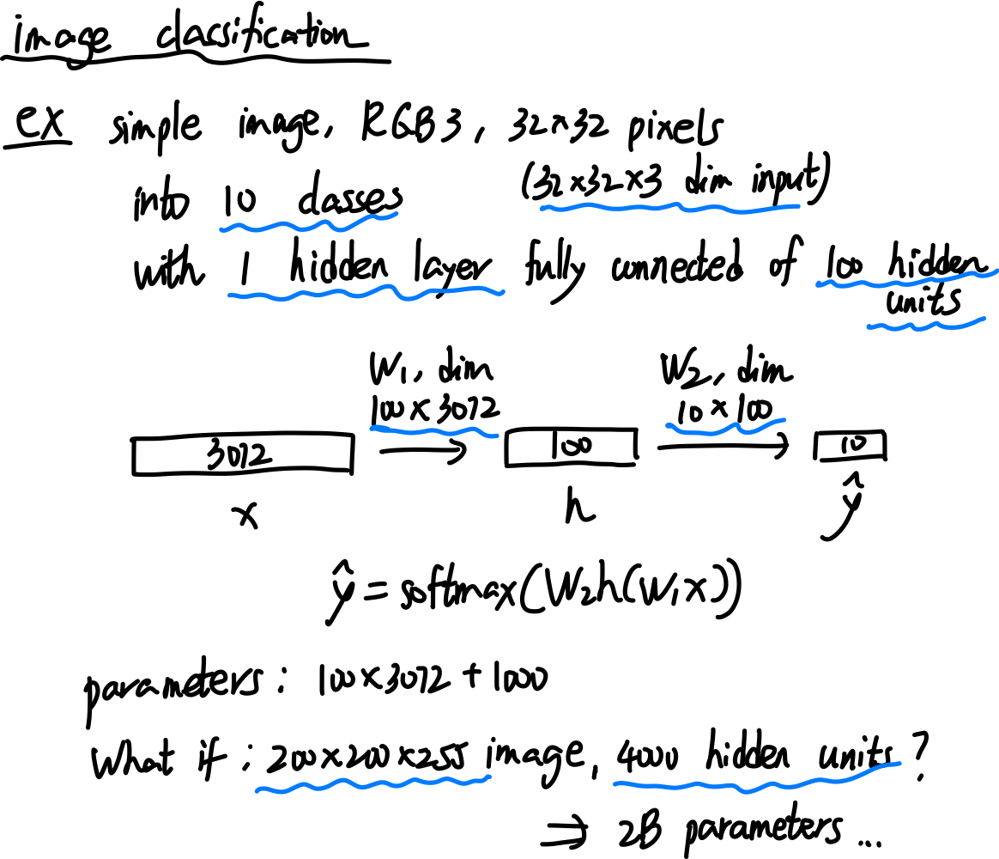
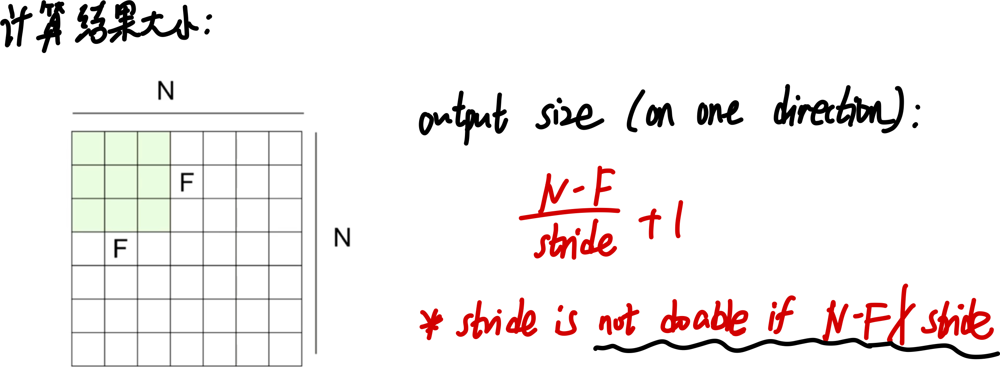
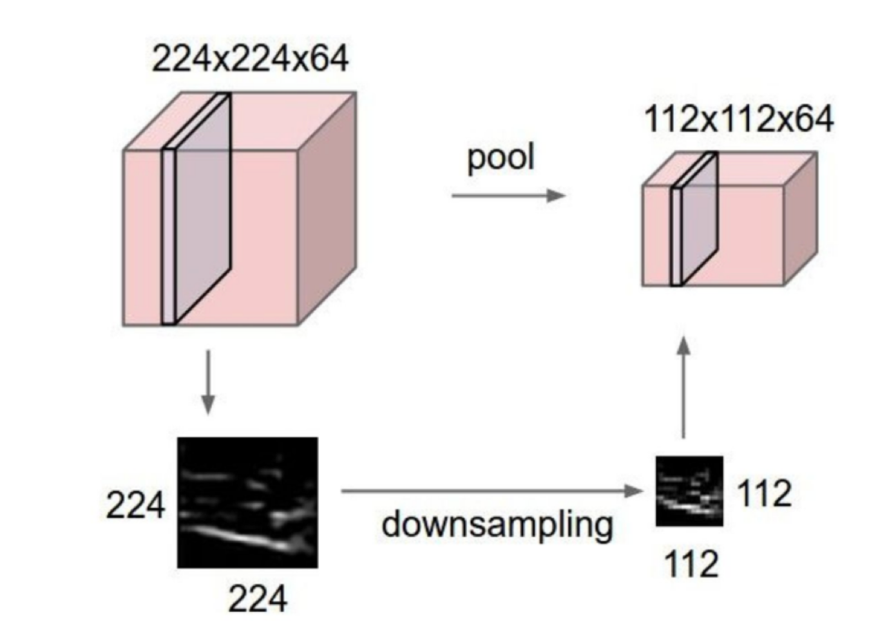
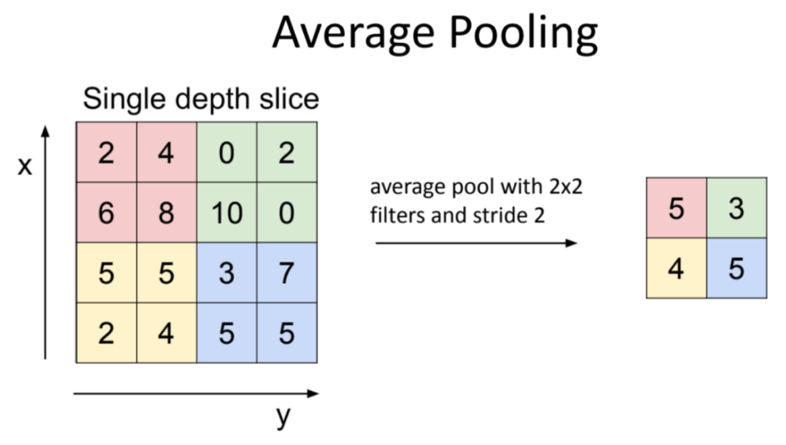
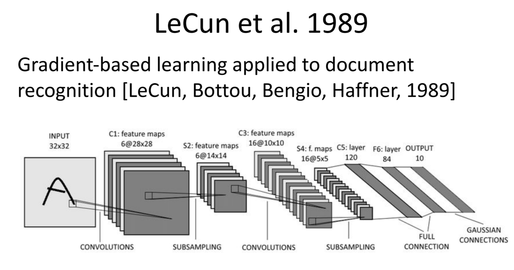
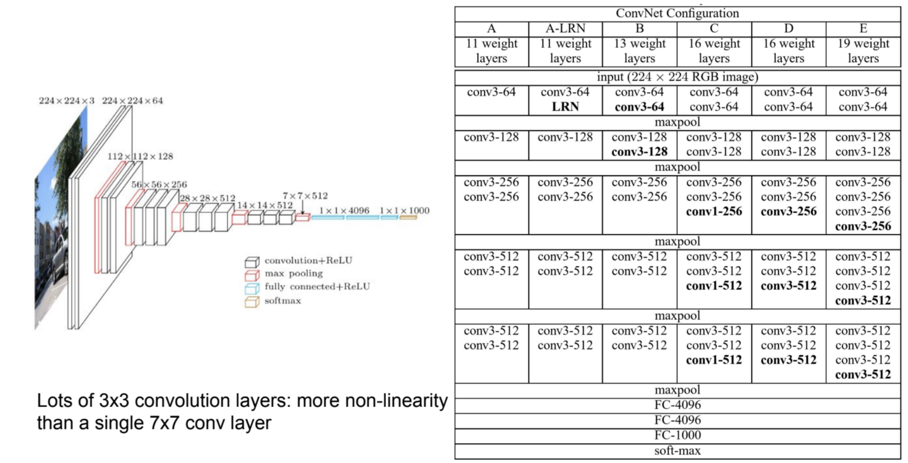
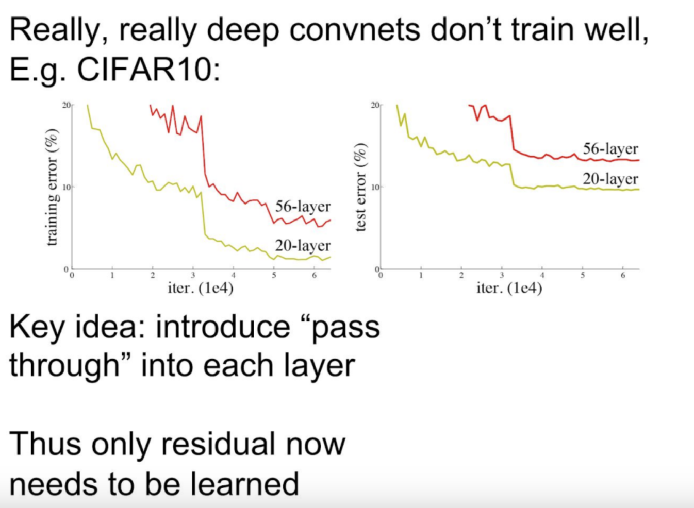
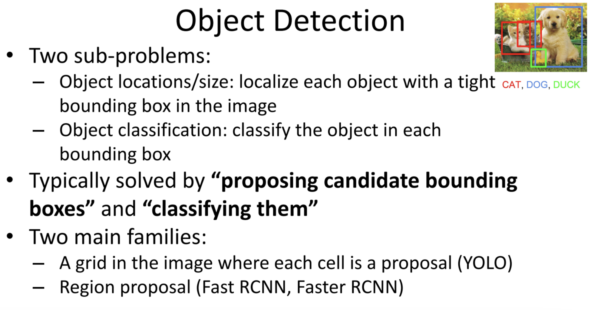
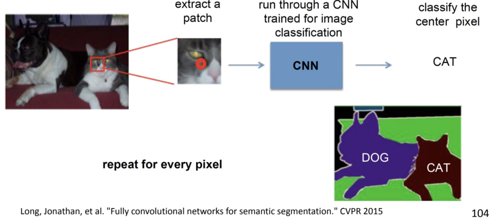
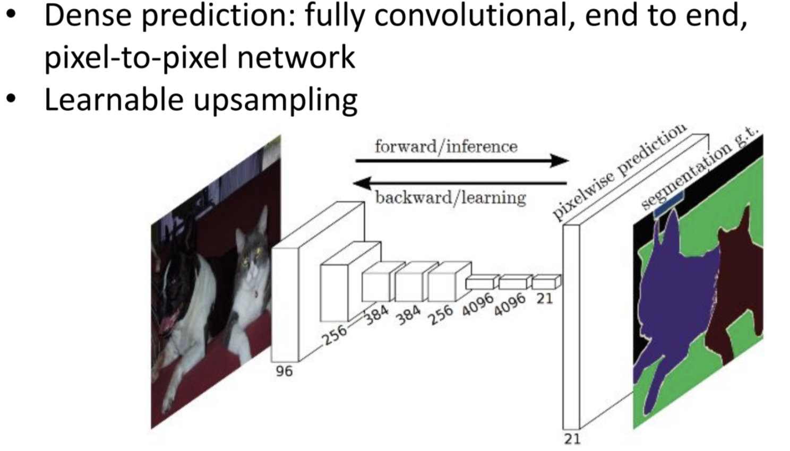

# CNN

### image classification if fully connected

## CNN layers

### convolution layer

Convolution layer 的 idea: 利用 pixels 的 2D topology, 即: 图形的 translate invariance 等.

具体:

1. 利用 Local connectivity,
2. parameter sharing
3. pooling, subsampling hidden units.

#### convolution layer: activation map

activation map: 

得到新的 image:

多个 filters 可创建多个 activation maps

#### express the feature map as convolution

Example: 

#### hyperparameter: strides

convolution layer 一共有 4 个 hyperparameters: 

1. number of filters
2. filter spatial dimension
3. stride
4. pad 

改变 strides 即改变 convolution 采样的间距. stride 越大, 表示采样越稀疏, 降低对了特征的采集的精细度.

计算 activation map 的像的维度的公式:

#### hyperparameter: padding

**`padding`（填充）**即在 input image 的边缘添加额外的像素，以控制输出的空间维度并提升模型的性能。它的作用主要包括以下几个方面：

1. **控制输出尺寸**

   我们已经知道，kernel 会减少输入特征图的尺寸 (如果 stride =1, 减少的是 kernel 的尺寸; 如果 stride 更大, 减少地更多 )。通过**填充（padding）**，可以按照需求调整输出尺寸，比如使输出特征图的大小保持与输入相同（如`same padding`）

2. **保留边界信息**

   在没有填充的情况下，**靠近边缘的像素会比中心的像素被卷积核覆盖的次数少**，导致边缘信息容易丢失。`padding` 允许卷积核在边界区域也能进行相同次数的计算，提升模型对边缘特征的学习能力。

3. **保证卷积核中心对齐**

   当使用**奇数大小的卷积核**（如 $3 \times 3$, $5 \times 5$）边界像素的计算会相对不对称. `padding` 可以使得所有位置都能完整地进行卷积运算，保证特征提取的一致性。

**计算 output 大小:**

(for one kernel.)

常见的 Padding 方式是 **Same Padding 或称 zero padding**（`padding` 使得输出尺寸等于输入尺寸）

- **步长 $ \text{stride}=1 $** 时：
  $$
  \text{padding} = \frac{k - 1}{2}, \quad \text{(当 k 为奇数时)}
  $$
  例如：

  - $3 \times 3$ 卷积核 → `padding=1`
  - $5 \times 5$ 卷积核 → `padding=2`

可以人为设定不同方向上的填充，例如 TensorFlow/PyTorch 允许 `(top, bottom, left, right)` 方式填充。在实际 CNN 设计中，`same padding` 更常用于深度网络，以保证特征图尺寸稳定。

### pooling layer

`Pooling` 池化是 CNN 中除了 convolution layer 外的另一个常用 layer. 它的 parameter 是 window size 和 stride. 

convolution layer 通过滑动窗口和 image 对应位置作 inner product 来提取特征图，而 pooling 则是一种更加直接的 **subsampling (降采样)**，主要目的是降低特征图的尺寸，减少计算量，同时保留重要特征。同样**利用了模型的平移不变性，减少参数数量，从而提高泛化能力。**

**常见的 pooling 操作**：

#### Max Pooling

- 计算窗口区域内的最大值。

- 主要用于保留局部区域的最强特征（高激活值）

- 适用于提取边缘和纹理等重要特征，常用于 CNN 任务，如图像分类、目标检测等

  

#### Average Pooling

- 计算窗口区域内所有值的**平均值**。

- 适用于平滑特征图，减少过拟合，但可能会导致信息损失较大

- 在某些任务（如图像分割、强化学习）中仍然有用

  

  

#### Global Average Pooling, GAP

- 直接对整个特征图计算**全局平均值**，得到一个数值（每个通道一个）。
- 主要用于替代全连接层，减少参数量。
- 在**ResNet、MobileNet**等轻量级 CNN 结构中经常使用。

#### **池化 vs 卷积**

Note: pooling 是不可训练的，完全是固定的。它没有参数，全部都是超参数

| **对比项**   | **池化 (Pooling)**   | **卷积 (Convolution)** |
| ------------ | -------------------- | ---------------------- |
| **作用**     | 降采样，减少计算量   | 提取特征               |
| **参数**     | 无参数               | 具有可学习的权重       |
| **影响**     | 提高模型的平移不变性 | 主要用于提取特征       |
| **可训练性** | 不可训练             | 可训练                 |

虽然池化很常见，但一些现代 CNN 结构（如 ResNet、DenseNet）倾向于用 **stride 卷积** 代替 `pooling` 来进行降维，因为：

- `stride` 卷积可以学习降维方式，而池化是固定操作。
- `stride` 卷积允许模型在降维的同时提取更多特征，提高表达能力。

但在轻量级模型（如 MobileNet）或某些任务（如语音处理、医学影像分析）中，**池化仍然是有效的降维手段**。

## CNN 架构

#### classical 架构

ex: vehicle 分类

#### Lenet

#### Alexnet

#### VGG-16

#### ResNet

error 排名：

d

## CNN 应用

#### object classification  

这是最简单的应用

#### object detection: proposing bounding boxes

RCNN: 

Fast RCNN:

#### semantic segmentation

