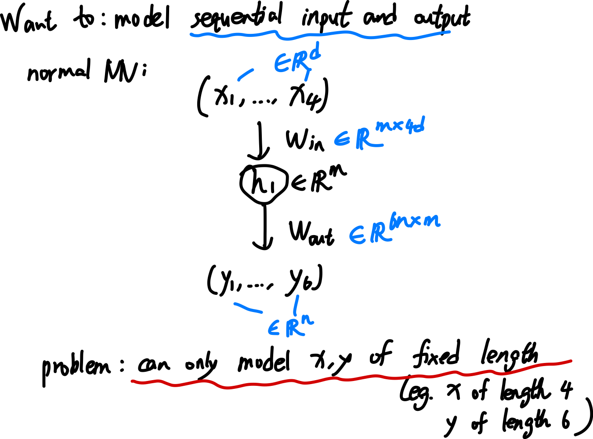
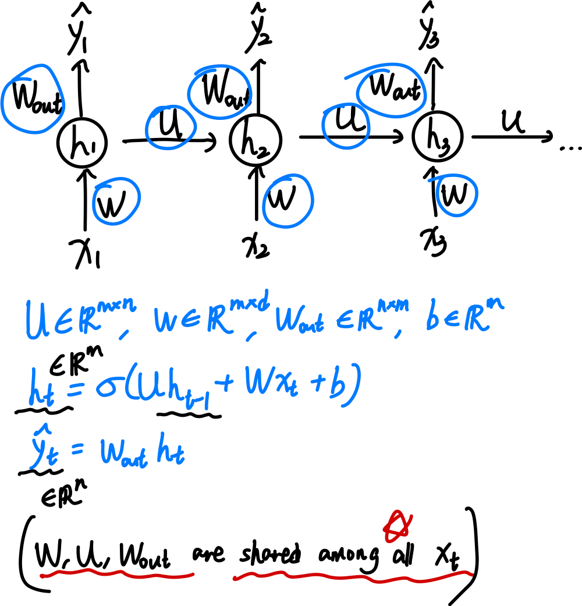
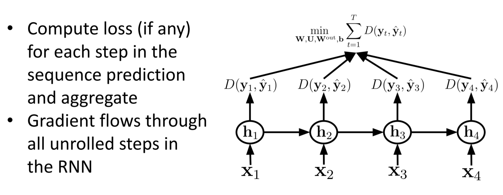
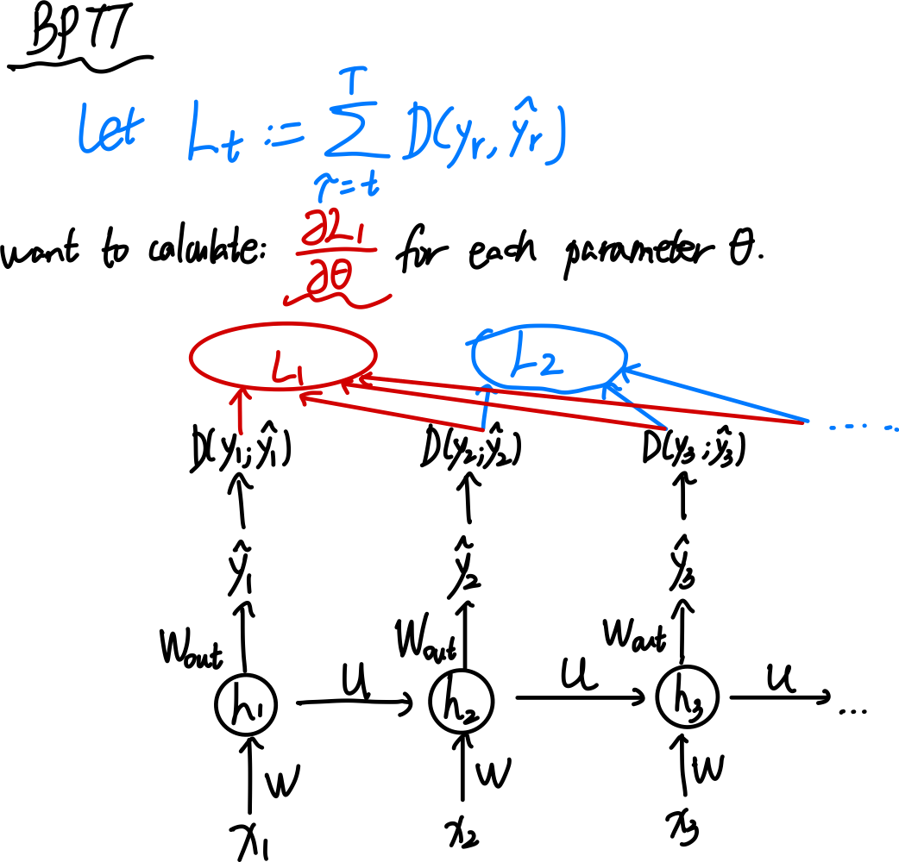

# lec 13: RNN & LSTM

## RNN basics

我们想要 model sequential 的 input 和 output: 比如输入一串文字，输出一串文字。（like GPT）

如果使用普通的 NN，可以做到，但是问题在于：我们的 input 和 output 的长度必须作为 hyperparameter 是固定的。不能够 model 长度任意变化的输入和输出。

因而 RNN: recurrance NN 诞生了。

它的 idea: 对 sequential data，使用一个隐藏状态（**hidden state**）存储过去的信息，并在每个 timestamp $t$ 上，通过至今的 hidden state $h_t$ 来给出对应的 prediction $\hat y_t$, 并更新这个 hidden state, 使它加入这一 timestamp 的新信息。从而连续地给出 output, 从 $x_1$ 处理到 $x_N$.

We reuse/share parameters for each input in a recurrent computation

(有点类似于 Markov chain)

### RNN 架构

在 RNN 中，**每个时间步 $t$ 的隐藏状态 $h_t$ 由前一个隐藏状态 $h_{t-1}$ 和当前输入 $x_t$ 共同决定：**

**RNN 的核心特点**：

1. **处理序列数据**：RNN 适用于时间序列、自然语言处理（NLP）、语音识别等任务。
2. **共享参数**：所有时间步共享同一个权重矩阵，降低了参数数量
3. **隐藏状态**：RNN 通过隐藏状态（hidden state）存储过去的信息，使得网络能够对序列进行建模。

#### RNN loss

RNN 的 loss 是所有的 time 上的 loss 的总和。每过一个 timestamp 就计算一次单 time 上的 loss.

为了计算这个 loss, 我们需要 do some recursion. Take: 
$$
\mathcal{L}_t = \sum_{\tau = t}^T D(y_\tau, \hat{y_\tau}) 
$$
表示从 time $t$ 累积到 $T$ 的 loss sum. (是从尾开始, 为了 do back propagation)

我们要求的就是 
$$
D_{all} = \mathcal{L}_1
$$
我们要 differentiate w.r.t. $W,U,W^{out}, b$

#### backpropagation through time (BPTT)

vectorized version:

**RNN 的问题**:

1. **梯度消失与梯度爆炸**：由于 RNN 在反向传播时依赖时间步的展开，长序列训练时可能导致梯度衰减（难以学习长期依赖关系）。
2. **长期依赖问题**：普通 RNN 很难记住长时间前的信息。

**改进 RNN 的方法**

1. **LSTM（Long Short-Term Memory）**：引入门控机制（输入门、遗忘门、输出门）来控制信息流，提高长期依赖的学习能力。
2. **GRU（Gated Recurrent Unit）**：简化版的 LSTM，仅使用两个门（更新门和重置门），计算更高效。

尽管 RNN 适用于序列数据，但由于训练困难，**Transformer 及其变体（如 BERT、GPT）已逐渐取代 RNN 在 NLP 任务中的地位**。

