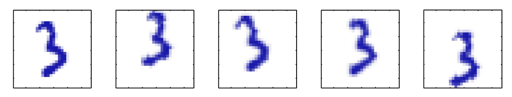

# PCA

Idea: high-dim Dataset 可能是 embedded in low-dim manifolds 的.

比如: image of 

- The data is $100 \times 100$-dimensional.
- But there are only three degrees of freedom, so it lies on a 3-dimensional subspace ( $x, y$, angle).
- (on a non-linear manifold, in this case)