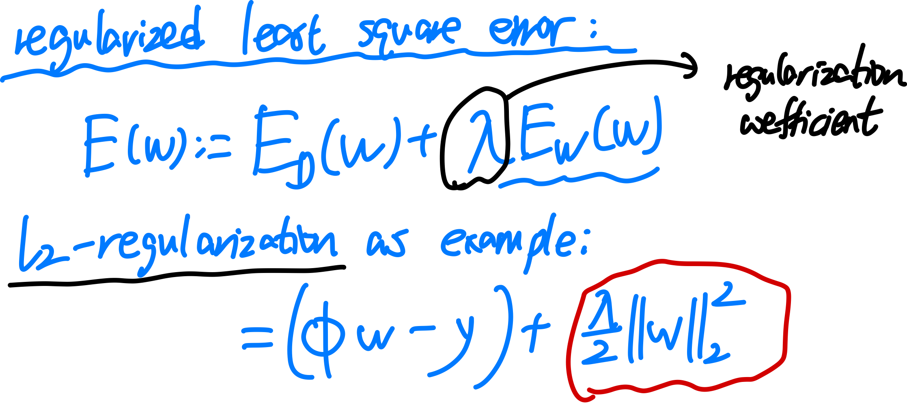

## Linear Regression: II

### overfitting

overfitting 的原因: features 数量 M 设置得太多, 导致过度保持 training sets 的点靠近曲线, 但是对于 testing set 并不对( 这里是一个简化, 实则不能单纯这样划分, 需要 cross validation)

overfitting 的表现: 各项 features 的参数动荡很大. 

overfitting 的解决方法 1: 增加数据点

### regularization: solving overfit

我们通过引入一个 regularization term, 也称为 penalty term 惩罚项, 以使得曲线尽量平缓, 从而减少 overfitting. 

Idea: 把 $w$ 本身的 Magnitute 作为一个 loss function 的一部分, 让我们降低 loss 的同时自带降低 w 的各个 entries 的正负动荡程度, 从而使得拟合曲线尽量平缓, 降低曲线的 expressibility.

这里的 $\lambda$ 理应设置较小, 如 0.001 等. 

$\lambda$ 设置越大, 曲线越接近 constant. 比如 $\lambda := 1$, 则会 

如果 traning error 和 testing error 都很大, 那就说明 $\lambda$ 调太大了.

### gradient of regularized least square

