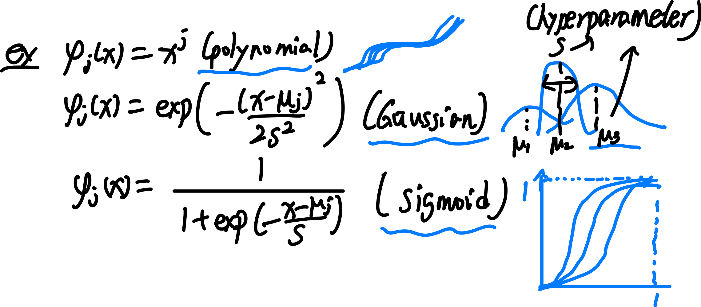

## Linear Regression(lec1)

### notation and expression
我们使用以下 notation:

**(generalized) linear regression 的定义:**
给定 $N$ 个 data points $\{(x^{(n)},y^{(n)}) \}_{n=1,\cdots, N}$ where each $x^{(n)}\in\mathbb{R}^d,y^{(n)}  \in\mathbb{R}$, 以及预先设定好的 $M$ 个 basis functions $\{ \phi_i(x)\}_{i=1,\cdots, M}$ 用以表示 $M$ 个 features;

我们通过建立一个 $h(x,w): \mathbb{R}^d \times \mathbb{R}^M \rightarrow  \mathbb{R} = \sum_{i=0}^{M-1} w_i \phi_i(x)$, 使其关于 $w$ 线性, 以找到一组参数 $w \in \mathbb{R}^M$, 使得 $h(x^{(n)},w)$ 能够近似 $y^{(n)}$ for each $n$, with respect to the loss function we define to measure the distance between two vectors. 

Remark:   注意 linear regression 指的是 $y$ 和参数 $w$ 之间是 linear 的, 而不是说 $y$ 和 input $x$ 之间是 linear 的. 我们可以选择 nonlinear 的 basis funtions 来 encode $x$ 来表示 features 的特性, 比如我们可以选择:

### loss function: sum of squared error
这个 loss function 衡量两个 vectors 之间的距离, 目的是衡量 $y \in \mathbb{R}^N$ 和 $h(x,w) \in \mathbb{R}^N$ 这两个 vectors 的差距. 实际上就是它们 difference 的 $L_2$-norm 的平方.

### gradient of sum of squared error
我们下面首先通过求 $\nabla E(w)$ 的每个 entry $\frac{\partial E}{\partial w_k}(w)$ 来写出这个 gradient.

### batch v.s. stochastic GD

我们通过迭代降低 gradient 来降低 loss function 的值, 从而优化 weight vector.

(More practically, 我们可以采用 minibatch SGD: 即在 batch GD 和 SGD 之间, 每次选择一小部分 samples, 称为一个 \textbf{minibatch}, 在这个 minibatch 上进行 GD.)

## Linear Regression(lec2)

### vectorization

我们可以把每个 $x^{(n)}$ 的 features 写成一个 row vector, 并 stack up $N$ 个 row vectors, 成为一个 $N\times M$ 的 matrix $\Phi$. 从而:
$$
h(x,w) = \Phi w
$$
vectorization 的好处是: 1. 便于手算; 2. computer 可以进行并行计算.
\pic[0.6]{assets/lec2-vect.png}
计算得 linear regression 的 loss function 为:
$$
E(w) = \frac{1}{2}w^T \Phi^T \Phi w - w^T \Phi^T y + \frac{1}{2}y^T y
$$

#### vector form gradient 以及 closed-form sol
如果
$$
\nabla E(w) = y
$$
有一个 closed form solution, 那么这个 solution 一定是一个 local min/max, 从而 possibly 成为一个 global min. (并且 we know, **如果 $E$ 是个 convex 的函数, 那么一定是 global min!**)

为了计算 closed form solution, 我们首先要给出 $\nabla E(w)$ 的 matrix form 表达式. \\
这里首先引入 linear form 和 quadratic form  的 gradient:

我们发现: $E(w)$ 就是一个 $w$ 的 quadratic form, 一个 $w$ 的 linear form 和一个 const 的组合. 从而可以求出:

从而我们得到 closed form solution (if exists):

因而 closed form exists iff $\Phi^T\Phi$ 可逆, iff $\Phi$ 可逆.
并且 recalll in linear algebra: **$rank(\Phi^T\Phi) = rank(\Phi)$.**
因而, **closed form exists iff $M >= N $ 且 $rank(\Phi) = N$**

### overfitting

overfitting 的原因: features 数量 M 设置得太多, 导致过度保持 training sets 的点靠近曲线, 但是对于 testing set 并不对( 这里是一个简化, 实则不能单纯这样划分, 需要 cross validation)

overfitting 的表现: 各项 features 的参数动荡很大. 

overfitting 的解决方法 1: 增加数据点

overfitting 的解决方法 2: 

#### regularization: solving overfit

我们通过引入一个 regularization term, 也称为 penalty term 惩罚项, 以使得曲线尽量平缓, 从而减少 overfitting. 

Idea: 把 $w$ 本身的 Magnitute 作为一个 loss function 的一部分, 让我们降低 loss 的同时自带降低 w 的各个 entries 的正负动荡程度, 从而使得拟合曲线尽量平缓, 降低曲线的 expressibility.

这里的 $\lambda$ 理应设置较小, 如 0.001 等. 

$\lambda$ 设置越大, 曲线越接近 constant. 比如 $\lambda := 1$, 则会 

如果 traning error 和 testing error 都很大, 那就说明 $\lambda$ 调太大了.

#### gradient of regularized least square

summary: regularization controls the tradeoff bewteen fitting error 和 expressibility.

## Linear Regression(lec3)

### Review on Probability

#### Likelihood function

后验概率 $P(\theta | X)$ 表示在给定观测数据 $X$ 的情况下，参数 $\theta$ 的概率分布。它是我们在观察数据后对参数的更新认知

根据 **贝叶斯定理**：
$$
P(θ|X)= \frac{P(X | \theta) P(\theta)}{P(X)}
$$
其中：

- $P(θ|X)$: 后验概率 (posterior)
- $P(X|θ)$: 似然函数（Likelihood）
- $P(θ)$: 先验概率（Prior）
- $P(X)$: 边际似然或归一化常数，确保后验概率的总和为 1。

### 2. **Likelihood（似然）**

似然 $P(X|θ)$ 描述在给定参数 $θ$ 的情况下，生成观测数据 $X$ 的可能性.

数学形式：如果数据是独立同分布（i.i.d.），则似然函数为
$$
P(X | \theta) = \prod_{i=1}^n P(x_i | \theta)
$$
似然函数衡量不同参数值对生成数据的“解释能力”。

### **生成观测数据的可能性**

“生成观测数据的可能性”指的是：给定模型和参数，观测到当前数据的概率大小。例如：

- 抛硬币时，若硬币正面概率 p=0.6p = 0.6，连续抛了 10 次得到 6 次正面，那么观测到这种结果的可能性（似然）可以用概率公式计算。

------

### 3. **Prior（先验概率）**

先验概率 P(θ)P(\theta) 表示在观测数据 XX 之前，参数 θ\theta 的概率分布。它反映了我们在未观察数据前对参数的主观认知或假设。

- 先验类
  - **非信息先验（Non-informative Prior）**：没有任何偏好，例如均匀分布。
  - **信息先验（Informative Prior）**：基于先验知识选择分布，例如根据历史数据选择分布。

P(θ∣X)=P(X∣θ)P(θ)P(X)P(\theta | X) = \frac{P(X | \theta) P(\theta)}{P(X)}

- P(X∣θ)P(X | \theta) 是似然函数，表明参数 θ\theta 解释数据 XX 的能力。
- P(θ)P(\theta) 是先验概率，表示对参数的先验假设。
- P(θ∣X)P(\theta | X) 是后验概率，综合了似然和先验后对参数 θ\theta 的更新。

------

### 举例说明

#### 抛硬币问题

假设：

- 硬币正面朝上的概率为 pp。
- 抛 10 次硬币，观测到 7 次正面。

1. **Prior（先验）**
    在抛硬币前，假设 pp 的分布是均匀分布 P(p)=1P(p) = 1（所有值同等可能）。

2. **Likelihood（似然）**
    给定参数 pp，生成 7 次正面和 3 次反面的观测数据的可能性为：

   P(X∣p)=(107)p7(1−p)3P(X | p) = \binom{10}{7} p^7 (1-p)^3

3. **Posterior（后验）**
    根据贝叶斯定理，后验分布为：

   P(p∣X)=P(X∣p)P(p)∫01P(X∣p)P(p)dpP(p | X) = \frac{P(X | p) P(p)}{\int_0^1 P(X | p) P(p) dp}

------

### 总结

- **Prior**：观测数据之前对参数的主观假设。
- **Likelihood**：参数给定时，数据出现的可能性。
- **Posterior**：结合观测数据后的参数分布。
- **生成观测数据的可能性**是 Likelihood 的核心，描述模型对数据的解释能力。

