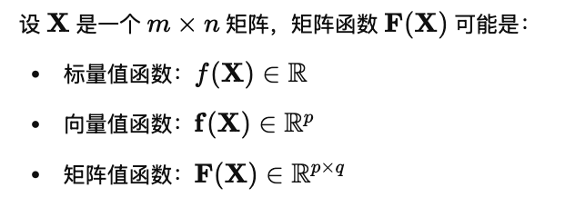
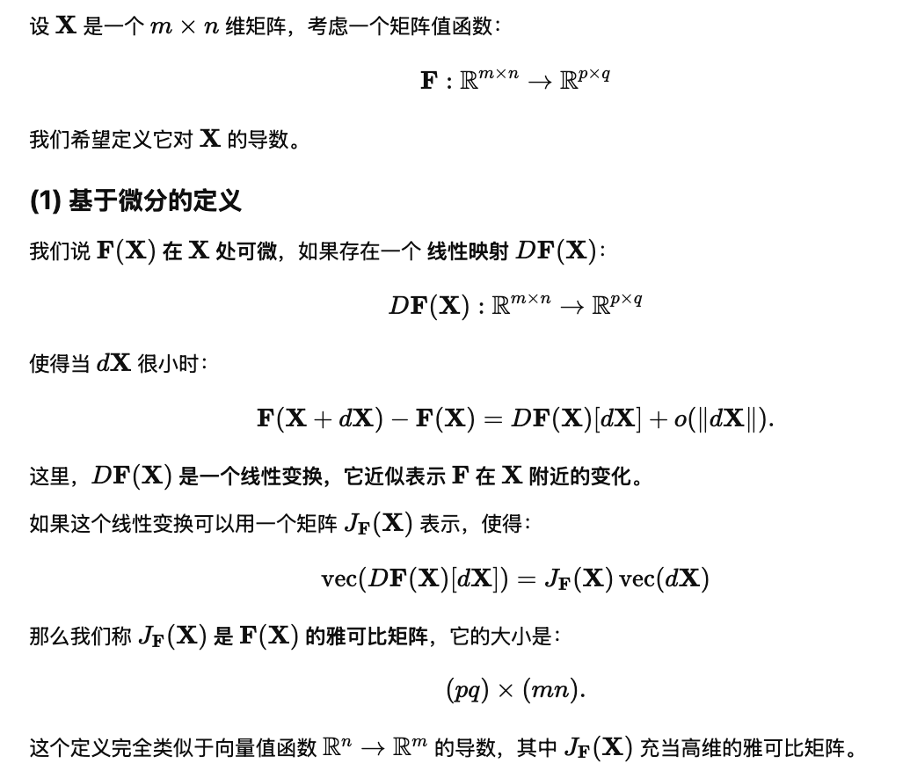
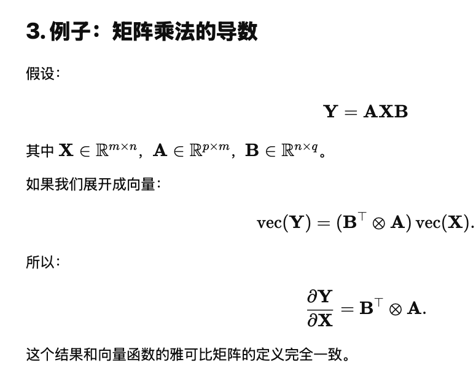

## gradient and Heissan

### gradient 的链式法则

### 求 Heissan 

Note: 

对于 $f:\mathbb{R}^n \rightarrow \mathbb{R}$,
$$
\nabla f: \mathbb{R}^n \rightarrow \mathbb{R^n}
$$
把一个点的值映射到这个点的导数的转置

而 Hessian 则是:
$$
H_f(x) = D(\nabla f) (x)
$$
可以写作:
$$
H_f(x) = \frac{\partial}{\partial x}(\nabla f) (x)
$$

## matrix-valued 函数

