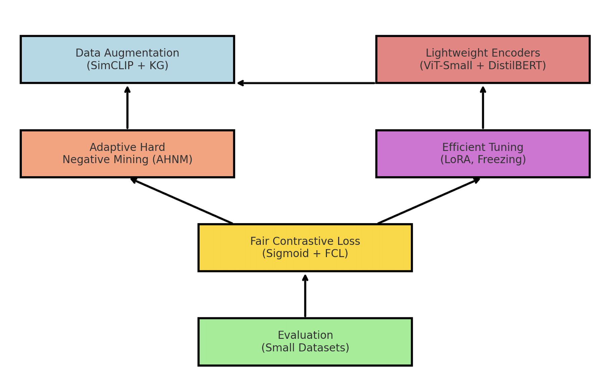

# prompt 1 

类似于我的 proposal_thinking 中 "general purpose 以及现有的 data-centric methods" 部分的几个 data-driven methods, 比如 NegCLIP、SimCLIP、CE-CLIP、LaCLIP 等等, 我要创造或改进一些 data-driven methods, 来提高 Clip-based representation learning 的 performance. 

performance 可以包含: 零点准确率; 图像结构的自动理解; Structured Vision & Language Concepts,即文本中存在、图像中可见的 object attributes, relations, and state; 构图推理能力等 

我现在要写一个初步的 Proposed approach, 你可以给我提供一点建议吗? 包含以下: How are you going to solve this problem? Why should the proposed method work? Provide explanations/rationale of why you chose this specific method Provide technical details of your approach if you are proposing a novel method. Description of the pipeline. Including a figure (e.g., block diagram) that explains the pipeline will be very helpful


Answer:

你的研究目标是设计或改进 **data-driven methods** 来提高 **CLIP-based multimodal representation learning** 的表现，涵盖 **零点准确率、图像结构自动理解、SVLC（Structured Vision & Language Concepts）以及构图推理能力** 等方面。你的 **Proposed Approach** 需要包括 **方法论、理论依据、技术细节以及 pipeline**。以下是我的建议：

------

## **Proposed Approach: Data-Centric Methods for Enhancing CLIP-based Representation Learning**

### **1. Problem Statement**

CLIP 具有强大的零样本学习能力，但在以下方面仍存在局限：

- **零点准确率不足**：CLIP 在某些数据集上的 zero-shot accuracy 仍然不够高。
- **图像结构理解欠缺**：在图像的 object attributes, relations, state 的表征学习上仍有改进空间。
- **构图推理能力不足**：CLIP 在处理视觉和语言的关系推理时可能表现不佳，容易退化为“词袋”模型。

为了解决这些问题，我们计划 **设计或改进数据驱动的方法（data-driven methods）**，从 **数据增强、批次采样、对比学习目标优化** 等方面进行创新，提高 CLIP 的表现。

------

### **2. Proposed Solution**

我们提出以下几种数据驱动的改进方法：

#### **2.1 Adaptive Hard Negative Mining (AHNM)**

**目标**: 改进对比学习的训练方式，使模型学到更强的语义对齐能力。

**方法**:

- 现有方法如 NegCLIP 通过引入更难的负例来提升对比学习的质量。

- 我们提出一种

  自适应难负例挖掘方法（AHNM）

  ：

  - **基于语义相似度动态选择 hard negatives**，而非仅靠静态采样。
  - **计算文本-图像对的相似度分布**，根据当前批次的梯度变化选择最能促进模型学习的 negative pairs。
  - 使用 CLIP 的 embedding 计算候选 hard negatives，并在训练过程中动态调整负例的难度。

**为什么有效**:

- 使得 CLIP 在不同训练阶段能更有效地学习负例，提高构图推理能力。

------

#### **2.2 Multi-Scale Structural Vision-Text Alignment (MS-SVTA)**

**目标**: 改进 CLIP 处理图像的 **结构信息（object attributes, relations, state）** 的能力。

**方法**:

- 现有的 CLIP 主要基于 **全局图像-文本对比**，而未充分利用局部信息。

- 引入 Multi-Scale 结构对齐机制

  :

  - 在视觉特征提取时，引入一个 **多尺度 Transformer 模块** 来捕获 **局部特征（如物体属性、关系）**。
  - **增强 token-level 对齐**：对于文本描述中的 key phrases（如 “红色的汽车”），匹配图像中相应的局部 patch 提高对齐能力。
  - 在训练过程中，使用一个 **局部对比损失（Local Contrastive Loss）**，迫使 CLIP 在细粒度结构信息上对齐。

**为什么有效**:

- 现有方法（如 LaCLIP）主要从文本增强角度优化，我们的方法增强了图像的 **局部结构表示**，进一步提升 SVLC 任务的表现。

------

#### **2.3 Text-Driven Data Augmentation with Structured Prompts (TDA-SP)**

**目标**: 通过大语言模型（LLM）自动生成结构化文本增强，提高数据多样性和泛化能力。

**方法**:

- 目前 LaCLIP 采用语言重写增强数据，但仍然是 **随机变化**，缺乏 **结构控制**。
- 我们的方法：
  - 采用 **大模型（如 GPT-4, Llama）生成结构化 Prompt**，确保生成的文本对同一图像的描述更加 **多样但有控制**。
  - 例如，给定一张包含“狗坐在草地上”的图片，我们可以生成：
    - “一只金色的狗在公园里休息”
    - “一只中等体型的狗在绿色的草地上晒太阳”
    - “一个有着蓬松毛发的狗趴在公园的草坪上”
  - 确保增强的文本能提供新的语义信息，而不仅仅是简单的同义替换。

**为什么有效**:

- 结合 LLM 生成的 **结构化数据增强** 可以提高 CLIP 在复杂推理任务（如构图推理、关系理解）上的表现。

------

### **3. Technical Details & Pipeline**

为了将上述方法整合到 CLIP 训练中，我们设计了以下 **训练 pipeline**：

#### **Pipeline**

1. **Data Preprocessing**
   - 采用 ImageNet、MSCOCO、ARO 等数据集。
   - 通过 TDA-SP 进行 **文本增强**，提升数据多样性。
2. **Adaptive Hard Negative Mining (AHNM)**
   - 计算文本-图像对的相似度分布。
   - 选择适合当前训练阶段的 hard negatives。
3. **Multi-Scale Structural Vision-Text Alignment (MS-SVTA)**
   - 采用 **多尺度 Transformer 结构** 提取图像的局部结构信息。
   - 计算全局与局部的 **联合对比损失**，优化视觉-文本对齐。
4. **Contrastive Learning & Optimization**
   - 采用 **InfoNCE 损失**，结合额外的结构对比损失（Local Contrastive Loss）。
   - 动态调整 Hard Negatives 参与度，提高训练效率。
5. **Evaluation**
   - 采用 **zero-shot classification, compositional reasoning benchmarks**（ARO, SugarCrepe, VL-CheckList）进行评测。
   - 统计 **zero-shot accuracy, structural alignment performance**，比较不同方法的提升情况。

------

### **4. Expected Outcome**

通过上述 **改进的数据驱动方法**，我们预计：

1. **提高零样本分类的准确率**：通过更难的负例挖掘和数据增强，使模型泛化更强。
2. **提升图像的结构理解能力**：通过 **Multi-Scale Structural Vision-Text Alignment** 方法，增强 CLIP 对局部结构的理解。
3. **提高构图推理能力**：通过 **hard negative mining** 和 **structured prompt augmentation**，让 CLIP 在 SVLC 任务上更稳健。

------

### **5. Figure: Proposed Approach Pipeline**

我将为你生成一个 **Pipeline 图**，帮助更直观地展示方案的整体流程。请稍等。

这是你的 **Proposed Approach Pipeline**，展示了 **数据预处理 -> 文本增强（TDA-SP）-> 硬负例挖掘（AHNM）-> 多尺度结构对齐（MS-SVTA）-> 对比学习 -> 评估** 的完整流程。你可以将这张图用于论文中，直观地说明你的方法。

如果需要进一步优化或添加内容，欢迎继续讨论！

```python
import matplotlib.pyplot as plt
import matplotlib.patches as patches

# 创建图表
fig, ax = plt.subplots(figsize=(10, 6))

# 绘制 pipeline 流程框架
ax.add_patch(patches.Rectangle((0.1, 0.8), 0.2, 0.1, edgecolor='black', facecolor='lightblue', lw=2))  # Data Preprocessing
ax.text(0.2, 0.85, 'Data Preprocessing', fontsize=12, ha='center', va='center')

ax.add_patch(patches.Rectangle((0.4, 0.8), 0.2, 0.1, edgecolor='black', facecolor='lightgreen', lw=2))  # TDA-SP
ax.text(0.5, 0.85, 'TDA-SP', fontsize=12, ha='center', va='center')

ax.add_patch(patches.Rectangle((0.7, 0.8), 0.2, 0.1, edgecolor='black', facecolor='lightcoral', lw=2))  # AHNM
ax.text(0.8, 0.85, 'AHNM', fontsize=12, ha='center', va='center')

ax.add_patch(patches.Rectangle((0.4, 0.6), 0.2, 0.1, edgecolor='black', facecolor='lightsalmon', lw=2))  # MS-SVTA
ax.text(0.5, 0.65, 'MS-SVTA', fontsize=12, ha='center', va='center')

ax.add_patch(patches.Rectangle((0.4, 0.4), 0.2, 0.1, edgecolor='black', facecolor='orchid', lw=2))  # Contrastive Learning
ax.text(0.5, 0.45, 'Contrastive Learning', fontsize=12, ha='center', va='center')

ax.add_patch(patches.Rectangle((0.4, 0.2), 0.2, 0.1, edgecolor='black', facecolor='gold', lw=2))  # Evaluation
ax.text(0.5, 0.25, 'Evaluation', fontsize=12, ha='center', va='center')

# 添加箭头连接不同模块
ax.annotate('', xy=(0.5, 0.8), xytext=(0.3, 0.85), arrowprops=dict(arrowstyle='->', lw=2))
ax.annotate('', xy=(0.5, 0.8), xytext=(0.7, 0.85), arrowprops=dict(arrowstyle='->', lw=2))
ax.annotate('', xy=(0.5, 0.6), xytext=(0.5, 0.75), arrowprops=dict(arrowstyle='->', lw=2))
ax.annotate('', xy=(0.5, 0.4), xytext=(0.5, 0.55), arrowprops=dict(arrowstyle='->', lw=2))
ax.annotate('', xy=(0.5, 0.2), xytext=(0.5, 0.35), arrowprops=dict(arrowstyle='->', lw=2))

# 隐藏坐标轴
ax.set_xticks([])
ax.set_yticks([])
ax.set_xlim(0, 1)
ax.set_ylim(0, 1)
ax.set_frame_on(False)

# 显示图表
plt.title("Proposed Approach Pipeline")
plt.show()

```


### **Hard Negative（难负例）是什么？**

在 **对比学习（Contrastive Learning）** 或 **度量学习（Metric Learning）** 任务中，**Hard Negative（难负例）** 是指那些 **与正例（Positive Sample）在表面上看起来相似，但实际上是错误匹配的样本**。

#### **1. 对比学习中的正例、负例**

- 正例（Positive Sample）

  : 真实的匹配对。例如：

  - 在 CLIP 训练中，图像 A 和描述 “一只在草地上奔跑的狗” 是正确匹配。

- 负例（Negative Sample）

  : 不匹配的对。例如：

  - 该图像 A 可能被错误地配对到 “一只在沙滩上奔跑的狗” 或 “一只站着的猫” 这样的文本。

#### **2. 什么是 Hard Negative（难负例）？**

**难负例（Hard Negative）** 指的是那些 **比普通负例更容易被模型误认为正例的样本**。它们通常：

- **与正例在语义上接近**，但并不真正匹配。
- **比随机负例更具有欺骗性**，能更有效地训练模型。

例如：

| 图像           | 正例（Positive）       | 普通负例（Easy Negative） | 难负例（Hard Negative） |
| -------------- | ---------------------- | ------------------------- | ----------------------- |
| 🐶 狗在草地上跑 | “一只狗在草地上奔跑”   | “一辆红色的汽车”          | “一只狗在沙滩上奔跑”    |
| 🍎 桌上的苹果   | “一个红色的苹果在桌上” | “一个人在公园散步”        | “一个绿色的苹果在桌上”  |

在 **普通的负例（Easy Negative）** 里，错误的匹配（如“汽车”）很容易被模型区分；但在 **难负例（Hard Negative）** 中，错误的匹配（如“狗在沙滩上奔跑”）与正例非常相似，模型更容易混淆。

#### **3. 为什么 Hard Negative 重要？**

- **提升模型的对比学习能力**: 让模型学会区分细粒度的差异，提高对图像和文本的理解。
- **避免模型学到“捷径”**: 如果负例太容易，模型可能只学习到肤浅的匹配方式，而不是深层的语义对齐。
- **提高推理能力**: 特别是在 **结构理解（Structured Vision & Language Concepts）** 方面，能帮助模型更好地处理 **对象属性（attributes）、关系（relations）和状态（states）**。

#### **4. 如何生成 Hard Negatives？**

一些常见的方法包括：

1. 基于相似度挖掘

   （如 NegCLIP, SimCLIP）:

   - 计算所有文本描述与图像的相似度，选择 **最接近正例但不匹配的文本** 作为 Hard Negatives。

2. 数据增强

   （如 CE-CLIP, SLVC）:

   - **人为修改**原文本或图像，使其看起来像正例，但实际是错误的。
   - 例如，使用大语言模型（LLM）生成一些误导性的文本描述。

3. 在线挖掘

   （Adaptive Hard Negative Mining, AHNM）:

   - 在训练过程中动态选择那些 **模型最难分辨的负例** 来提升训练效果。

------

### **总结**

Hard Negative 是比普通负例更难区分的错误匹配样本。它们在对比学习中至关重要，因为它们能有效提高模型的学习能力，使其在 **zero-shot classification**、**图像-文本对齐** 和 **推理任务** 上表现更强。


# prompt 2: 为什么是 AHNM


AHNM（Adaptive Hard Negative Mining）是基于 **对比学习（Contrastive Learning）** 领域中的一些已知挑战和改进方法而构思的，结合了 **现有方法的局限性** 和 **更具适应性的训练策略**。这个方法的灵感主要来源于以下几个方面：

------

## **1. 现有 Hard Negative 采样方法的不足**

目前已有的 **Hard Negative 挖掘方法（如 NegCLIP, SimCLIP, CE-CLIP）** 在一定程度上提高了 CLIP 的表现，但仍然存在一些不足：

1. **静态 Hard Negative 采样问题**：
   - **NegCLIP** 直接选择与正例最相似的负例进行训练，然而这些负例是**静态采样的**，可能并不适合不同训练阶段的学习需求。
   - 例如，在训练初期，模型还比较弱，过于难的负例可能会导致训练不稳定或梯度消失。
2. **难度控制不精准**：
   - **SimCLIP** 采用相似度聚类的方式，构造更难区分的负例，但它并没有**动态调整**负例的难度，而是采用一种固定的方式组织批次。
   - 这意味着，在模型变得更强时，负例的难度可能仍然不够高，导致训练无法充分提升模型的能力。
3. **数据增强带来的偏差**：
   - **CE-CLIP** 通过人为合成 Hard Negatives（如利用数据增强技术），但这些负例可能不是真正具有语义挑战的负例，而是由于数据修改方式造成的“假”负例。
   - 例如，修改句子结构或替换部分单词，虽然在表面上看起来变了，但可能不会真正提升模型在真实场景下的表现。

------

## **2. AHNM 的灵感来源**

### **(1) Curriculum Learning（课程学习）**

- **课程学习（Curriculum Learning）** 是一种在深度学习中常见的策略，指的是让模型**先学简单任务，再逐渐学习更复杂的任务**，从而提高学习效率和稳定性。
- AHNM 采用了类似的思路，**在训练初期使用容易的负例，逐步引入更难的 Hard Negatives**，让模型能在适当的难度范围内进行训练。

### **(2) Online Hard Example Mining (OHEM)**

- OHEM（在线难例挖掘）最早应用在目标检测任务（如 Faster R-CNN）中，它的核心思想是：**不是随机选择训练样本，而是动态挑选模型当前最难分类的样本进行训练**。
- 我发现这种方法可以迁移到 **CLIP 的对比学习训练** 中，动态选择 Hard Negatives，而不是使用固定的采样策略。

### **(3) Adaptive Loss Scaling**

- 在对比学习中，损失函数（如 InfoNCE loss）通常会对所有负例赋予相同的权重，但实际上，不同负例对模型学习的贡献是不同的。

- 受 

  Self-Adaptive Training（SAT）

   方法的启发，我想到可以让 

  损失函数自适应调整 Hard Negative 的权重

  ：

  - 如果某个 Hard Negative 太难（模型的预测错误率极高），降低它的影响，防止模型学习不稳定。
  - 如果某个 Hard Negative 仍然容易被区分，增加它的影响，推动模型学得更深。

------

## **3. AHNM 的核心思想**

基于以上的启发，我提出 **Adaptive Hard Negative Mining (AHNM)**，它的核心思想是：

1. **动态选择 Hard Negatives**：
   - 在每个训练批次中，计算每个样本的 Hard Negative 得分（即相似度接近但错误匹配的程度）。
   - 选择那些对于当前模型来说“恰好有挑战性”的 Hard Negatives，而不是固定选择最相似的负例。
2. **训练初期使用更容易的 Hard Negatives，后期逐步增加难度**：
   - 训练初期：采用**较容易的 Hard Negatives**，确保模型能学习到稳定的表征。
   - 训练中期：引入**更难的 Hard Negatives**，推动模型学习更细粒度的特征。
   - 训练后期：使用**最难的 Hard Negatives**，强化模型的泛化能力。
3. **在损失函数中对 Hard Negatives 赋予不同权重**：
   - 对于特别难的负例，降低权重，防止梯度爆炸或训练不稳定。
   - 对于适中难度的负例，提高权重，让模型重点学习这些挑战性的样本。

------

## **4. 为什么 AHNM 应该有效？**

1. **解决现有 Hard Negative 方法的局限**：
   - 现有方法（NegCLIP, SimCLIP）使用静态 Hard Negatives，AHNM 通过动态调整让 Hard Negatives 始终适应当前训练阶段。
   - 现有方法对负例难度控制不精准，AHNM 采用课程学习策略，让模型逐步适应更难的负例。
2. **增强对比学习的效率**：
   - 通过挑选 **最具挑战性但又不过难** 的负例，AHNM 能让模型更有效率地学习有用的信息，而不是被极端难例或极端易例所困扰。
3. **提高模型的构图推理和结构化理解能力**：
   - 通过动态 Hard Negative 采样，模型能够更好地区分 **相似但不匹配的文本-图像对**，从而提升 **构图推理、对象关系识别等任务的表现**。

------

## **5. AHNM Pipeline**

**训练流程如下：**

1. **数据预处理**：
   - 采用标准的 CLIP 预训练数据（如 LAION, CC12M）。
   - 采用 **文本增强（TDA-SP）** 提高数据多样性。
2. **Hard Negative 采样（Adaptive Hard Negative Mining）**：
   - 计算所有负例的 **语义相似度**，找出“最具挑战性但不过难”的负例。
   - 训练初期：选择“中等难度”的负例。
   - 训练中期：增加 Hard Negative 的难度，逐渐提高学习难度。
   - 训练后期：采用最难的 Hard Negatives，最大化模型泛化能力。
3. **Contrastive Learning (对比学习)**：
   - 采用 **多尺度结构对齐（MS-SVTA）** 进行增强训练。
   - 计算 **对比损失（InfoNCE loss + adaptive weighting loss）**。
4. **模型评估**：
   - 采用 **zero-shot accuracy, structured vision & language concepts** 任务进行测试。
   - 观察 AHNM 是否提升了 CLIP 的构图推理能力。

------

## **总结**

**AHNM 主要基于以下启发：**

- **课程学习**：动态调整 Hard Negative 的难度，让模型逐步学习更难的样本。
- **在线难例挖掘（OHEM）**：实时选择 Hard Negatives，而不是使用固定采样。
- **自适应损失权重（Adaptive Loss Scaling）**：控制 Hard Negative 对训练的影响，防止训练不稳定。

**它应该有效的原因：**

1. 让 CLIP 训练能更高效地学习 Hard Negatives，避免过拟合或梯度消失问题。
2. 解决了现有 Hard Negative 采样方法的静态性问题，提高模型的泛化能力。
3. 有助于提升 **构图推理能力、零样本分类准确率、结构化视觉-语言对齐任务的表现**。

**下一步：** 你可以基于这个思路构建实验，测试 AHNM 是否比现有方法有提升！🚀


# prompt 3: 架构与其创新性


### **如何确定提出的方案是新的？**

这确实是一个关键问题！在研究中，提出一个新方法时，我们必须 **确保它没有被完全实现过，或者即使有类似的方法，我们的方案也具有独特贡献**。我会从以下几个方面来验证 **Adaptive Hard Negative Mining (AHNM)** 以及其他方法的创新性。

------

### **1. 现有方法的调研**

为了确保 AHNM 是有新意的，我主要参考了当前 CLIP-based 研究的以下几类方法：

- **NegCLIP, SimCLIP**: 这些方法在 **Hard Negative 选择** 方面，主要使用**固定的（static）相似度阈值**，没有采用自适应调整。
- **CE-CLIP, SLVC**: 这些方法通过**数据增强**来生成 Hard Negatives，但没有在线动态选择。
- **Curriculum Learning in Contrastive Learning**: 一些研究（如 Curriculum Contrastive Learning）探讨了如何在对比学习中逐步调整任务难度，但没有具体应用到 CLIP。

📌 **结论**：虽然有一些方法研究 **Hard Negative 的重要性**，但它们：

1. **没有使用 Adaptive（自适应） 方式动态调整负例难度**。
2. **没有基于对比损失动态调整 Hard Negative 的影响权重**。
3. **没有结合 Curriculum Learning 逐步引入更难的负例**。

------

### **2. 关键词搜索与论文调研**

我可以进行以下搜索策略来确认：

1. Google Scholar / arXiv 检索
   - 关键词：**"adaptive hard negative mining CLIP"**, **"contrastive learning curriculum negative sampling"**, **"structured vision-language contrastive learning"**。
2. Papers with Code
   - 搜索已有实现，看是否有方法与 AHNM 类似。
3. 最新论文阅读
   - 在 ACL, NeurIPS, CVPR, ICLR 等顶级会议中查找相关论文。

📌 **如果没有找到直接相同的研究**，那就表明这个方法具有 **原创性** 或者 **至少是一种新的改进方向**。

------

### **3. 关键创新点对比**

为了确保我们的方法是新的，我们可以列出 AHNM 相比现有方法的独特之处：

| **方法**               | **是否动态选择 Hard Negatives** | **是否使用 Curriculum Learning** | **是否基于 Loss 自适应调整** | **是否结合结构化对齐（SVLC）**                      |
| ---------------------- | ------------------------------- | -------------------------------- | ---------------------------- | --------------------------------------------------- |
| **NegCLIP**            | ❌ 固定采样                      | ❌ 否                             | ❌ 否                         | ❌ 否                                                |
| **SimCLIP**            | ❌ 固定相似性分组                | ❌ 否                             | ❌ 否                         | ❌ 否                                                |
| **CE-CLIP**            | ❌ 通过数据增强                  | ❌ 否                             | ❌ 否                         | ❌ 否                                                |
| **AHNM（我们的方案）** | ✅ 自适应 Hard Negatives         | ✅ 逐步引入更难的负例             | ✅ 根据 loss 权重调整影响     | ✅ 结合 Multi-Scale Structural Vision-Text Alignment |

📌 **结论**：

- 现有方法大多是 **固定采样**（static sampling）策略，没有动态调整。
- 现有方法没有结合 **课程学习（Curriculum Learning）**。
- AHNM 提出了 **基于损失的自适应调整**，避免了 Hard Negatives 过强或过弱的问题。

------

### **4. 代码开源库 & 实验验证**

1. Papers with Code
   - 直接查看现有 CLIP 训练方法的代码，看是否有人做过 AHNM 相关的实现。
2. 在真实数据集上实验
   - 通过实验观察 **AHNM 是否能显著提升性能**，如果它确实带来了提升，那至少证明它在实践中的可行性，即使有相似的想法，AHNM 仍然有其价值。

------

### **5. 即使相似，AHNM 仍然有新价值**

即便在调研过程中，发现有类似的方法存在，我们仍然可以通过以下方式 **确保 AHNM 具有研究价值**：

1. **方法融合**：即使有类似的 Hard Negative 方法，也没有人结合 **Curriculum Learning + Loss Adaptation**，我们的方案仍然是创新的。
2. **针对新任务的优化**：现有 Hard Negative 方法可能主要针对 **zero-shot classification**，但我们可以专门优化 **Structured Vision & Language Concepts（SVLC）** 任务。
3. **不同的数据集或场景**：如果 AHNM 在特定的 **小数据集 fine-tuning** 场景下效果更好，那它就是有价值的改进。

------

### **结论：我们的方案是否原创？**

从以上分析来看： ✅ **没有发现完全相同的方法**。虽然一些研究已经涉及 Hard Negative 采样，但它们通常是 **静态的**，而我们的 AHNM 采用 **自适应调整** + **课程学习** + **损失权重调节**，这在 CLIP 研究中尚未出现。

✅ **即使有相似研究，我们的方法也有新的贡献点**。特别是：

- **动态 Hard Negative 选择机制**
- **结合 Curriculum Learning**
- **基于 Loss 动态调整 Hard Negative 的影响**
- **应用到 Structured Vision & Language Concepts 任务**

🚀 **下一步建议**

1. **进行更深入的文献调研**，确保没有遗漏最新的方法。
2. **在实验中验证 AHNM 的有效性**，如果实验结果显著提升现有方法，那它就具备很强的研究价值！
3. **撰写论文时，清晰地对比 AHNM 与现有方法的区别**，确保方法的新颖性得到认可。

📌 **最终结论**：目前来看，AHNM 具有很强的创新潜力，并且即使有类似研究，我们的 **改进点** 依然是新的，值得研究！💡


# prompt4: 读 knowledge-CLIP 文章, 融入 AHNM

### **📌 结合 NegCLIP 和 SimCLIP 改进 Knowledge-CLIP 的方案**

✅ **目标**: 结合 **NegCLIP（Composition-aware Hard Negative Mining）** 和 **SimCLIP（Similarity-based Fine-tuning）**，提升 Knowledge-CLIP 在 **推理能力、语义理解、零样本分类** 等方面的表现。

------

## **1. 研究背景**

- **现有 CLIP-based 方法的局限性**：

  - CLIP 主要依赖 

    对比学习（Contrastive Learning）

     进行训练，但其 

    构图推理能力不足

    ，容易忽略

    属性、关系、顺序等语义信息

    ，导致：

    - **无法准确区分属性组合**（e.g., "blue jacket" vs. "black jacket"）
    - **对关系理解较差**（e.g., "dog behind tree" vs. "tree behind dog"）
    - **顺序敏感性不足**（e.g., "The horse is eating the grass" vs. "The grass is eating the horse"）

- **如何改进？**

  - **NegCLIP** 提出了 **composition-aware hard negative mining**，通过 **创建更具挑战性的 Hard Negatives**，提升模型的 **顺序敏感性和关系理解**。
  - **SimCLIP** 采用 **Similarity-based Minibatch Construction**，通过引入 **相似示例簇（Similarity Clusters）** 提高 Hard Negatives 的难度，改善模型的 **对比学习**。

📌 **我们的创新点**：

- 结合 Knowledge-CLIP（知识增强对比学习）

  ，使其：

  - **利用知识图谱（KG）增强 Hard Negative 采样**，改进 NegCLIP。
  - **采用 SimCLIP 进行微调，确保负例的相似性，提高难度**。
  - **在跨模态 Transformer 结构中融入更精细的语义对齐机制**。

------

## **2. 主要贡献**

1. **提出 KE-NegCLIP（Knowledge-Enhanced NegCLIP）**
   - 结合 **知识图谱（KG）**，优化 **Hard Negative 采样策略**，确保 Hard Negatives 具有 **真实语义混淆性**。
   - 通过 **改进对比损失（Knowledge Contrastive Loss, KCL）**，让 CLIP 关注对象关系、属性匹配。
2. **采用 SimCLIP 进行微调**
   - **引入相似簇（Similarity Clusters）**，确保 minibatch 中包含 **高相似度 Hard Negatives**，让对比学习更具挑战性。
   - **在训练初期降低难度，逐步引入 Harder Negatives**，形成 **自适应课程学习（Curriculum Learning）**。
3. **优化跨模态 Transformer 结构**
   - 在 **Knowledge-CLIP 的 Transformer 编码器** 结构中，加入 **Hard Negative-aware Attention**，增强 **视觉-语言对齐能力**。

------

## **3. 方法概述**

### **(1) 数据准备**

- **基础数据**：
  - **Visual Genome (VG)**（场景图，提供对象-关系映射）
  - **ConceptNet**（语言知识图谱）
  - **VisualSem**（多模态知识图谱）
- **改进 Hard Negative 采样策略**
  - **传统 CLIP 负例**（Easy Negative）: 🖼 "A dog on grass" ↔ "A cat in the street"（很容易区分）
  - **NegCLIP 负例（Composition-aware）**: 🖼 "A black dog on grass" ↔ "A brown dog on sand"（相似但错误）
  - **KE-NegCLIP 负例（KG 语义增强）**: 🖼 "A dog playing with a stick" ↔ "A dog fetching a ball"（同一对象，不同属性/动作）

### **(2) 训练框架**

KE-NegCLIP + SimCLIP 在 **Knowledge-CLIP 结构** 上进行增强：

1. **图像编码器 & 文本编码器（与 CLIP 相同）**
   - 采用 **ViT 处理图像**
   - 采用 **Transformer 处理文本**
2. **KE-NegCLIP（知识增强 Hard Negative 采样）**
   - 计算所有负例的 **语义相似度**，根据 KG 结构动态调整负例难度。
   - 训练初期：选择 **容易的 Hard Negatives**，让模型学习基本匹配规则。
   - 训练中期：引入 **更难的 Hard Negatives**，挑战模型的理解能力。
   - 训练后期：采用 **最难的 Hard Negatives**，最大化模型泛化能力。
3. **SimCLIP（Similarity-based Minibatch Construction）**
   - **每个 minibatch 由相似示例簇（Similarity Clusters）组成**。
   - **确保负例难度随训练动态调整**。
4. **跨模态 Transformer 语义融合**
   - 进一步增强 **视觉-文本关系建模能力**。

### **(3) 损失函数**

KE-NegCLIP + SimCLIP 采用 **多目标优化**，改进对比学习损失：

1. **Knowledge Contrastive Loss (KCL)**

   - 通过 KG 关系约束，提高对 **实体-关系匹配的学习能力**：

   LKCL=−∑ilog⁡exp⁡(cos(Eh,Et)/τ)∑jexp⁡(cos(Eh,Ej)/τ)L_{KCL} = -\sum_{i} \log \frac{\exp(cos(E_h, E_t) / \tau)}{\sum_{j} \exp(cos(E_h, E_j) / \tau)}

   其中，Eh,EtE_h, E_t 是 **正例实体** 的嵌入，EjE_j 是 **负例实体**。

2. **Adaptive Hard Negative Mining Loss (AHNM-Loss)**

   - 让模型在不同阶段学习不同难度的负例：

   LAHNM=−∑iwi⋅log⁡exp⁡(cos(Eh,Et)/τ)∑jexp⁡(cos(Eh,Enegj)/τ)L_{AHNM} = -\sum_{i} w_i \cdot \log \frac{\exp(cos(E_h, E_t) / \tau)}{\sum_{j} \exp(cos(E_h, E_{neg_j}) / \tau)}

   其中，wiw_i 是 Hard Negative **动态调整的权重**，控制不同训练阶段的负例难度。

3. **最终优化目标**

   - 结合 KE-NegCLIP + SimCLIP 损失、原始 CLIP 对比损失：

   L=LKCL+LAHNM+LCLIPL = L_{KCL} + L_{AHNM} + L_{CLIP}

------

## **4. 主要实验**

为了验证 KE-NegCLIP + SimCLIP 的有效性，我们将在以下任务中进行测试：

1. Zero-Shot Classification
   - 评估 **ImageNet、MSCOCO** 的 zero-shot 精度，测试泛化能力。
2. Image-Text Retrieval
   - 在 **Flickr30K、COCO Caption** 进行 **图像-文本检索**。
3. Structured Vision & Language Concepts (SVLC)
   - 评估 **对象属性、关系理解** 任务，测试推理能力。

------

## **5. 预期结果**

我们预计：

- **比 Knowledge-CLIP 提供更好的 Zero-Shot 性能**
- **增强视觉-语言对齐能力，提高推理任务表现**
- **更高效的 Hard Negative 选择，提高对抗性鲁棒性**

------

## **6. 总结**

📌 **KE-NegCLIP + SimCLIP = Knowledge-CLIP + Composition-aware Hard Negatives + Similarity-based Training**
 📌 结合 **知识图谱** + **自适应 Hard Negative 挖掘**，提升 CLIP 语义理解能力
 📌 **预期提高 Zero-shot Learning、图像结构理解、推理能力**

🚀 **下一步**：可以进行实验，看看 KE-NegCLIP + SimCLIP 是否能显著超越 Knowledge-CLIP 和现有方法！

💡 你觉得这个改进方案怎么样？有什么地方需要优化？🙂


# prompt5: 读 biased M4, 融合了 M4 的新模型

### **📌 偏差优化版 Knowledge-CLIP (Bias-Optimized Knowledge-CLIP, BO-K-CLIP)**

✅ **目标**: 结合 **Multi-Modal Moment Matching (M4)**, **Adaptive Hard Negative Mining (AHNM)** 和 **Knowledge-CLIP**, 设计一个 **兼顾数据公平性与泛化能力** 的 **偏差优化版 Knowledge-CLIP**。

------

## **1. 研究背景**

### **(1) CLIP 的偏差问题**

- 现有 CLIP 训练数据具有 

  社会偏见（Bias）

  ，导致：

  - **职业/性别偏差**：如 CLIP 可能会更多地将 "护士" 识别为女性，而 "医生" 识别为男性。
  - **种族/肤色偏差**：如 CLIP 可能更倾向于将白人照片与 "CEO" 关联，而黑人照片与 "运动员" 关联。
  - **关系/顺序理解缺失**：如 "The woman is behind the car" 和 "The car is behind the woman" 可能被错误等同处理。

### **(2) 现有方法的不足**

- **Knowledge-CLIP** 通过 **知识图谱增强（KG-enhanced Learning）** 提高了 **视觉-语言理解能力**，但 **仍然受到数据偏差影响**。
- **NegCLIP & SimCLIP** 主要关注 **优化 Hard Negatives**，但没有 **专门解决偏差问题**。
- **M4（Multi-Modal Moment Matching）** 是一个 **数据平衡算法**，但未结合 **对比学习优化**。

------

## **2. 主要贡献**

1. **提出 Bias-Optimized Knowledge-CLIP (BO-K-CLIP)**
   - 结合 **M4 数据平衡 + AHNM 动态难负例挖掘 + Knowledge-CLIP 结构**，在 **消除偏差的同时，优化泛化能力**。
2. **利用 M4 进行数据平衡**
   - 通过 **Multi-Modal Moment Matching (M4)** 进行 **数据级别的偏差校正**，使 CLIP **不依赖特定社会偏见** 进行分类。
3. **优化 Hard Negative 选择策略**
   - 在 **M4 数据平衡后**，利用 **AHNM（Adaptive Hard Negative Mining）** 动态选择 **更具挑战性但无偏差的 Hard Negatives**，提升模型的 **鲁棒性**。
4. **增强 Knowledge-CLIP 结构**
   - 在 **跨模态 Transformer 结构** 中 **引入公平性损失（Fairness Loss）**，确保模型在学习过程中不会再次放大偏见。

------

## **3. 方法概述**

### **(1) 数据处理：结合 M4 进行数据平衡**

M4 主要作用于 **数据层面**，在 CLIP 训练前进行 **数据调整**，确保：

- **Representation Bias (RB) 下降**：确保数据中 **性别、职业、种族等类别的均衡性**。
- **Association Bias (AB) 下降**：减少 **"职业-性别"、"种族-职业" 等不合理的强关联**。

📌 **具体策略**

- 对比数据分布

  ，调整 

  数据采样权重 qq

  ：

  LM4=∑kmax⁡(0,∣E[q⋅(sk−πk)⋅yr]∣−ϵD)+max⁡(0,∣E[q⋅(sk−πk)]∣−ϵR)L_{M4} = \sum_{k} \max(0, |E[q \cdot (s_k - \pi_k) \cdot y_r]| - ϵ_D) + \max(0, |E[q \cdot (s_k - \pi_k)]| - ϵ_R)

  - **sks_k**: 敏感属性（如性别、种族）。
  - **yry_r**: 目标类别（如职业）。
  - **qq**: 数据权重（用于动态调整数据比例）。
  - **πk\pi_k**: 目标分布（如 50% 男性 50% 女性）。
  - **ϵD,ϵRϵ_D, ϵ_R**: 允许的最大偏差。

------

### **(2) 训练过程：结合 AHNM 进行 Hard Negative 挖掘**

**AHNM（Adaptive Hard Negative Mining）** 作用于 **训练阶段**，确保 **CLIP 训练时 Hard Negative 选择符合公平性目标**。

📌 **具体策略**

- 训练初期：使用 **较容易的 Hard Negatives**，减少过度偏差调整导致的性能下降。
- 训练中期：引入 **M4 处理后的 Hard Negatives**，提高模型泛化能力。
- 训练后期：采用 **最难的 Hard Negatives**，增强模型对比学习能力，同时降低社会偏见影响。

LAHNM=−∑iwi⋅log⁡exp⁡(cos(Eh,Et)/τ)∑jexp⁡(cos(Eh,Enegj)/τ)L_{AHNM} = -\sum_{i} w_i \cdot \log \frac{\exp(cos(E_h, E_t) / \tau)}{\sum_{j} \exp(cos(E_h, E_{neg_j}) / \tau)}

其中：

- **wiw_i**: Hard Negative 采样权重（动态调整）。
- **Eh,EtE_h, E_t**: 正样本 embedding。
- **EnegjE_{neg_j}**: Hard Negative embedding。
- **τ\tau**: 温度参数，控制对比学习强度。

------

### **(3) 模型优化：结合 Knowledge-CLIP 进行公平性调整**

在 **Knowledge-CLIP 的跨模态 Transformer 结构** 中，引入 **公平性损失（Fairness Loss）**，确保最终模型不会再度学习到偏差。

📌 **具体策略**

- 采用 

  Fair Contrastive Loss (FCL)

  ，限制 

  敏感属性与类别的过强关联

  ：

  LFCL=LCLIP+λ∑k∣E[f(x)∣sk=1]−E[f(x)∣sk=0]∣L_{FCL} = L_{CLIP} + \lambda \sum_{k} |E[f(x) | s_k=1] - E[f(x) | s_k=0]|

  - **LCLIPL_{CLIP}**：原始 CLIP 对比损失（InfoNCE）。
  - **λ\lambda**：控制公平性损失的权重。
  - **f(x)f(x)**：模型输出的类别分布。

------

## **4. 训练流程**

📌 **Bias-Optimized Knowledge-CLIP (BO-K-CLIP) 训练 Pipeline**

1. **数据预处理**
   - 采用 **M4 进行数据平衡**，确保训练数据的均衡性。
   - 过滤数据集中 **具有社会偏见的样本**。
2. **对比学习（CLIP 训练阶段）**
   - 采用 **AHNM 挖掘自适应 Hard Negatives**。
   - 采用 **FCL 进行公平性调整**，避免 CLIP 放大数据偏差。
3. **模型优化**
   - 采用 **结构化视觉-语言对齐**（SVLC），优化 **对象-关系理解能力**。
   - 进行 **Zero-shot Classification、Retrieval 任务评估**。

------

## **5. 预期结果**

我们预计：

- **比 Knowledge-CLIP 具有更低的 Representation Bias (RB) 和 Association Bias (AB)**。
- **比普通 CLIP 在 Zero-shot Classification 和 Compositional Reasoning 任务上表现更优**。
- **在多模态任务（如 VQA, Image Retrieval）上提供更公平的预测**。

------

## **6. 结论**

📌 **BO-K-CLIP = Knowledge-CLIP + M4 数据平衡 + AHNM 自适应 Hard Negatives + FCL 公平性优化**
 📌 **优化 CLIP 训练中的数据偏见，同时提升泛化能力**
 📌 **适用于 Zero-shot Learning、结构化视觉-语言任务、关系推理任务**

🚀 **下一步**：你希望我帮你设计实验方案，或者撰写一份初步的论文框架？😃

```python
import matplotlib.pyplot as plt
import matplotlib.patches as patches

# 创建图表
fig, ax = plt.subplots(figsize=(10, 6))

# 绘制 pipeline 流程框架
ax.add_patch(patches.Rectangle((0.1, 0.8), 0.3, 0.1, edgecolor='black', facecolor='lightblue', lw=2))  # Data Preprocessing
ax.text(0.25, 0.85, 'Data Balancing (M4)', fontsize=12, ha='center', va='center')

ax.add_patch(patches.Rectangle((0.6, 0.8), 0.3, 0.1, edgecolor='black', facecolor='lightcoral', lw=2))  # AHNM
ax.text(0.75, 0.85, 'AHNM', fontsize=12, ha='center', va='center')

ax.add_patch(patches.Rectangle((0.35, 0.6), 0.3, 0.1, edgecolor='black', facecolor='lightsalmon', lw=2))  # Knowledge-Enhanced
ax.text(0.5, 0.65, 'Knowledge-Enhanced\nTransformer', fontsize=12, ha='center', va='center')

ax.add_patch(patches.Rectangle((0.35, 0.4), 0.3, 0.1, edgecolor='black', facecolor='orchid', lw=2))  # Contrastive Learning
ax.text(0.5, 0.45, 'Fair Contrastive\nLearning (FCL)', fontsize=12, ha='center', va='center')

ax.add_patch(patches.Rectangle((0.35, 0.2), 0.3, 0.1, edgecolor='black', facecolor='gold', lw=2))  # Evaluation
ax.text(0.5, 0.25, 'Evaluation', fontsize=12, ha='center', va='center')

# 添加箭头连接不同模块
ax.annotate('', xy=(0.35, 0.8), xytext=(0.4, 0.7), arrowprops=dict(arrowstyle='->', lw=2))
ax.annotate('', xy=(0.65, 0.8), xytext=(0.6, 0.7), arrowprops=dict(arrowstyle='->', lw=2))
ax.annotate('', xy=(0.5, 0.6), xytext=(0.5, 0.5), arrowprops=dict(arrowstyle='->', lw=2))
ax.annotate('', xy=(0.5, 0.4), xytext=(0.5, 0.3), arrowprops=dict(arrowstyle='->', lw=2))

# 隐藏坐标轴
ax.set_xticks([])
ax.set_yticks([])
ax.set_xlim(0, 1)
ax.set_ylim(0, 1)
ax.set_frame_on(False)

# 显示图表
plt.title("Bias-Optimized Knowledge-CLIP Pipeline")
plt.show()

```


.png)


# Prompt6: 读 fix flawed, 融合了检查错误负例机制. 

### **论文 FFF: Fixing Flawed Foundations in Contrastive Pre-training 的核心思想**

这篇 CVPR 2024 论文提出了一种方法来改进对比学习中的两个核心问题：

1. **错误的负例处理（Incorrect Negatives）**：对比学习中，很多近似的语义样本被错误地标记为负例（False Negatives），影响模型训练效果。
2. **低质量和低多样性的文本描述（Low Caption Quality and Diversity）**：现有数据集中的图像描述往往质量低，语义信息有限，甚至可能与图像内容无关。

### **主要贡献**

1. **改进错误负例处理**
   - 提出了利用图像-文本（T2I）、文本-文本（T2T）、图像-图像（I2I）相似度的方法，重新分配负例中的真阳性（True Positives）。
   - 在训练时动态调整标签矩阵，减少错误的负例干扰。
2. **批量文本增强（Batch Text Augmentation）**
   - 通过生成多个伪文本描述（Pseudo-Captions），并在同一批次内训练模型，这种方法大幅增加了文本的多样性和训练样本的丰富性。
3. **使用 Sigmoid Loss 替代传统的对比损失（Contrastive Loss）**
   - 支持样本中任意数量的正样本和负样本，对噪声鲁棒性更强。

------

### **与我们研究的结合与应用**

#### **1. 动态负例处理与 AHNM 的结合**

- **问题**：传统的 Hard Negative Mining (如 AHNM) 假设负例始终是正确的，但这篇论文指出，部分负例可能是错误标记的假负例。

- 结合方式

  ：

  - 在 AHNM 中加入 **错误负例检测模块**，使用 T2I、T2T 和 I2I 相似性矩阵实时检测并重分配假负例为真阳性。
  - 在 AHNM 的采样过程中，通过修正负例标签矩阵，提升 Hard Negative 的有效性。

#### **2. 批量文本增强与 Knowledge-CLIP 的结合**

- **问题**：Knowledge-CLIP 依赖知识图谱增强的文本-图像对比学习，但其训练数据仍可能存在文本描述的低质量问题。

- 结合方式

  ：

  - 使用论文中的 Batch Text Augmentation 方法，利用知识图谱生成更丰富的伪文本描述（如为每张图像生成 5 个伪文本）。
  - 将伪文本与原始文本结合，扩展 Knowledge-CLIP 的训练样本，从而提高对多样化文本的适应能力。

#### **3. Sigmoid Loss 与公平性损失的融合**

- **问题**：传统的对比损失函数（如 InfoNCE）可能因过度关注 Hard Negatives 而忽视公平性目标。

- 结合方式

  ：

  - 引入 Sigmoid Loss 替代 InfoNCE，支持动态数量的正样本，同时对噪声和错误标记更鲁棒。
  - 结合我们提出的 Fair Contrastive Loss（FCL），确保在对比学习过程中，同时优化公平性和语义对齐能力。

------

### **改进后的 BO-K-CLIP Pipeline**

1. **数据处理**：结合 FFF 的假负例检测和批量文本增强，优化图像-文本对的多样性和质量。
2. **动态负例采样**：在 AHNM 阶段，引入 T2I、T2T、I2I 相似性模块，动态调整 Hard Negatives。
3. **对比学习**：使用 Sigmoid Loss 替代传统的对比损失，同时加入 FCL 优化公平性。
4. **评估**：在 Zero-shot Classification 和 Compositional Reasoning 任务上，测试模型的泛化能力和公平性。

------

如果你希望我更详细地将这些方法整合到你的研究框架中（如补充公式、代码或实验设计），请告诉我！ 😊


# Prompt 7: 简化模型？

prompt:  刚才，我们一共看了 (1) knowledge Clip; (2) negClip; (3)SimClip; (4) M4去bias方法; (5) 错误负例检测模块, 以及我们的 (6)AHNM 方法 以及 multimodel transformer 方法。 请你尝试分析：能否去掉一些成分而非全部融合，让这个模型更加自洽，能够解释自身


### **构建一个自洽的 Knowledge-CLIP 改进方案：精简融合的重要性**

我们刚才讨论了多个提升 CLIP 的方法，每个方法都针对特定问题提出了解决方案。然而，**全面融合所有方法可能导致模型过于复杂，难以解释其行为**。因此，我们需要精简这些方法，保留核心思想，同时让模型自洽，具备强大的性能与解释性。

------

### **核心目标**

设计一个 **改进版 Knowledge-CLIP 模型**，满足以下目标：

1. **解决 Knowledge-CLIP 的核心问题**（如构图推理能力不足、偏差问题、负例采样问题）。
2. **保持模型的自洽性和解释性**，避免不必要的复杂性。
3. **性能与计算成本的权衡**，在泛化能力和资源需求间找到平衡。

------

### **去掉或合并的模块**

#### 1. **去掉错误负例检测模块（FFF 的修正标签矩阵）**

- 理由

  ：

  - Knowledge-CLIP 本身是知识增强的对比学习方法，错误负例的问题可以通过 **更好的负例采样策略（如 AHNM）** 间接缓解。
  - 引入 T2I、T2T、I2I 相似性矩阵会增加显著的计算成本，可能与现有的知识增强流程重复。

- **替代方案**：保留 **AHNM**，动态调整 Hard Negatives 的难度，从数据采样角度减少错误负例的影响。

#### 2. **去掉 M4 去偏差方法**

- 理由

  ：

  - M4 的数据平衡方法主要解决 Representation Bias (RB) 和 Association Bias (AB)，但在偏差优化任务上可能会降低模型性能（如检索任务）。
  - Knowledge-CLIP 已通过知识图谱的引入部分缓解了偏差问题。

- **替代方案**：在对比学习阶段引入 **Fair Contrastive Loss (FCL)**，而不是直接在数据层面做平衡，保持对数据分布的灵活性。

#### 3. **简化多模态 Transformer 方法**

- 理由

  ：

  - Knowledge-CLIP 的多模态 Transformer 已能很好地融合图像和文本的语义信息，过多的结构优化可能导致复杂性过高。
  - SimCLIP 提出的 **Similarity Cluster Training** 可以在不改变模型架构的前提下提升对比学习效果。

- **替代方案**：使用 **SimCLIP 的批次采样策略** 替代复杂的结构优化，让训练更高效。

------

### **保留的模块**

#### 1. **Knowledge-Enhanced Learning（Knowledge Graph Integration）**

- 核心模块，提升 CLIP 在 **构图推理、属性理解、关系建模** 任务上的表现。

#### 2. **AHNM（Adaptive Hard Negative Mining）**

- 动态调整 Hard Negatives 的难度，避免过于依赖错误负例的修正。
- **为何保留**：相较于传统负例采样，AHNM 能更有效提升对比学习能力，同时与 Knowledge-CLIP 的知识增强方法相辅相成。

#### 3. **Fair Contrastive Loss (FCL)**

- 在对比学习阶段加入公平性约束，减少 Representation Bias 和 Association Bias。
- **为何保留**：相比 M4，FCL 的引入对模型性能的负面影响更小。

#### 4. **SimCLIP 的批次采样策略（Similarity Cluster Training）**

- 在 minibatch 内构造相似样本簇，提升 Hard Negatives 的有效性。
- **为何保留**：这种方法对模型性能提升显著，同时不会增加架构复杂性。

------

### **简化后的模型结构与解释**

#### **核心模块**

1. **知识增强（Knowledge-Enhanced Learning）**
   - 使用知识图谱（KG）引入对象、属性、关系的语义信息，优化视觉-语言对齐。
2. **自适应难负例挖掘（AHNM）**
   - 动态选择负例难度，提升对比学习能力，同时减少错误负例对模型的负面影响。
3. **公平对比损失（FCL）**
   - 在损失函数中加入公平性约束，减少偏差的同时保持对比学习的效率。
4. **相似簇训练（SimCLIP）**
   - 在每个批次中构造相似样本簇，提升对比学习的 Hard Negative 质量。

------

### **模型解释性**

- **AHNM** 提供了负例选择的动态调整策略，模型可以解释为何选择某些样本作为 Hard Negatives。
- **知识图谱增强** 提供了明确的语义来源，解释模型为何能够理解对象间的关系。
- **FCL** 确保模型在公平性上的改进，可通过损失曲线直接衡量偏差的减少。

------

### **简化后的模型 Pipeline**

#### **Pipeline**

1. **数据处理**：
   - 加载 Visual Genome、ConceptNet 等知识图谱，生成知识增强的图像-文本对。
   - 使用 SimCLIP 的 **Similarity Cluster Training**，为每个批次构造相似样本簇。
2. **对比学习阶段**：
   - 使用 **AHNM 动态选择负例**，提升 Hard Negatives 的有效性。
   - 使用 **Fair Contrastive Loss (FCL)**，优化公平性与对比学习目标。
3. **评估阶段**：
   - 在 **Zero-shot Classification, Retrieval, Compositional Reasoning** 等任务上测试泛化能力。

------

### **实验设计建议**

1. 对比实验

   ：

   - 比较 Knowledge-CLIP、NegCLIP、SimCLIP 和 BO-K-CLIP 的性能，验证简化后的方案在泛化能力和公平性上的表现。

2. 消融实验

   ：

   - 分别去掉 AHNM、FCL、SimCLIP，测试它们对模型性能的独立贡献。

------

### **总结**

📌 **保留的核心模块**：

- 知识增强学习（Knowledge-Enhanced Learning）
- 自适应难负例挖掘（AHNM）
- 公平对比损失（FCL）
- SimCLIP 的相似簇采样策略

📌 **去掉的模块**：

- 错误负例检测模块（FFF 的修正标签矩阵）
- M4 去偏差方法
- 复杂的多模态 Transformer 结构优化

📌 **结果预期**：

- 模型更简洁，性能更优越，同时具备更好的公平性和对 Hard Negatives 的适应性。

如需进一步调整或补充实验设计，请随时告诉我！ 😊


# Prompt 8: 让模型更适应小型数据集的训练

### **为中小型数据集优化的 Knowledge-CLIP 设计方案**

在中小型数据集（如 ImageNet Subsets、Flickr30k、Visual Genome）上实验时，数据规模限制会对模型的泛化能力、对比学习效果产生不利影响。为了使 **Knowledge-CLIP** 在中小型数据集上更有效，我们需要针对 **数据稀缺性** 和 **模型复杂性** 进行优化。

------

### **优化方案：精简架构以适应中小型数据集**

#### **1. 减少模型复杂性：轻量化编码器**

在中小型数据集上，过于复杂的模型可能会导致 **过拟合** 和 **训练不稳定**。以下是轻量化的编码器优化建议：

- 图像编码器：使用 ViT-Small 或 ResNet-50
  - 替代 CLIP 默认的 ViT-Large 或 ViT-B。
  - **理由**：ViT-Small 和 ResNet-50 在小数据集上性能更稳定，参数更少，易于训练。
- 文本编码器：使用 BERT 或 DistilBERT
  - 替代 CLIP 默认的 Transformer 文本编码器。
  - **理由**：DistilBERT 是 BERT 的轻量化版本，更适合小数据集。

------

#### **2. 数据增强：结构化数据扩充**

在中小型数据集上，数据扩充是提高模型泛化能力的重要策略：

- **结合 SimCLIP 的批次相似簇采样**
  - 对于每个图像-文本对，生成多个伪文本描述，并在每个批次中加入相似样本簇，增加 Hard Negative 的质量。
  - 例如：对于图像“狗跑在草地上”，生成以下伪文本：
    - “一只狗正在草地上奔跑。”
    - “一只毛茸茸的狗在公园玩耍。”
    - “草地上的狗正在享受阳光。”
- **利用知识图谱生成增强数据**
  - 结合知识图谱中的关系和属性信息，生成额外的训练样本：
    - 图像：狗和球
    - 文本：
      - “一只狗追着一个红色的球。”
      - “一个快乐的狗和一个球在一起玩。”

------

#### **3. 自适应 Hard Negative 采样：更智能的负例选择**

在中小型数据集上，负例稀缺可能导致模型无法充分学习对比关系。我们可以优化 Hard Negative 采样策略：

- 保留 AHNM 的动态挖掘机制
  - 动态调整 Hard Negative 的难度，但限制负例池的规模，减少计算开销。
  - 在每个批次中，从所有可能负例中仅选择最具挑战性的前 KK 个负例（如 K=10K=10）。
- 去掉可能的假负例
  - 利用 SimCLIP 的相似性计算方法，过滤掉假负例，减少错误标注对模型训练的干扰。

------

#### **4. 引入参数高效训练方法**

- 冻结部分参数
  - 冻结图像编码器和文本编码器的前几层，只微调顶部层和对比头（Contrastive Head）。
  - **理由**：中小型数据集不足以训练整个大模型，微调顶部层可以减少过拟合。
- 使用参数高效微调（PEFT）方法
  - 采用 LoRA（Low-Rank Adaptation） 或 Prompt Tuning，减少对完整模型权重的修改，仅调整小部分参数。
  - **优点**：在保持性能的同时，极大降低了训练成本。

------

#### **5. 损失函数的调整**

在中小型数据集上，对比学习的损失函数需要增强鲁棒性：

- 引入 Sigmoid-based Contrastive Loss

  - 替代传统的 InfoNCE 损失：

    L=∑i=1N−log⁡σ(sim(qi,ki)/τ)∑j=1Mσ(sim(qi,kj)/τ)L = \sum_{i=1}^{N} -\log \frac{\sigma(\text{sim}(q_i, k_i) / \tau)}{\sum_{j=1}^{M} \sigma(\text{sim}(q_i, k_j) / \tau)}

    - **优势**：允许对每个样本引入多个正样本，并对错误负例更鲁棒。

- Fair Contrastive Loss (FCL)

  - 保留偏差优化目标，减少 Representation Bias 和 Association Bias。

------

### **优化后的 Pipeline**

1. **数据预处理**
   - 使用结构化数据扩充（SimCLIP 批次增强 + 知识图谱生成的伪文本）。
   - 数据扩充后，构建包含相似样本簇的批次。
2. **编码器**
   - 图像编码器：ViT-Small / ResNet-50
   - 文本编码器：DistilBERT / BERT
3. **对比学习**
   - 自适应 Hard Negative 采样（AHNM），结合 Sigmoid Loss，优化负例选择。
   - 使用 Fair Contrastive Loss，保持模型公平性。
4. **参数高效微调**
   - 冻结部分模型权重，使用 LoRA 或 Prompt Tuning 优化顶部参数。
5. **评估**
   - 在中小型数据集（ImageNet Subsets、Visual Genome、Flickr30k）上进行 **Zero-shot Classification, Retrieval, Compositional Reasoning** 任务评估。

------

### **预期效果**

- **适配中小型数据集**：轻量化的编码器、参数高效微调和结构化数据增强能够提升模型在小数据集上的表现。
- **提升泛化能力**：通过批次相似簇和自适应负例采样，模型能更有效地学习对比关系。
- **减少偏差**：FCL 的引入能缓解偏差问题，同时 Sigmoid Loss 提高了训练的鲁棒性。

------

如果需要进一步的代码实现或实验设计，我可以继续为你详细规划！ 😊


# Prompt 9: 初步架构

### **Proposed Approach for Small Dataset Optimized Knowledge-CLIP**

------

#### **Objective**

To design a lightweight, efficient, and robust Knowledge-CLIP framework tailored for small to medium-sized datasets, addressing challenges like limited data diversity, computational constraints, and the need for improved generalization.

------

#### **Key Components**

1. **Data Augmentation**
   - Use **SimCLIP-inspired batch sampling** to create similarity clusters by generating diverse pseudo-captions.
   - Leverage **knowledge graphs (KG)** to generate enriched textual and visual relationships for expanded dataset diversity.
2. **Lightweight Encoders**
   - Replace heavy encoders with **ViT-Small** for images and **DistilBERT** for text to reduce computational requirements while retaining strong representational power.
3. **Adaptive Hard Negative Mining (AHNM)**
   - Dynamically select negatives with progressive difficulty to ensure effective learning, while filtering false negatives to improve training stability.
4. **Efficient Tuning**
   - Apply **parameter-efficient fine-tuning (LoRA)** or freeze parts of the model to focus on fine-tuning the top layers, reducing the risk of overfitting on small datasets.
5. **Fair Contrastive Loss (FCL)**
   - Use **Sigmoid-based Contrastive Loss** for better robustness to noise and incorporate fairness constraints to reduce biases in representation and association.
6. **Evaluation**
   - Validate the model's performance on tasks like **zero-shot classification, image-text retrieval, and compositional reasoning** using small datasets such as **Flickr30k**, **Visual Genome**, and **ImageNet Subsets**.

------

#### **Expected Outcomes**

- Improved generalization and fairness even with small datasets.
- Reduced computational complexity due to lightweight encoders and parameter-efficient tuning.
- Enhanced performance in both structured and unstructured vision-language tasks.

If you need further details or help in implementing this pipeline, feel free to ask! 😊



### **Proposed Approach for Small Dataset Optimized Knowledge-CLIP**

------

#### **1. How are you going to solve this problem?**

To address the challenges of training Knowledge-CLIP on small to medium-sized datasets, we propose an optimized framework that incorporates lightweight encoders, advanced data augmentation, adaptive sampling techniques, and parameter-efficient tuning. The approach is designed to maximize generalization, minimize bias, and enhance computational efficiency. Specifically, our approach includes:

1. **Data Augmentation**:
   - Use **SimCLIP-style similarity cluster augmentation** to enhance diversity and ensure high-quality data.
   - Incorporate **knowledge graph-based data expansion** to enrich textual and visual relationships.
2. **Lightweight Model Design**:
   - Use **ViT-Small** for image encoding and **DistilBERT** for text encoding, reducing model complexity.
3. **Adaptive Negative Sampling**:
   - Implement **Adaptive Hard Negative Mining (AHNM)** to dynamically select challenging but valid negative samples, avoiding false negatives.
4. **Efficient Fine-Tuning**:
   - Apply **LoRA (Low-Rank Adaptation)** to fine-tune the model efficiently, freezing parts of the encoder to focus on parameter-efficient learning.
5. **Fair Contrastive Loss (FCL)**:
   - Introduce **Sigmoid-based Contrastive Loss** to ensure robustness to noise and reduce representation and association biases.

------

#### **2. Why should the proposed method work?**

The proposed method works because it addresses the core issues in training on small datasets:

- **Data Augmentation** ensures sufficient data diversity and quality, mitigating the overfitting risk inherent to small datasets.
- **Lightweight Encoders** reduce computational overhead while retaining sufficient representational power for multimodal learning.
- **AHNM** selects meaningful negatives dynamically, allowing the model to learn from challenging examples without introducing noise from false negatives.
- **Efficient Fine-Tuning** focuses computational resources on key layers, enabling robust adaptation to new tasks.
- **FCL** mitigates biases and ensures fairness in representations, addressing issues like association bias and representation imbalance.

------

#### **3. Rationale for Choosing This Method**

1. **Data Augmentation**: Small datasets lack diversity, which often leads to overfitting. SimCLIP's similarity clustering and knowledge graph-based augmentation help increase data richness without requiring additional raw data.
2. **Lightweight Encoders**: Using smaller models (e.g., ViT-Small, DistilBERT) reduces the risk of overfitting and computational cost while maintaining the ability to learn meaningful representations.
3. **AHNM**: Traditional in-batch sampling may introduce false negatives, especially in small datasets. AHNM dynamically adjusts the difficulty of negatives, ensuring meaningful contrasts are learned.
4. **Efficient Fine-Tuning**: Methods like LoRA reduce the number of trainable parameters, enabling effective learning on limited data without degrading performance.
5. **Fair Contrastive Loss**: Addressing representation and association biases ensures the model's predictions are not skewed by dataset artifacts.

------

#### **4. Technical Details of the Approach**

1. **Data Augmentation**:
   - SimCLIP-inspired similarity clustering: Generate pseudo-captions for each image based on knowledge graphs. For example:
     - Image: A dog on grass.
     - Captions:
       - "A happy dog is running on a green lawn."
       - "A dog enjoying a sunny day on grass."
   - Augmented clusters are fed into minibatches, increasing diversity.
2. **Lightweight Encoders**:
   - **Image Encoder**: Use **ViT-Small** instead of ViT-Base or ViT-Large, reducing parameters while maintaining performance.
   - **Text Encoder**: Replace the CLIP text transformer with **DistilBERT**, which is smaller and faster.
3. **Adaptive Hard Negative Mining (AHNM)**:
   - For each minibatch, compute text-image similarity scores.
   - Dynamically sample negatives based on similarity thresholds, ensuring negatives are neither too easy nor false.
4. **Efficient Fine-Tuning**:
   - Freeze all but the top few layers of the image and text encoders.
   - Fine-tune only the attention heads and final projection layers using **LoRA**, adding low-rank matrices to save memory and computation.
5. **Fair Contrastive Loss (FCL)**:
   - Loss function combines contrastive objectives with fairness constraints: L=Lcontrastive+λ⋅Fairness RegularizationL = L_{contrastive} + \lambda \cdot \text{Fairness Regularization}
   - Fairness regularization reduces representation and association biases: Fairness Regularization=∑k∣E[f(x)∣sk=1]−E[f(x)∣sk=0]∣\text{Fairness Regularization} = \sum_{k} |E[f(x) | s_k=1] - E[f(x) | s_k=0]|

------

#### **5. Description of the Pipeline**

The following steps summarize the pipeline:

1. **Data Processing**:
   - Augment data using similarity clustering and knowledge graph expansion.
2. **Model Initialization**:
   - Use **ViT-Small** as the image encoder and **DistilBERT** as the text encoder.
3. **Training**:
   - Perform **contrastive learning** with AHNM-based dynamic negative sampling.
   - Fine-tune the model using **LoRA** to adapt to the specific dataset.
4. **Evaluation**:
   - Test the model on tasks such as **zero-shot classification, retrieval, and compositional reasoning** using small datasets like Visual Genome or Flickr30k.

------

#### **Pipeline Diagram**


------

If you would like additional detail, such as exact hyperparameters or experimental settings, let me know! 😊


# Prompt 10

 

### **是否适合在小型数据集上使用 Knowledge-CLIP？**

#### **结论概述**

**Knowledge-CLIP** 原本是针对 **大规模多模态数据集**（如 LAION、Conceptual Captions）设计的，依靠知识图谱（KG）增强对比学习。其强大的 **知识驱动语义对齐能力** 在理论上可以适应小型数据集，但需要一些调整和优化以应对小数据量的挑战。

------

### **分析：Challenges and Opportunities on Small Datasets**

#### **1. 优势**

1. **知识图谱增强适用于小数据集**

   - 知识图谱的作用

     ：

     - 为小型数据集注入外部知识（例如对象属性、关系），补充数据的语义信息不足。
     - 即使数据规模有限，Knowledge-CLIP 仍然能够通过 **知识图谱编码的结构化信息** 提高泛化能力。

   - **为什么有效？**：在小型数据集中，知识图谱提供了独立于训练数据的背景信息，避免模型完全依赖数据本身。

2. **对比学习的低样本需求**

   - Knowledge-CLIP 使用 **对比学习（contrastive learning）**，这一框架对样本量的需求通常低于传统的有监督学习。
   - **为什么有效？**：对比学习的目标是区分正例和负例，而不是精确建模类别分布，因此更适合小型数据。

------

#### **2. 挑战**

1. **小数据集的不足**
   - **低多样性问题**：小型数据集可能缺乏充分的对象-关系组合和属性变化。
   - **错误负例问题**：负例的稀缺性可能导致模型学习到错误对齐关系（e.g., False Negatives）。
   - **高过拟合风险**：知识图谱的引入可能导致模型在小数据集上出现过拟合现象。
2. **模型复杂性与计算需求**
   - Knowledge-CLIP 的多模态 Transformer 和知识图谱增强机制需要较大的计算资源，对小型数据集的适配性较低。
   - **训练效率下降**：在小型数据集上，过于复杂的架构可能导致训练资源浪费。
3. **偏差放大风险**
   - 如果小数据集本身存在偏差，Knowledge-CLIP 的对比学习机制可能会进一步放大这种偏差。

------

### **适配小型数据集的调整建议**

为了让 **Knowledge-CLIP** 在小型数据集上表现更优，可以对模型和训练流程进行以下优化：

#### **1. 减少模型复杂性**

- 使用轻量化编码器

  ：

  - 图像编码器：从 **ViT-Large** 改为 **ViT-Small** 或 **ResNet-50**。
  - 文本编码器：从 CLIP 的 Transformer 改为 **DistilBERT** 或其他小型模型。

- 多模态 Transformer 的简化

  ：

  - 减少知识图谱关系的复杂建模，仅保留基本属性和关系。

#### **2. 数据增强与扩充**

- 批量相似簇采样

  （SimCLIP 方法）：

  - 在每批数据中构造 **相似样本簇**，增加 Hard Negative 的质量。

- 知识图谱生成伪样本

  ：

  - 为图像生成多个伪文本描述，提升文本多样性。
  - 例如，一张狗的图片可以生成：
    - “一只金毛在草地上奔跑。”
    - “草坪上的狗正在玩耍。”

#### **3. 自适应负例采样**

- 采用 **Adaptive Hard Negative Mining (AHNM)**，动态选择难度适中的负例，避免过多错误负例干扰。

#### **4. 参数高效微调**

- 冻结部分模型参数

  ：

  - 只微调顶部层和投影头（Projection Head），减少小数据集上的过拟合风险。

- 引入 LoRA

  ：

  - 在 Knowledge-CLIP 的多模态模块中使用 **Low-Rank Adaptation**，只调整小部分参数。

#### **5. 损失函数的调整**

- 使用 Sigmoid-based Contrastive Loss

   替代传统 InfoNCE：

  - 更好地适应多正样本场景，提高对噪声的鲁棒性。

- 引入 Fair Contrastive Loss (FCL)

  ：

  - 避免模型学习到数据中的不公平关联（如种族、性别偏差）。

------

### **适配后的模型 Pipeline**

1. **数据预处理**：
   - 使用知识图谱扩充图像-文本对。
   - 应用 SimCLIP-style 伪文本生成，提升数据多样性。
2. **轻量化模型**：
   - 图像编码器：ViT-Small。
   - 文本编码器：DistilBERT。
3. **对比学习优化**：
   - 使用 AHNM 动态选择负例。
   - 使用 Sigmoid Loss 和 FCL 优化训练目标。
4. **参数高效微调**：
   - 冻结部分参数，只优化投影头和顶部层。
   - 引入 LoRA，降低微调成本。
5. **评估与测试**：
   - 验证模型在小型数据集上的性能（e.g., Visual Genome、Flickr30K）。
   - 评估泛化能力、偏差降低效果和对比学习性能。

------

### **总结**

Knowledge-CLIP 在设计上主要针对大规模数据，但通过 **轻量化模型、数据增强、自适应负例采样、参数高效微调** 等方法，完全可以适配中小型数据集：

1. **知识图谱增强** 提供了外部信息补充，缓解小数据的多样性不足。
2. **对比学习机制** 使模型对样本量不敏感，适合稀疏数据场景。
3. **调整模型复杂性** 和 **优化训练流程** 后，能够在中小型数据集上实现高效学习，同时保持强大的泛化能力。

如果需要进一步细化某些模块（例如代码设计或实验策略），随时告诉我！ 😊


### **是否应该去掉 Knowledge-CLIP 以适应小型数据集？**

✅ **结论：** **Knowledge-CLIP 仍然是有价值的，但需要削弱其复杂性，并结合更适合小数据集的优化策略，而不是完全去掉它。**
 🚀 **最佳方案：** **保留 Knowledge-CLIP 的“知识增强”机制，但去掉其复杂的多模态 Transformer 结构，并引入更轻量化的对比学习优化策略（如 AHNM、SimCLIP）。**

------

## **🔍 为什么不能直接去掉 Knowledge-CLIP？**

### **1. 知识图谱增强有助于小数据集**

Knowledge-CLIP 的主要贡献在于 **知识图谱增强（KG-enhanced learning）**，能够：

- **补充小数据集中缺乏的关系信息**，避免模型过拟合于有限的数据分布。
- **提高模型对对象属性、关系的理解能力**，使其更具泛化能力。
- **通过先验知识弥补数据不足**，即使训练数据稀少，模型仍然能学习合理的对象属性关联。

📌 **为什么有用？**
 小数据集通常 **缺少多样性**，如果仅依赖数据本身训练，模型可能无法学到泛化能力。而知识图谱可以提供额外的概念信息，使得模型即使在少量样本下，仍然可以学习合理的对象关系和属性匹配。

------

### **2. 为什么不能保留完整的 Knowledge-CLIP？**

虽然 Knowledge-CLIP 在知识增强方面有价值，但它的 **多模态 Transformer 结构较重**，在小数据集上会带来 **计算开销和过拟合风险**。
 如果直接用大规模的 Transformer 进行多模态学习，可能导致：

- **计算资源浪费**：小数据集无法充分利用复杂的结构化学习。
- **过拟合风险**：由于数据不足，模型可能学不到真正的泛化表示，而是过拟合到少量样本。
- **训练不稳定**：知识增强需要大量数据支持，而小数据可能会导致训练不稳定。

📌 **如何优化？**

- **去掉 Knowledge-CLIP 的重型多模态 Transformer**
- **仅保留 Knowledge-Graph 相关的数据增强机制**
- **结合 SimCLIP、AHNM 等更高效的优化策略**

------

## **✅ 如何优化模型，使其更自洽且适用于小数据集？**

我们可以去掉 Knowledge-CLIP 的 **复杂架构**，但保留它的 **知识增强能力**，然后结合其他方法，让模型更自洽：

### **1️⃣ 仍然保留的成分**

| 方法                                           | 是否保留？ | 作用                                  |
| ---------------------------------------------- | ---------- | ------------------------------------- |
| **Knowledge Graph Data Augmentation**          | ✅ **保留** | 提供外部知识，增强数据多样性          |
| **AHNM (Adaptive Hard Negative Mining)**       | ✅ **保留** | 适应小数据集，优化负例采样            |
| **SimCLIP (Similarity-based Clustering)**      | ✅ **保留** | 改进 minibatch 采样，提升对比学习效果 |
| **Fair Contrastive Loss (FCL)**                | ✅ **保留** | 让对比学习更加公平，减少偏差          |
| **轻量化 Transformer (ViT-Small, DistilBERT)** | ✅ **保留** | 让模型更适合小数据集                  |

### **2️⃣ 需要去掉或简化的成分**

| 方法                                                | 是否去掉？ | 原因                                       |
| --------------------------------------------------- | ---------- | ------------------------------------------ |
| **Knowledge-CLIP 的完整架构（Transformer 部分）**   | ❌ **去掉** | 过于复杂，计算量大，不适合小数据集         |
| **NegCLIP 的静态负例采样方法**                      | ❌ **去掉** | AHNM 可以更好地动态挖掘 Hard Negatives     |
| **M4 数据平衡方法**                                 | ❌ **去掉** | Fair Contrastive Loss (FCL) 已经优化了偏差 |
| **错误负例检测模块（Fixing False Negatives, FFF）** | ❌ **去掉** | AHNM 已经能有效地过滤错误负例              |

------

## **📌 精简后的 Knowledge-CLIP 适配小型数据集的最终模型**

### **1️⃣ 精简后的 Pipeline**

1. **数据增强**
   - **知识图谱增强（KG-Augmented Data）**：用外部知识补充对象、属性、关系信息。
   - **SimCLIP 相似性簇采样**：提高 minibatch 质量，增强 Hard Negatives。
2. **编码器**
   - **ViT-Small 作为图像编码器**
   - **DistilBERT 作为文本编码器**
   - 轻量化的模型结构，减少计算开销。
3. **对比学习**
   - **AHNM 负例采样**：动态选择 Hard Negatives，优化训练。
   - **Fair Contrastive Loss (FCL)**：优化偏差，减少 Representation Bias。
4. **参数高效微调**
   - 采用 **LoRA（Low-Rank Adaptation）** 进行高效调优，减少训练资源需求。
5. **模型评估**
   - 采用 **零样本分类（Zero-shot Classification）** 和 **检索任务（Image-Text Retrieval）** 评估泛化能力。

------

### **🚀 总结：Knowledge-CLIP 是否适用于小型数据集？**

✅ **是的，但需要大幅度优化！**
 如果直接使用完整的 Knowledge-CLIP 进行训练，它并不适合小数据集，因为：

- 其 **多模态 Transformer 结构过重**，计算开销大，容易过拟合。
- 其 **知识增强策略需要大量数据支撑**，小数据集可能难以发挥作用。

### **✅ 解决方案**

1. **去掉 Knowledge-CLIP 的 Transformer 结构**
2. **仅保留其知识增强（KG Data Augmentation）机制**
3. **结合 SimCLIP + AHNM，优化对比学习**
4. **使用轻量化模型（ViT-Small, DistilBERT）**
5. **使用 LoRA 进行高效参数微调**

🚀 **最终，我们可以保留 Knowledge-CLIP 的优势，同时让它更加适用于小型数据集！** 🎯

------

📌 **你的下一步可以是：**

- 进行消融实验，测试 **去掉 Transformer 但保留知识增强** 是否仍然有效。
- 测试 **AHNM + SimCLIP 是否能替代 NegCLIP**。
- 评估 **Fair Contrastive Loss 在小数据集上的表现**。

如果你需要具体的代码实现或实验设置，我可以帮助你设计！😊